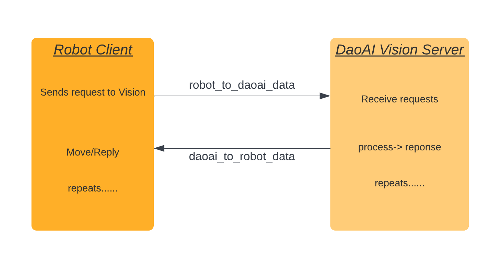

Socket
=================

The communication between robot and **Vision** is based on low level interface on TCP/IP socket. 
TCP provide stable communication protocol, which is ideal for robot and **Vision** .

Connections 
----------------

    
|

+------------------------+----------------------------------------------+
| Type                   | TCP/IP socket                                |
+========================+==============================================+
| Port                   | 6969 (TCP)                                   |
+------------------------+----------------------------------------------+
| Byte order             | Network order (big endian)                   |
+------------------------+----------------------------------------------+

Just like the Client-Server pattern, server is waiting for the requests from client. 
**Vision** is the server in this case, so the communication would start from robot.
Robot sends a request to **Vision** , this request should include command and payloads. 
**Vision** determines the process by checking command. after processing data on **Vision** side, it replies back response, this response should include status and payloads. 
Robot also checks this status, based on this response to preform moving, picking or holding still. 

The IP address of server is the IP of workstation which the **Vision** is running on. Port number must to identical for robot and **Vision** , otherwise they will not be able to communicate.

Protocols
----------------
Request and responses messages between a robot and **Vision** have a fixed size. 
A fixed-size message protocol has the advantage that it is easy to implement on the robot side, even with limited programming features.

.. note::
	Even though requests and response are having fix-size length, they do not have starting and/or ending signals. Robot side is able to compare the message size to determine the boundaries of each message.

Requests and response are consist of many fields, each fields are ``int32 `` size of 4 bytes. Floats would be multiply with a constant number ``MULT = 10000`` , then sends back as ``int32`` . After that, client side robot would divide the multifactor to get the data. Negative values would use one's complement.

Request Message
----------------

+-------------+----------+------------------------+------------------------------------------------------------------------------------------------------------------------------------------------------------+
| Content     | Type     | Length                 | Description                                                                                                                                                |
+=============+==========+========================+============================================================================================================================================================+
| Position    | int32[3] | 12 bytes               | Robot flange position(x,y,z all in metres) in right hand base. Each position should multiply by MULT factor                                                |
+-------------+----------+------------------------+------------------------------------------------------------------------------------------------------------------------------------------------------------+
| Orientation | int32[4] | 16 bytes               | Robot flange direction in right hand base representation. Each Orientation should multiply by MULT factor                                                  |
+-------------+----------+------------------------+------------------------------------------------------------------------------------------------------------------------------------------------------------+
| Command     | int32    | 4 bytes                | Request command                                                                                                                                            |
+-------------+----------+------------------------+------------------------------------------------------------------------------------------------------------------------------------------------------------+
| Payload     | int32[2] | 8 bytes                | Payloads are optional for extra message contents in communication                                                                                          |
+-------------+----------+------------------------+------------------------------------------------------------------------------------------------------------------------------------------------------------+
| Meta        | int32[2] | 8 bytes                | meta_1 is the second last field in a message, sending the type of robot to Vision; meta_2 is the last field in message, sending the robot protocol version |
+-------------+----------+------------------------+------------------------------------------------------------------------------------------------------------------------------------------------------------+

Payloads are optional, this field can put anything. However, the other fields are mandatory, without these fields the message is not recognizable by Vision. Command is the main value for vVision to determine which operations to perform.

Response Message
----------------

+-------------+----------+------------------------+----------------------------------------------------------------------------------------------------------------------------------------------------------------------+
| Content     | Type     | Length                 | Description                                                                                                                                                          |
+=============+==========+========================+======================================================================================================================================================================+
| Position    | int32[3] | 12 bytes               | Objecte location or object coordinate shifts(x,y,z, all in metres), depending on response status. Every value should devided by MULT factor                          |
+-------------+----------+------------------------+----------------------------------------------------------------------------------------------------------------------------------------------------------------------+
| Orientation | int32[4] | 16 bytes               | Object direction or object coordinate rotations, depending on status. Encoding and units depend on the chosen orientation convention and have to be divided by MULT  |
+-------------+----------+------------------------+----------------------------------------------------------------------------------------------------------------------------------------------------------------------+
| Payload     | int32[6] | 24 bytes               | Optional fields which for extra information message. Encoding and units depend on the chosen orientation convention and have to be divided by MULT                |
+-------------+----------+------------------------+----------------------------------------------------------------------------------------------------------------------------------------------------------------------+
| Status      | int32    | 4 bytes                | Payloads are optional for extra message contents in communication                                                                                                    |
+-------------+----------+------------------------+----------------------------------------------------------------------------------------------------------------------------------------------------------------------+
| Meta        | int32[2] | 8 bytes                | meta_1 is the second last field in a message, sending the type of robot to Vision; meta_2 is the last field in message, sending the robot protocol version           |
+-------------+----------+------------------------+----------------------------------------------------------------------------------------------------------------------------------------------------------------------+

Commands
----------------
These are the commands which robot sends to **Vision**:

.. code-block:: text

	RC_DAOAI_NO_COMMAND 				= -1
	RC_START_MANUAL_CALIBRATION			=  1
	RC_STOP_MANUAL_CALIBRATION 			=  2
	RC_MANUAL_ACCUMULATE_POSE			=  6
	RC_START_AUTO_CALIBRATION			=  4
	RC_AUTO_ACCUMULATE_POSE				=  7
	RC_GUIDANCE_CALIBRATION 			= 10
	RC_DAOAI_CAPTURE_AND_PROCESS			= 20
	RC_DAOAI_GET_NEXT_OBJECT 			= 21
|

**RC_START_MANUAL_CALIBRATION**

+--------+------------------------+------------------------------------------------------------+
| Field  | Value                  | Description                                                |
+========+========================+============================================================+
| status | DAOAI_MODE_CALIBRATION | Correct Manual Calibration reply, starts the process       |
+--------+------------------------+------------------------------------------------------------+

**RC_STOP_MANUAL_CALIBRATION**

+--------+-------------------------+---------------------------------------+
| Field  | Value                   | Description                           |
+========+=========================+=======================================+
| status | DAOAI_UNKNOWN_COMMAND   | Robot terminates Calibration program  |
+--------+-------------------------+---------------------------------------+

Robot sends the ending signal of calibration mode, Vision would stop calibration mode and sends
back ``DAOAI_UNKNOWN_COMMAND = -1`` to acknowledge the termination of calibration mode.

**RC_START_AUTO_CALIBRATION**

+--------+-------------------------------+-----------------------------------------+
| Field  | Value                         | Description                             |
+========+===============================+=========================================+
| status | DAOAI_MODE_AUTO_CALIBRATION   | Acknowledge and enters accumulate mode  |
+--------+-------------------------------+-----------------------------------------+

Robot sends the start signal of auto calibration mode, Vision would acknowledge the auto
calibration mode. Vision would reply ``DAOAI_MODE_AUTO_CALIBRATION = 11`` to acknowledge and enter
accumulate mode. If Vision sends back any other status, it means Vision is under different
process, robot would resends current command and repeat the above process.

**RC_MANUAL_ACCUMULATE_POSE**

+--------+--------------------------+------------------+
| Field  | Value                    | Description      |
+========+==========================+==================+
| status | DAOAI_MODE_CALIBRATION   | Accumulate mode  |
+--------+--------------------------+------------------+

Robot requests Vision to accumulate and collect images to accumulates calibration poses. If
Vision sends back ``DAOAI_MODE_CALIBRATION = 10``, it means Vision is under correct process. Else,
Vision is under a different process and robot will sends ``RC_START_MANUAL_CALIBRATION = 1`` to
re-acknowledge the calibration process.

**RC_AUTO_ACCUMULATE_POSE**

+--------+-------------------------------+----------------------------------------------+
| Field  | Value                         | Description                                  |
+========+===============================+==============================================+
| status | DAOAI_MODE_AUTO_CALIBRATION   | Accumulate mode                              |
+        +-------------------------------+----------------------------------------------+
|        | DAOAI_DONE_AUTO_CALIBRATION   | Collected enough poses, stop Calibration     |
+--------+-------------------------------+----------------------------------------------+

Robot requests Vision to accumulate and collect images to accumulates calibration poses. If
Vision sends back ``DAOAI_MODE_AUTO_CALIBRATION = 11``, it means Vision is under correct process. Else
if, Vision sends back ``DAOAI_DONE_AUTO_CALIBRATION = 33``, it means Vision collected enough poses for
calibration mode, this status ends the auto calibration mode in robot. If Vision replies anything
other than 11 or 33, that means Vision and robot are under different process, robot will resend
``RC_START_AUTO_CALIBRATION = 4`` to restart auto calibration process.

**RC_GUIDANCE_CALIBRATION**

+--------+----------------------------------+----------------------------------------------+
| Field  | Value                            | Description                                  |
+========+==================================+==============================================+
| status | DAOAI_GUIDANCE_CALIBRATION_GOOD  | Good pose, proceed to next pose              |
+        +----------------------------------+----------------------------------------------+
|        | DAOAI_GUIDANCE_CALIBRATION_BAD   | Bad pose, adjust the pose                    |
+        +----------------------------------+----------------------------------------------+
|        | DAOAI_DONE_GUIDANCE_CALIBRATION  | Collected enough poses, stop Calibration     |
+--------+----------------------------------+----------------------------------------------+

Robot requests Vision to start guidance calibration process. Robot would keeps sending this command
throughout the guidance process. Vision will start accumulate and collect images to accumulates
calibration poses from the first robot pose. Then based on the first pose, Vision would calculate
and output the next recommended pose; based on these poses, Vision would reply 12, 13 and 32
according to the calculation: if the pose is good, Vision replies 12, meaning is able to move to next
pose; if Vision replies 13, it means the pose is not good according to the calculation; 32 means
Vision has collected enough poses to generate calibration result, terminates the calibration mode
in robot. If Vision replies anything other than the status above, that means Vision and robot are
under different process, robot will resend ``RC_GUIDANCE_CALIBRATION = 10`` to restart guidance
calibration process.

**RC_DAOAI_CAPTURE_AND_PROCESS**

Robot requests the start signal of picking mode, Vision would acknowledge picking mode. Vision
would reply ``DAOAI_DETECTION =  5`` to acknowledge and enter detection and picking process. If Vision
sends back any other status, it means Vision is under different process, robot would resend
current command and repeat the above process.

Response Status
----------------

These are the status which robot receive from **Vision**:

.. code-block:: text

	DAOAI_UNKNOWN_COMMAND        			= -1  
	DAOAI_OBJECTS_FOUND				=  2
	DAOAI_NO_OBJECT_FOUND				=  3
	DAOAI_NO_IMAGE_CAPTURED				=  4 
	DAOAI_DETECTION					=  5
	DAOAI_MODE_CALIBRATION				= 10 
	DAOAI_MODE_AUTO_CALIBRATION 			= 11
	DAOAI_GUIDANCE_CALIBRATION_GOOD			= 12
	DAOAI_GUIDANCE_CALIBRATION_BAD			= 13
	DAOAI_DONE_GUIDANCE_CALIBRATION			= 32
	DAOAI_DONE_AUTO_CALIBRATION 			= 33
|

Message metadata
----------------

+------------------------+----------------------------------------------+
| Fields                 | Description                                  |
+========================+==============================================+
| Meta_1                 | ABB = 0                                      |
|                        +----------------------------------------------+
|                        | Fanuc = 1                                    |
|                        +----------------------------------------------+
|                        + Hanwha = 2                                   |
|                        +----------------------------------------------+
|                        | Kuka = 3                                     |
|                        +----------------------------------------------+
|                        + Omron_TM = 4                                 |
|                        +----------------------------------------------+
|                        | Siemens_PLC = 5                              |
|                        +----------------------------------------------+
|                        + Staubli = 6                                  |
|                        +----------------------------------------------+
|                        | UR = 7                                       |
|                        +----------------------------------------------+
|                        | Yaskawa = 8                                  |
|                        +----------------------------------------------+
|                        + Efort = 9                                    |
|                        +----------------------------------------------+
|                        | Aubo = 10                                    |
|                        +----------------------------------------------+
|                        + Dobot = 11                                   |
|                        +----------------------------------------------+
|                        | Mitsubishi = 12                              |
|                        +----------------------------------------------+
|                        | Other = 99                                   |
+------------------------+----------------------------------------------+
| Meta_2                 | This is the protocol between Vision version  |
|                        | and robot version, in this case meta_2 is 1. |
+------------------------+----------------------------------------------+

If your robot does not follow the protocols above, Vision would report errors, and terminates any process in order to protect the robot.

