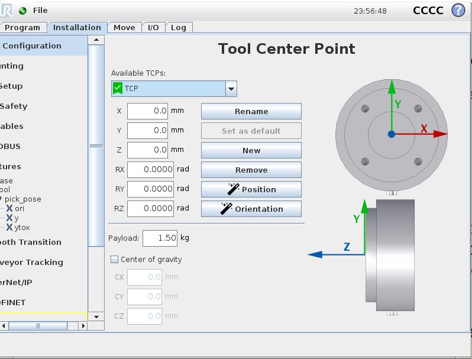
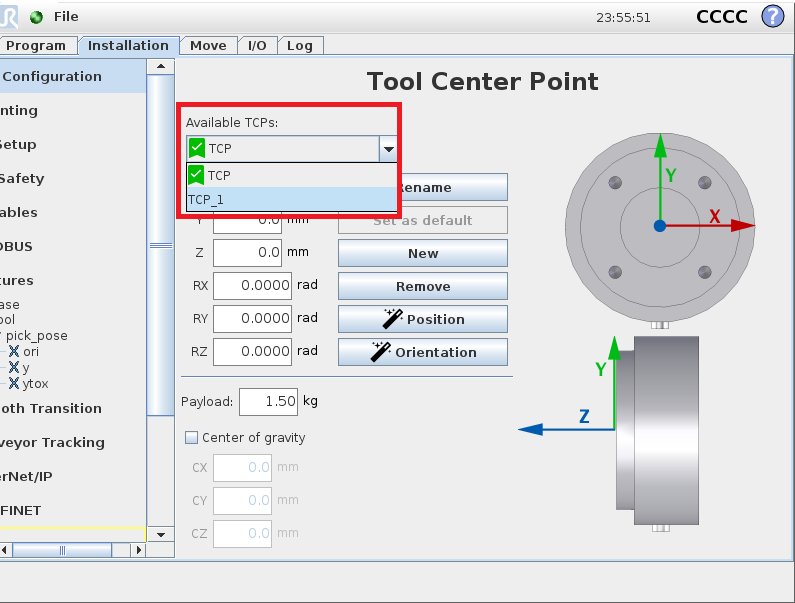
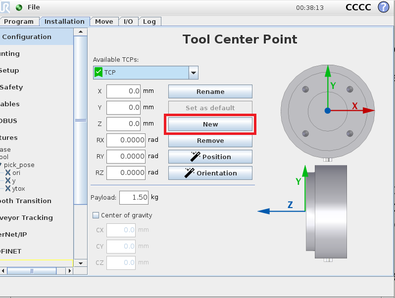
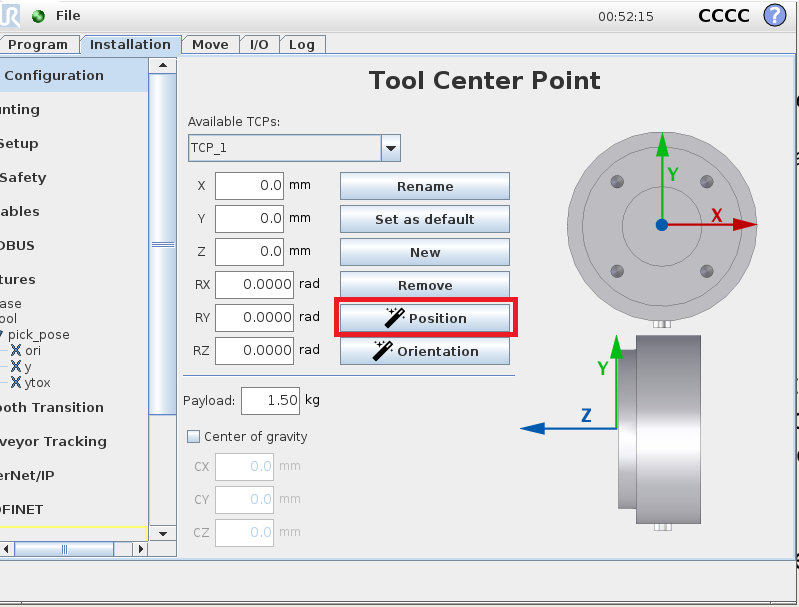
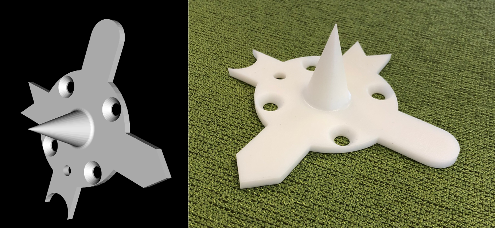
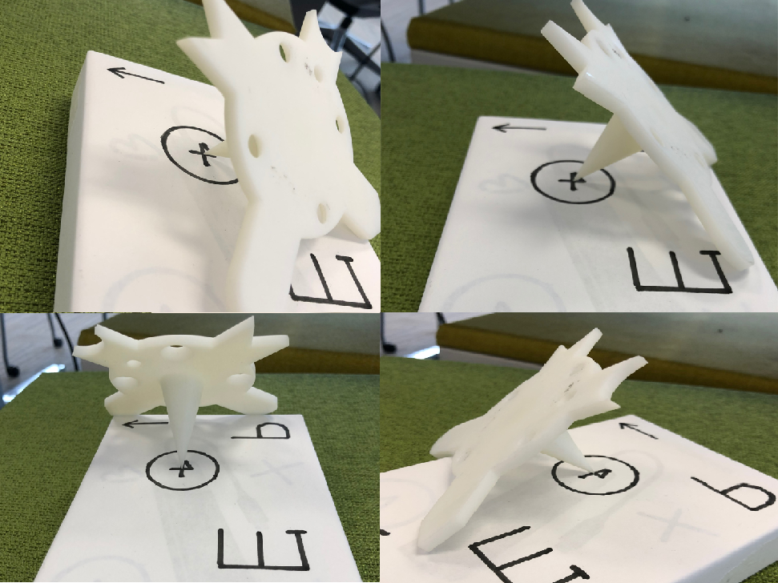
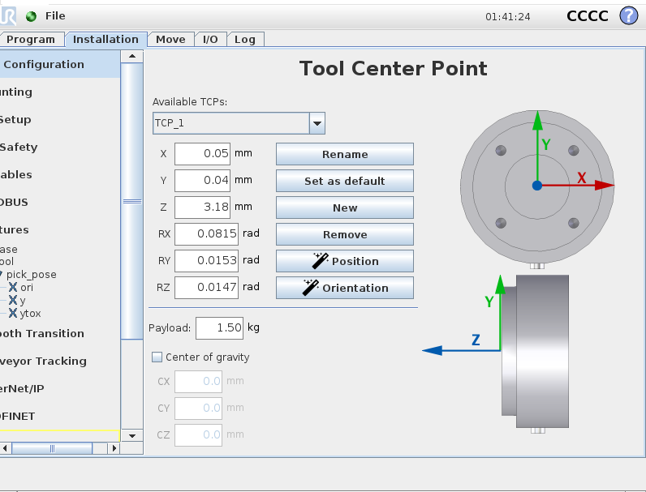

Tool Center Point(TCP)
====================

Robot arm can be equipped with many different tools, they are usually differed in length, shape and functioinalities. 
Therefore, the gripping point of one tool will be different to another tool. 
Some relations in **Vision** requires the Tool Center Point(alias as **TCP** in the following article) in flange relation. 
Hence it would be helpful if we can have the TCP in flange relation from UR. 

In UR installation tab, you can setup the TCP, using UR installation tool to get the TCP in flange relation. So that, you do not need to work on the transformations for flange and TCP.

Clicking on the **Available TCPs** will bring down the list of TCPs stored in UR. 
You can add new TCPs by clicking on **New** button. 
Which allows you to rename and create a new TCP. 

You can also use the **Remove** button to manage your TCPs.

After creating a new TCP, you can use the **Position** button to define the waypoints for this TCP. 

|

.. image:: Images/tcp_waypoints.png
    :align: center 

Setting up these waypoints can help UR to define the TCP to flange relation. 
You should have the tool installed before defining these waypoints. 
These waypoints should have a common grip point. For example, the gripper like below:

The TCP should be defined to the top points(the sharp top). 
The waypoints should be in different rotations and angles, which all pointing to the same coordinate. Like the image shown below:

The cross is where you want to align all waypoints to. When all waypoints are pointing to a same locatioin, with different poses and rotations, UR is able to generate the relation of TCP to flange.

|

Therefore, the TCP to flange relation will be disaplayed in installation tab.

.. attention::
    After the TCP is created, you should choose the TCP you created as default in order to use this relation.

    .. image:: Images/tcp_default.png
        :align: center