Installation and Setup
========

System Setup
------------

Turn on the robot
~~~~~~~~~~~~~~~~~

To turn on the real robot, press the green button on the teaching pendant. 

    
|

Network
~~~~~~~

Once you open the program, we would need to configure the network setting so we can communicate with the robot.  Click on Setup Robot → Network → select static address and we will change the IP address. 

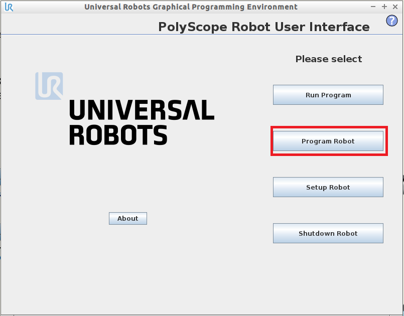
    
|

.. image:: Images/ur_setupnetwork.png
    :align: center
    
|

Open the command prompt on your PC, in the command, type “ipconfig” to check all the available networks on your PC:

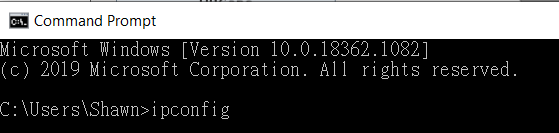
    
|

Locate the network you will communicate with your robot. If you are using the virtual simulation, go find the VMnet8 network (Or other networks that your VM is using) and copy the IP address and keep the last 3 digits as 129.

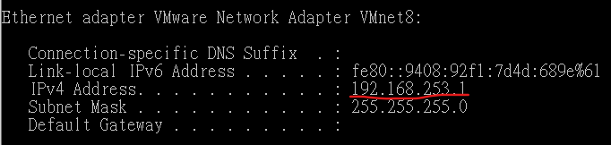
    
|

If you are using a real robot, make sure to change your network to a static IP address by going into Network Connections → Right-click on the network and click on properties → right click on TCP/IPv4, and change the IP address. 

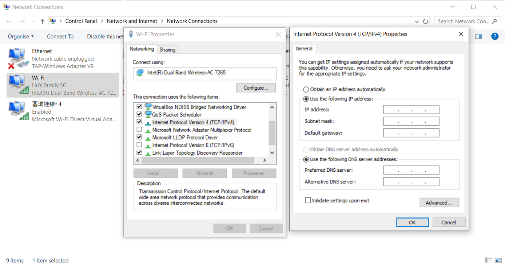

|

Once the IP address is changed, hit Apply to finish the changes. 

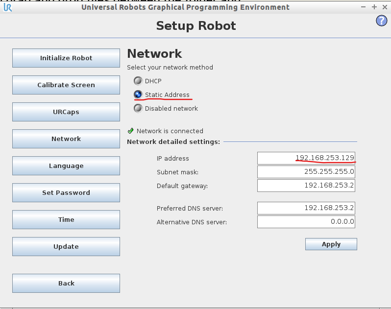

|

In order to make sure your robot is connected, go to the command prompt and type “ping _ “ where _ would be the IP address you assigned the robot to. If the message is displayed like the one shown below, then the robot is connected successfully. If the responses timed out, check if you typed your IP address correctly as well as the settings. 

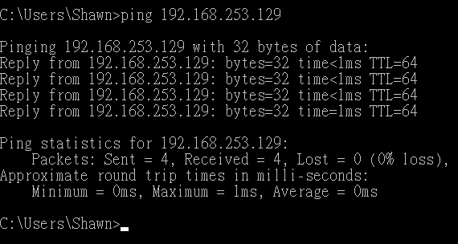

|

Safety Issue
------------

Moving Speed
~~~~~~~~~~~~

It is important to note the operating speed of the robot as the robot can be dangerous when running at a fast speed. Make sure your robot speed is within the range of 20% speed to reduce the robot operating speed as well as giving the safety time to recover the robot if something goes wrong half-way through the operation. 

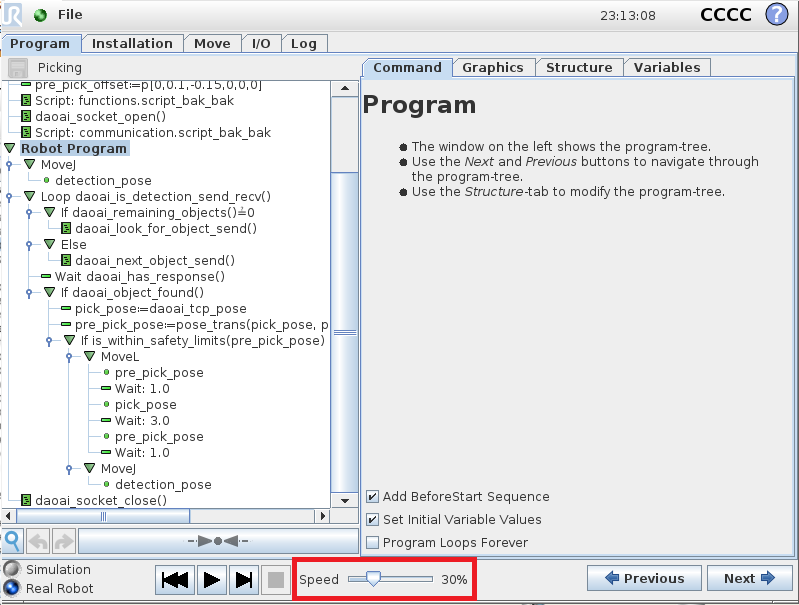
    
|

Emergency Stop
~~~~~~~~~~~~~~

If something goes wrong using the UR5 robot during the robot operation, press the emergency red button located below the power button. To restart and recover the robot operation, rotate the emergency stop button in the direction indicated on the button (Clockwise) until it becomes unpressed. Then repeat the previous set up procedure. 

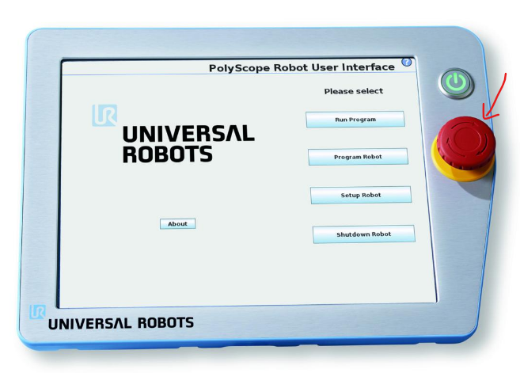
    
|

Vision and Robot Communication
------------------------------

Load Program
~~~~~~~~~~~~

Once you finished configuring the network, click Back to go back to the menu and click on Program Robot. Click on Load Program to load the first program, “get pose.urp”,  in the UR Code folder downloaded previously in your Program UR5 folder, and then open the program. 

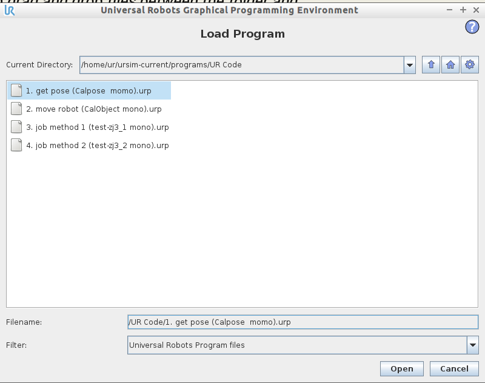
    
|

Before running the program, you would need to make sure that the robot is connected to the right IP and port. Go to “Connected==socket_open…” under chushiconnected and change the IP address to the same network as the virtual network (or the network the real robot is on), and change the port to 6969 (or the same port as the Hercules program on the server-side). 

.. image:: Images/ur_ip.png
    :align: center

|

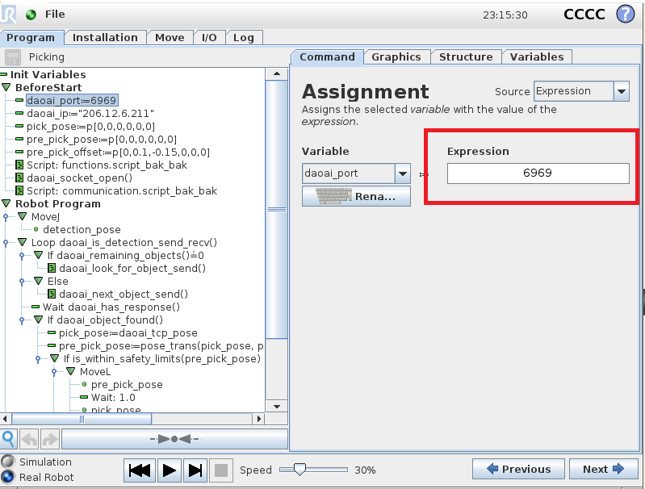
    
|

click on waypoint under the Robot program, and set the waypoint, make some position adjustment and click ok.

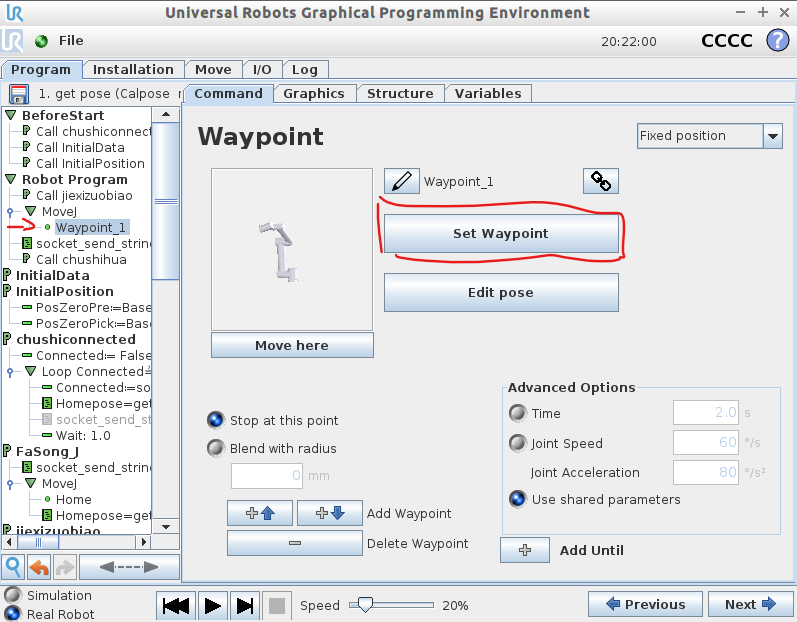
    
|

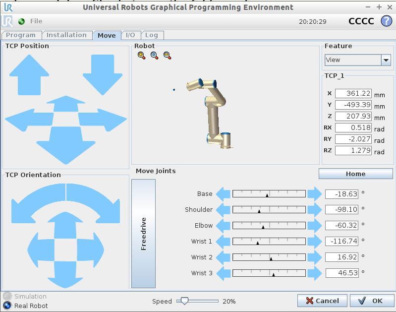
    
|

After setting the waypoint, click run, you should be able to see the connection established between the client and the server-side by checking the Client connection status. 

|

Configuration on Vision
~~~~~~~~~~~~~~~~~~~~~~~

On the top menu bar, select ``Platform`` ->  ``Platform config page``. 

.. image:: Images/Robot0.png
    :align: center
    
|

Select ``Robots`` on left side menu bar and click ``+``,

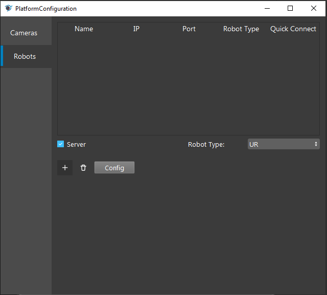
    
|

Press ``Connect`` (Keep the pamameter defualt)

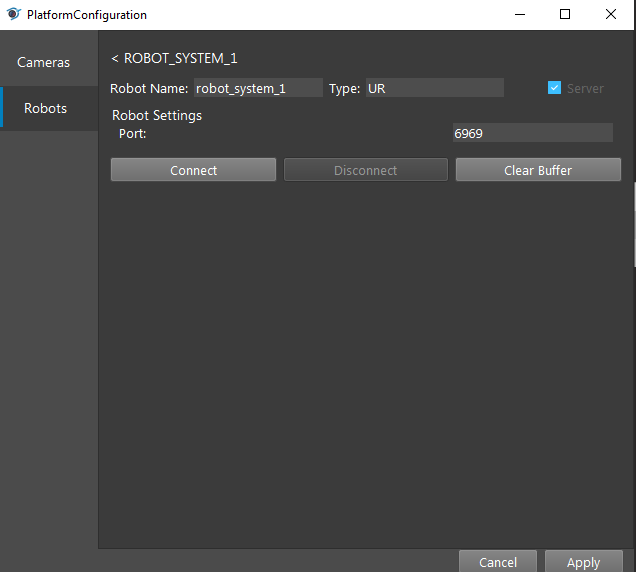
    
|

Now you are good to go with Robot related Nodes.

