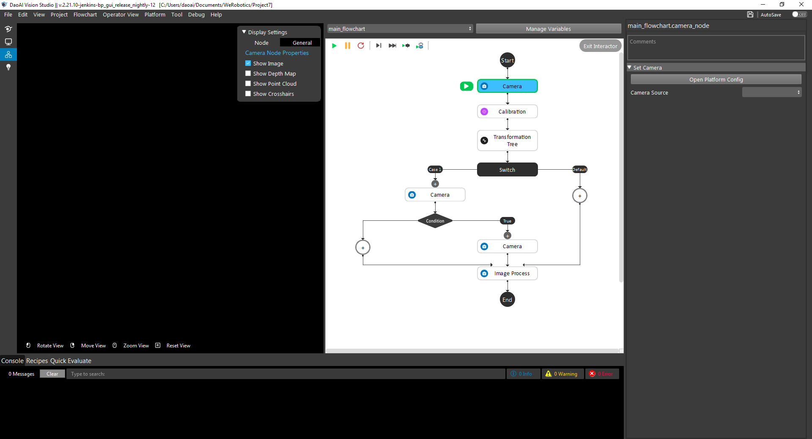
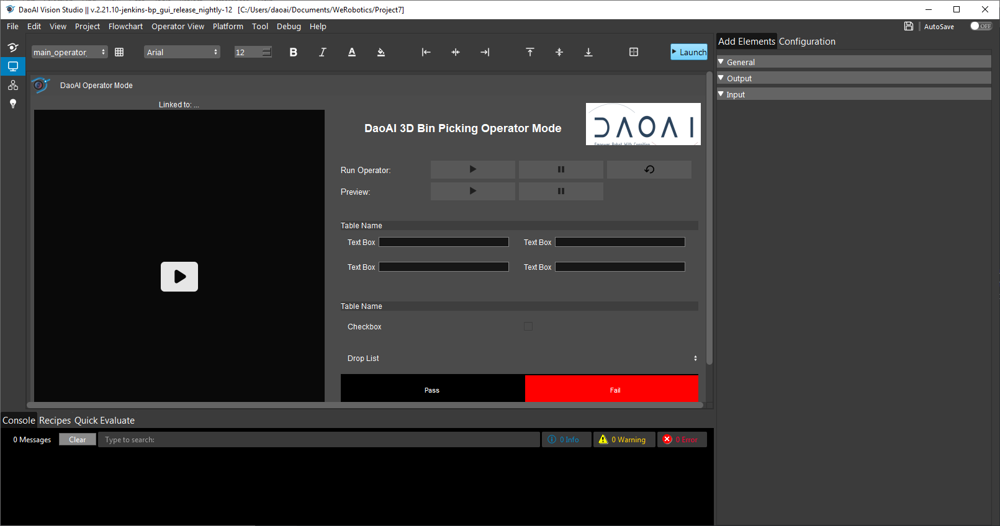
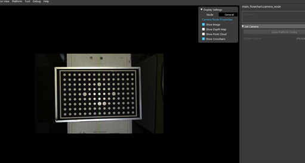
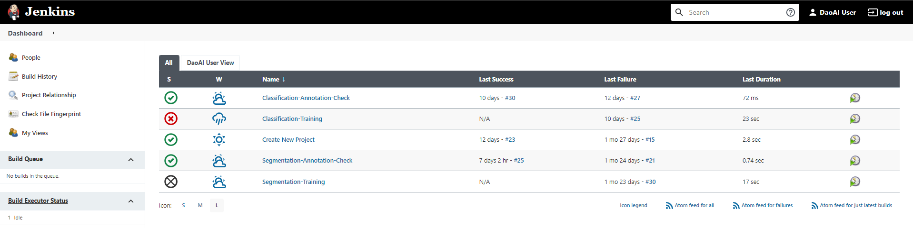
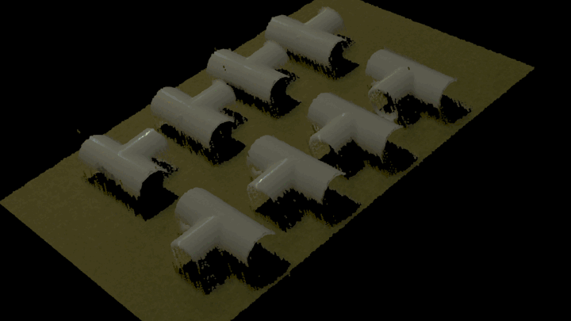
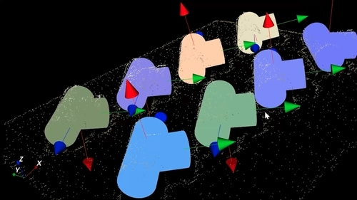
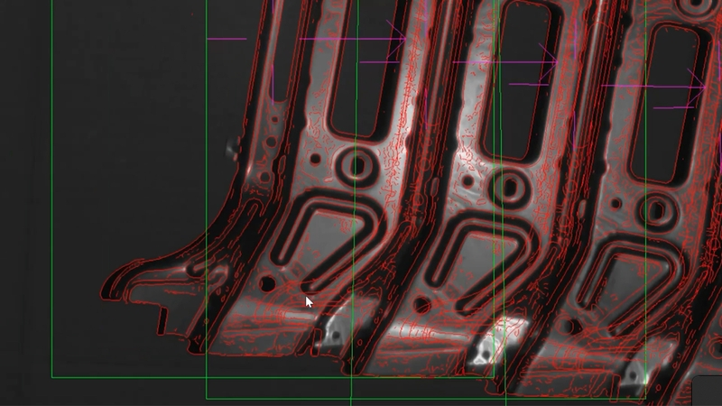

Welcome to the DaoAI Vision knowledge base!
========================

Here you can find everything you need to know about DaoAI Vision Studio, a plug and play 3D vision solution for your robot that allows it to pick parts of different shapes, materials and sizes. With DaoAI Vision Studio  you can automate any type of picking application such as bin picking, machine loading, depalletizing, kitting and assembly, and pick and place.

- **System Overview**: You will find basic information of the software, and get a taste for using the software
- **Hareware**: You will get to know how to mount the hardware, and connect it. It includes the cameras, robots and processors.
- **Nodes Details Explanation**: You will find each nodes detailed explanation, and how to use it. Including the tunning guidelines for your own application.
- **Deep Learning**: You will understand how to train your deep learning model and use it inside the DaoAI Vision Studio.
- **Complete Robot Guidance Steup**: You will understand how each node was integrated together to fullfill real work robot guidance applications. 
- **Template Usage**: You will get to know how to use each template, and the configuration for each template. Afterwards, you will be able to modify on your own based on your needs.
- **Project Example**: You will see real world example project, and get to know how to mount the camera, and which template or functionalities will suit it.
- **Excercise**: Through the excercise, you will be able to determine your knowledge regarding the DaoAI Vision Studio, and get hands on experience to operate the software.
- **FAQ & Troubleshooting**: You will be able to see common problems, and answer to it.

If you can’t find what you’re looking for here, please reach out to us by sending an email to support@daoai.com.

Feature Highlights
~~~~~~~~~~~~

Flowchart Based Program
""""""""""
As the image below shows, you could configure the flowchart using different logical control, and also functional nodes.

Operator View for Deployment
""""""""""
In the following image, based on the project needs, you are able to configure the layout that display to the end user (operator), where you could place the start/stop buttons, and also place your company logos etc.. 

Camera & Robot Calibration
""""""""""
Based on different needs, the system support both the chessboard and sphere calibration modules. Where chessboard is easy to easy and very common in machine vision field. While the sphere calibration is more designed for 3D cameras, where you could simply attach a PingPong ball on the robot arm or place it on the groud. 

.. image:: introduction_images/sphere_calibration.png
   :width: 48%

Deep Learning Recognition Features
""""""""""
The system provide state of the art deep learning functionalities, including image classification, segmentation, key-points detection etc.. And all these modules can be trained online with our deep learning server.

.. image:: introduction_images/deep_learning.gif
   :width: 100%

Classical Machine Vision Features
""""""""""
Our software also support classfical machine vision tools, including pattern matching, image corrections, code reading, and metrology etc. These tools can be combined together with the robot guidance applications or used indepently.

.. toctree::
   :numbered:
   :hidden:
   :caption: Contents

   introduction/index
   system-overview/index
   hardware/index
   nodes/index
   deep-learning/index
   complete-vision-guidance/index
   template-usage/index
   examples/index
   excercise/index
   faq-trouble-shooting/index
