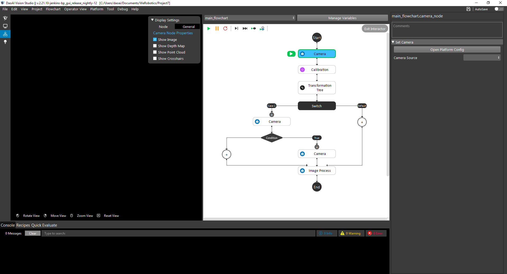
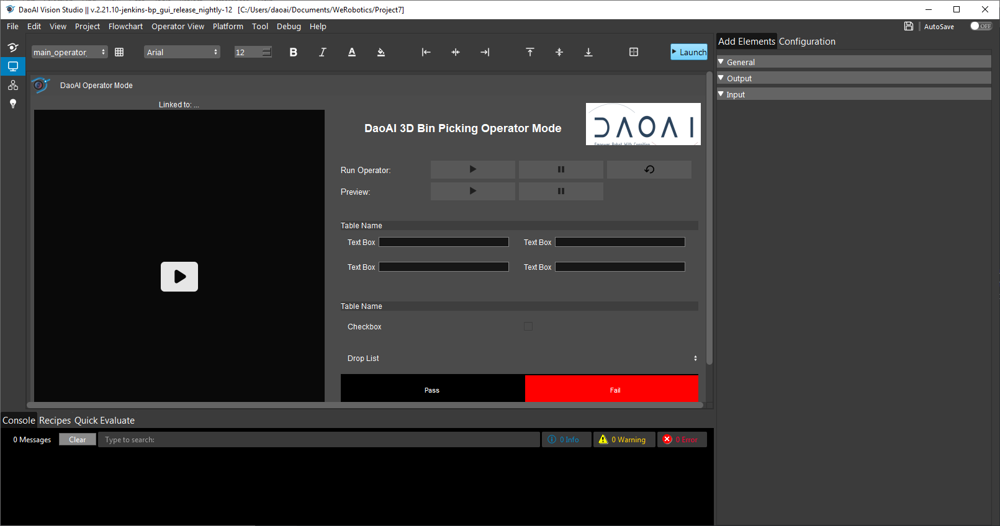
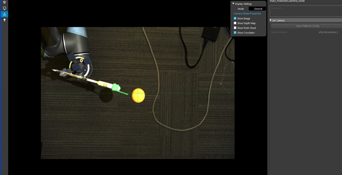
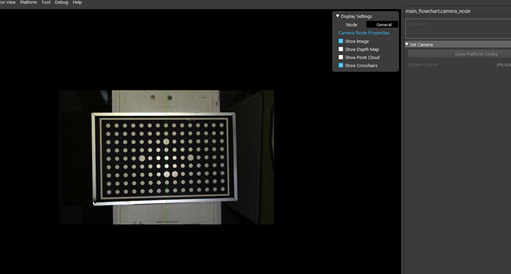
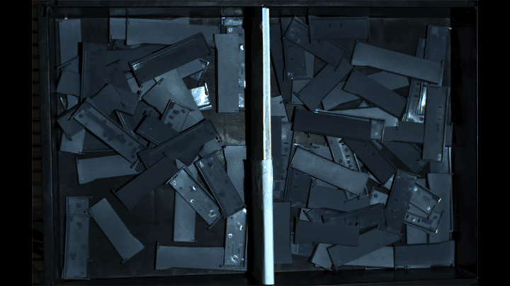
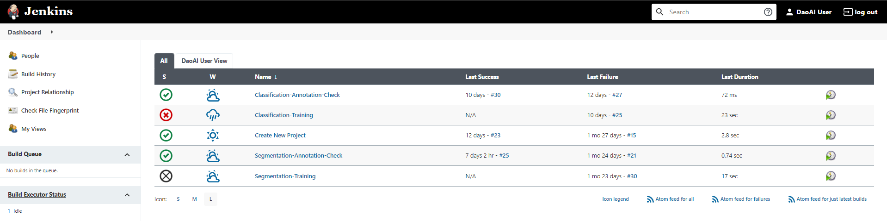
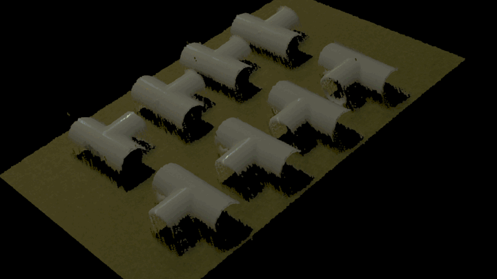
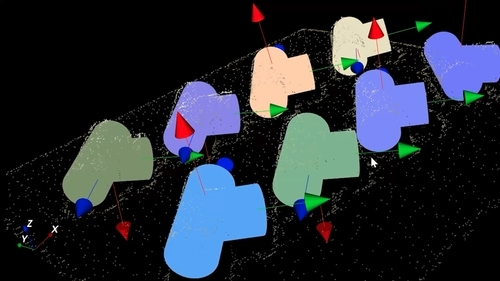
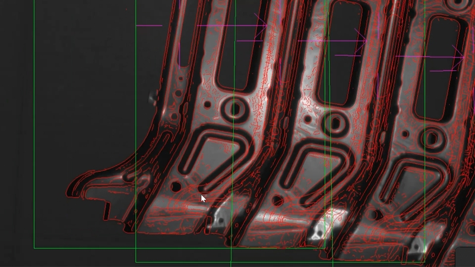

Introduction
============

The DaoAI Vision Studio is an interactive tool that lets you create flowchart based applications/projects designed for machine vision and vision guided robot. It supports a wide range of 3D/2D cameras, robots. And also provide functionalities regarding deep learning modules, classical machine vision modules, and calibration modules etc..

Feature Highlights
============

Flowchart Based Program
~~~~~~~~~
As the image below shows, you could configure the flowchart using different logical control, and also functional nodes.

Operator View for Deployment
~~~~~~~~~~
In the following image, based on the project needs, you are able to configure the layout that display to the end user (operator), where you could place the start/stop buttons, and also place your company logos etc.. 

Camera & Robot Calibration
~~~~~~~~~~~~~~~~~~~~~~~~~~
Based on different needs, the system support both the chessboard and sphere calibration modules. Where chessboard is easy to easy and very common in machine vision field. While the sphere calibration is more designed for 3D cameras, where you could simply attach a PingPong ball on the robot arm or place it on the groud. 

Deep Learning Recognition Features
~~~~~~~~~~~~
The system provide state of the art deep learning functionalities, including image classification, segmentation, key-points detection etc.. And all these modules can be trained online with our deep learning server.

Classical Machine Vision Features
~~~~~~~~~~~~~
Our software also support classfical machine vision tools, including pattern matching, image corrections, code reading, and metrology etc. These tools can be combined together with the robot guidance applications or used indepently.

