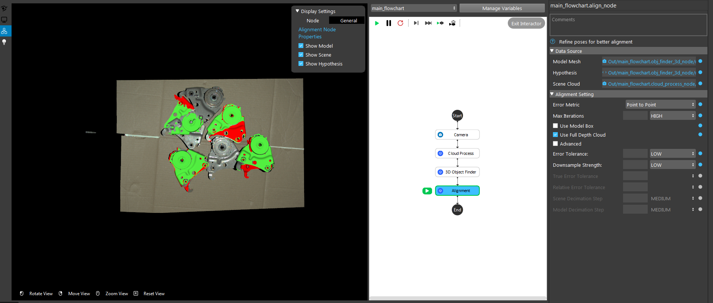
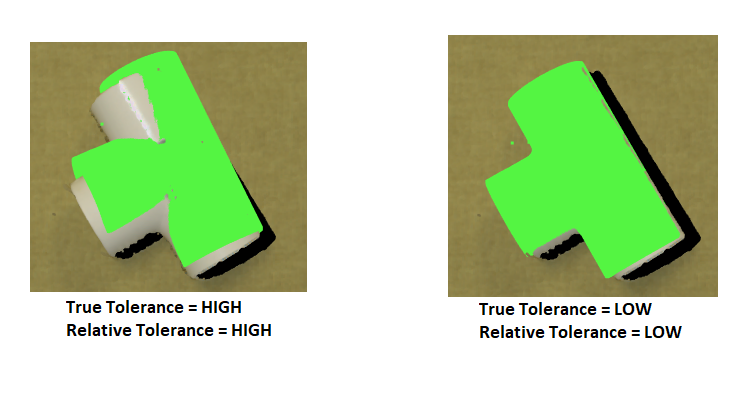
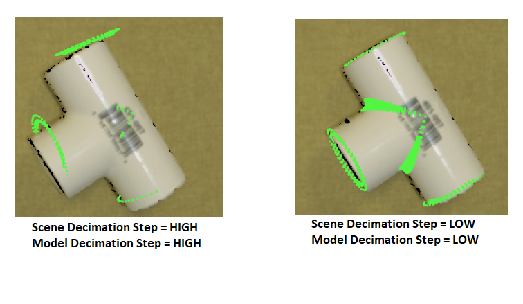

Procedure of Using Alignment Node
=====================================

1. Get 3d poses of the object (3d object finder node, mod finder node 3d mode, reconstruct node, etc)
2. Get model point cloud or mesh
3. Get scene cloud
4. Run alignment node to improve 3d poses
5. (Optional) Use verification node to verify the aligned poses

Tips on making alignment result more accurate
-----------------------------------------------

1. Generally, it is recommend using point to point error metric unless the geometry and amount of overlap between the hypothesis and scene are large to use the point to plane metric.
2. Increase max iteration to get better alignment, at the cost of longer running time.
3. Check "Use Model Box" to check the scene based on the model's bounding box before alignment (speeds up matching)
4. Change tolerance
   

5. Change decimation step
   
