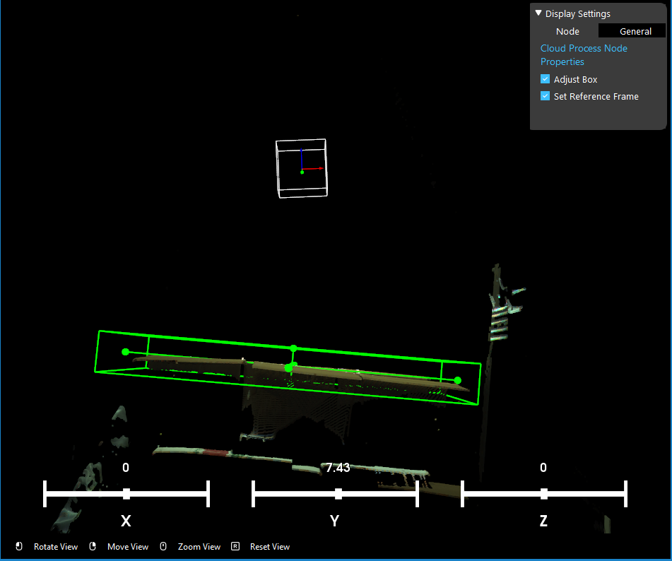
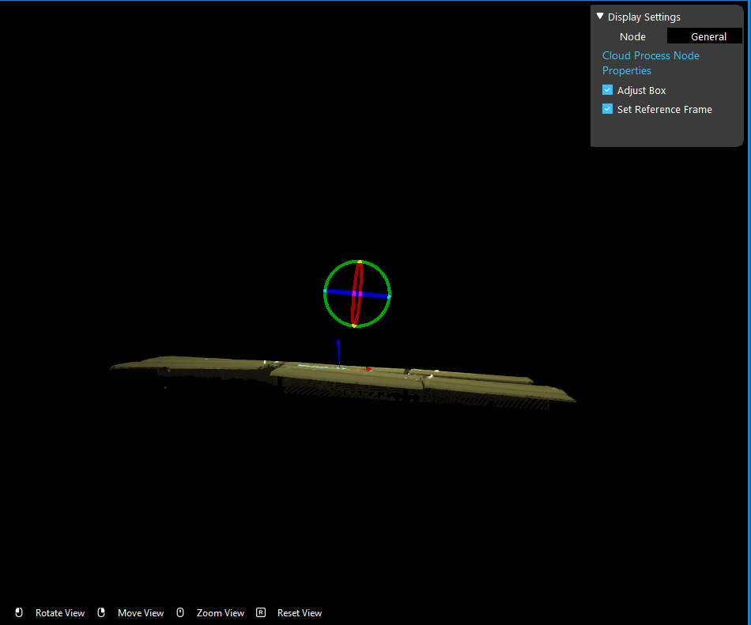
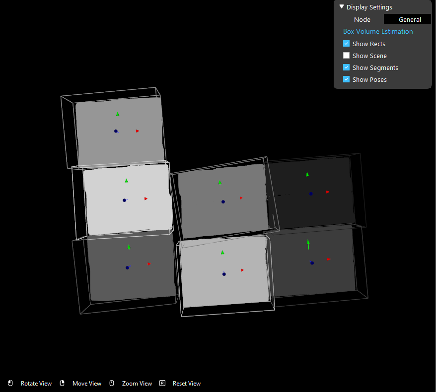
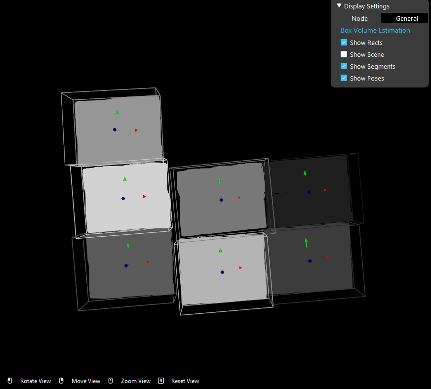

Procedure in Using Box Volume Estimation Node
===================================================

1. Pre-process scene cloud, define reference frame
2. Do point cloud segmentation using DL segmentation node or regular segmentation node
3. Use scene crop to separate scene cloud into a vector of point clouds using segmentation result. Each segment will contain a box
4. Run box volume estimation node on segmented point clouds.
5. Use pick adjustment node to further process picking pose based on pose and volume (width and height) of the box

Pre-process Scene cloud
------------------------------

In order to better estimate the width and height of the boxes, the point cloud must be pre-processed

* Use adjust bounding box to filter out the noises in the point cloud.
* Use set reference frame to define the reference frame. In ring interactor, try to align the x-y plane (purple ring) with the box surface
* Use normals operation to compute the normal of the point cloud.

Tuning Parameters to Get Best Estimation
-------------------------------------------

* Use "Lock Z Axes" option so that the z axes of the poses will always be prependicular to the reference plane
* Use "Use OBB" to estimate the rotated box. Use "Use 2D Correction" to better estimate the 2d rotation of the box

