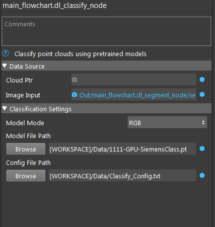

Deep Learing Classification Node
======================================

The DL Classification Node offers state-of-the-art classification of point clouds using pretrained models. 
The setup of this node is very similar to DL Segmentation with the only difference being the task at hand.

Input
-------------

* Cloud Ptr: point cloud used for classification
* Image Input: RGB image used for classification

Output
---------------

* classLabel: label of the object, an int defined by the deep learning model
* confidence: confidence of the classification

Classfication Setting
---------------------

* Model Mode: use only RGB for classification; use only depth(from point cloud) for classification; or use both.
* Model File Path: path to deep learning model
* Config File Path: path to deep learning config file