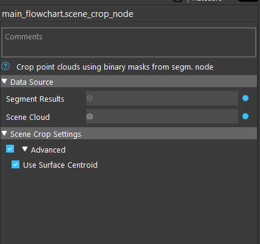

Scene Crop Node
==========================

The Scene Crop Node uses segmentation results to crop a Point Cloud and output a vector of clouds corresponding to each segment.

Input
--------------------------

* Segment result: segmentation result vector, either from segmentation node or DL segmentation node
* Scene cloud: scene point cloud to be cropped

Output
----------------------------

* segmentClouds: a vector of point cloud, representing the cropped point cloud for each segment
* segmentPoses: poses of each point cloud, if the scene cloud has normals (from cloud process node), this pose will represent the surface normal of the segment

Parameters
--------------

* Use Surface Centroid: whether to compute the centroid of the segmented point cloud when computing segmentPoses
  

screenshot required to show result