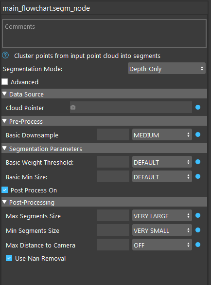

Segmentation Node
================================

The Segmentation Node clusters the points from an input point cloud into segments. The output segment masks can be used by the Scene Crop Node to create a vector of segment clouds. 
The matching process will run faster on these segments.

RGBD segmentation works best when instances of objects are spaced apart. 
Otherwise, segments may contain multiple instances of the object. In these cases, normal segmentation may segment out the instances more clearly. 
Both watershed segmentations are performing on the image using maker generation. They are faster but could result in less accurate segmentation.

Four types of Segmentation Nodes are available:
   * Segmentation RGBD: Uses the RGB and depth information to perform clustering
   * Segmentation Normal: Uses the normals in the point cloud to perform clustering
   * RGB only: Performs segmentation on an RGB image.
   * Depth only: Performs segmentation on a Depth image. 

Input
-------------------------------

* Cloud Ptr: a point cloud to be segmented
* Camera Intrinsic: camera intrinsic parameter used for RGBD segmentation
* RGB Pointer: RGB image to be segmented

Output
------------------------------

* preSegmRGB: rgb image before segmentation
* postSegmDepth: depth image of the scene after segmentation
* postSegmPCA: image showing PCA of the scene cluster 
* postSegmRGB: rgb image after segmentation
* results: a vector of segments, each containining a mask image of the size of the scene image, showing which points belong to this segment

Parameters
-----------------------

Pre-process
~~~~~~~~~~~~~~~~~~~~

* Basic Downsample: Level of downsampling when doing segmentation

Segmentation Parameters
~~~~~~~~~~~~~~~~~~~~~~~~~

* Basic Weight Threshold: how much differnt between the adjascent points to be considered as different segment. Default Value is 50, range is [0,100].
* Basic Min Size: minimum size of each segment. Default value is 50, range is [0,100].

Post-processing
~~~~~~~~~~~~~~~~~~~~~~~~

* Max Segment Size: Maximum size of the segment, segment greater than this will be removed. Default value is 100, range is [0,100].
* Min Segment Size: Minimum size of the segment, segment greater than this will be removed. Default value is 0, range is [0,100].
* Max Distance to Camera: Maximum distance of points in segment to camera, segment with points further than this distance will be removed. Off by default. Distance unit is millimeter
* Use Nan Removal: remove segment with more than 75% of the points invalid, if turned on.

