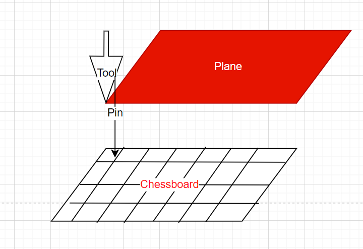
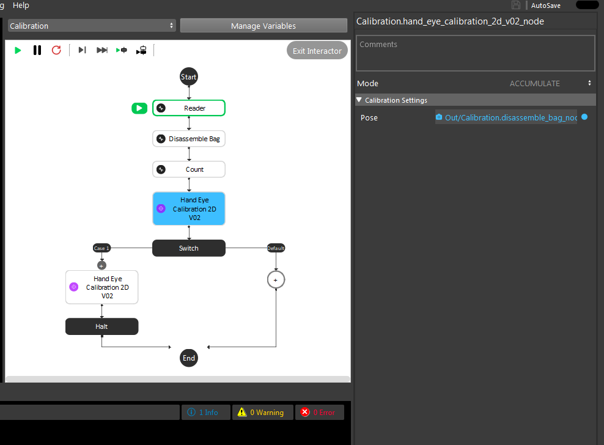
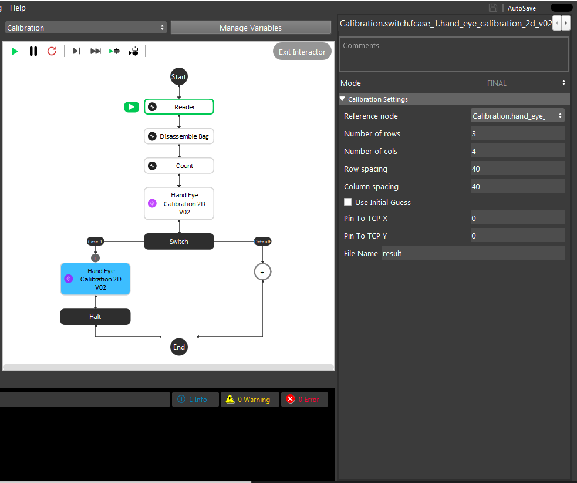
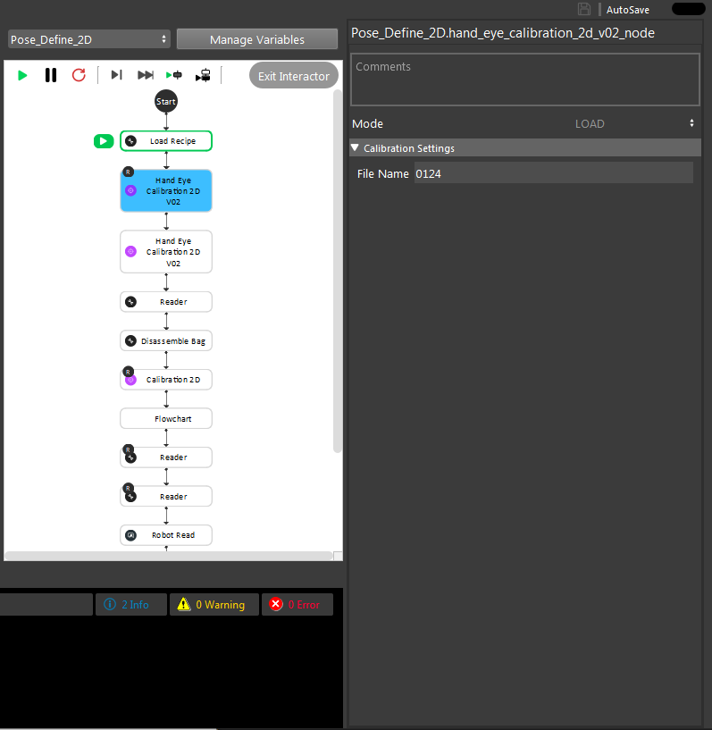
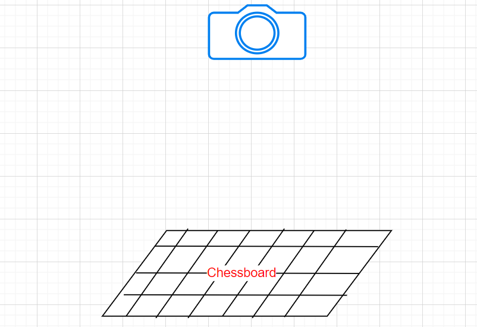
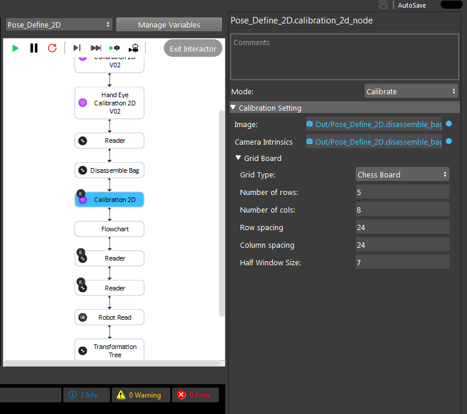

2D Calibration
========================

In the scenarois that the used camera is 2D, no 3D point cloud from the scene is available for bin picking applications. Therfore, we need to perfrom 2D picking. In this scenario, the picking height with respect to the workspace is hardcoded and 
constant. In this case, we need to perfrom 2D calibration ehivh is the goal of finding 2D tramsformations between differnt coordinate systems.

We provide two nodes to perform 2D calibration. One is Calibration2D node and the other one is HandEyeCalibration2DV02 nodes. These two nodes should be used in combination with each other to able to perfrom 2D picking. In the following a summary of each of 
these nodes is provided. 

HandEyeCalibration2DV02 node
~~~~~~~~~~~~~~ 

This node is used to perform robot-world 2D calibration for random bin picking. More specifically, this node calculates the 2D transformation between a robot virtual plane and the world (chessboard) where it is assumed that bin picking 
is performed on a 2D plane. In other words, this type of calibration can be used in scenarios where the picking height. An overview of the calibration setup is shown below. 

|
    
As shown above, this type of calibration requires the user to place the chessboard on the objec tray. We will refer to the chessboard coodiante system as the world coordinate system in the rest of this section.
Also, a pin is attached to the robot arm and a robot virtual plane is defined using the robot pendent which should be parallel to the chessboard. Each robot type (robot brand) provides a way to define a virtual plane. Please 
refer to your robot manual for more details on how to do this.

In order to create this virtual plane. the user needs to define 3 different TCP positions. Then, the robot will automatically create a virtual plane with the Z axis directing upwards. Note that for the case of our calibration, we need to define 
the 3 TCP positions such that the pin touches the 3 corners of the chessboard on the tray.  

.. image:: Images/hand_eye_calibration_v2/pin.jpg
    :align: center
|

Once this virtual plane is created, We need to gather the calibration data needed. For this purpose, the robot operator needs to move the the pin to corner points in the chessboard. The choice of the number of 
chessboard points to touch is arbitrary. However, our experiment with 12 points and using a row and column spacing of 2 squares is hown to give us a good and stable result. 
To better undertand this,  as shown in the image below, the robot operator has to giude the robot to touch (nearly touch) the corner points of the chessboard in a zig zag pattern. Note that the distance between every two points in a 
row is called the row spacing value and the distance between every two points in a column is called the column spacing value. (2 square in this image). When touching chessboard with the pin, the TCP value in the plane should a Z value of 
near zero. Also, make sure the Rx and Ry values are set to zero. Finally, use a variety of random rotation values for the Rz to ensure a good calibration result. Once the robot pose (TCP in plane) for each pin position is 
collected, the user needs to save them for further use of the HandEyeCalibration2DV02 node. (Please refer to 2D picking flowchart template). 

Now the data has been collceted, the HandEyeCalibration2DV02 node can be used to perfrom robot plane- world calibration. As mentioned before, the goal of this node is to find the 2D transformation between the robot plane and the world (chessboard).
When adding the HandEyeCalibration2DV02 node, wou will see that this node has three modes. The first mode is the accumulation mode which used to load the calibration data (robot poses) needed for the calibtaiton calculation.
    

|

After accumualtion, the next step is to perfrom the calibration computation and find the needed transformations. This is done using the final mode of HandEyeCalibration2DV02 node.  

|

The output of the final mode is the 2D transfomation of plane to world and world to plane alongside with the 2D translation of pin to TCP. 
The inputs of the node in final mode inlcude the refernce node which is the reference accumualtion node. Also, the user has to specifiy the number of used row and columns for the pin points and 
distance between these points in each row and column (row spacing and column spacing). Also, the user can specifiy an intital value for the translation of pin to TCP which is then used as an initialization for the optimization peformed 
for claibration. Finallt, the filename is the name of the file that the calibration results will be save into. This then can be used to use the load mode to load the results later on without a need for performing the previous steps again. 

|

Calibration2D node
~~~~~~~~~~~~~~ 

In the previous section, we provided details on the HandEyeCalibration2DV02 node which obtains transformation between the world and the robot virtual plane. However, in order to be able to perfrom the 2D picking succesfully, we need a way
to obtain the between a camera and the world. This can be done using the Calibration2D node which obtains the transformation between the world (chessboard) and the camera ony using a single capture. Note that to perform this calibration, be sure
the position of the chessboard is the same as the HandEyeCalibration2DV02 experiment as these two nodes are used together in the 2D picking pipeline. 

|

By adding the Calibration2D node, you can see that this node operates in two modes. One is the calibrate mode which simply usues the captured image from the chessboard to obtain the intrinsic parameters of the camera as well as the 
tranformation of camera to world. 

|

The other mode of the Calibration2D node is the project mode. This mode is used in thre 2D picking pipeline to convert a detected 2D pixel (from a mod_finder node) into the 3D world coordiante system.   

.. image:: Images/calibration_2d/project.jpg
    :align: center
|

Note that as the picking process is 2D and as mentioned before, the picking height is hardcoded. This vlaue can be set in the Zoffset filed of the project mode in calibration2D node ad shown above. This is the distance from the 
detection surface surface to the chessbaord surface. I the detection surface is above the calibration surface for 20mm, wou shoould enter -20 and vice-versa. 

By obtaning the transforation of a 2D pixel to world corrdiantes system and the transfomration of world to robot plane, the transformation from 2D pixels to robot base can obtained which then can be used for 2D picking. 

 

