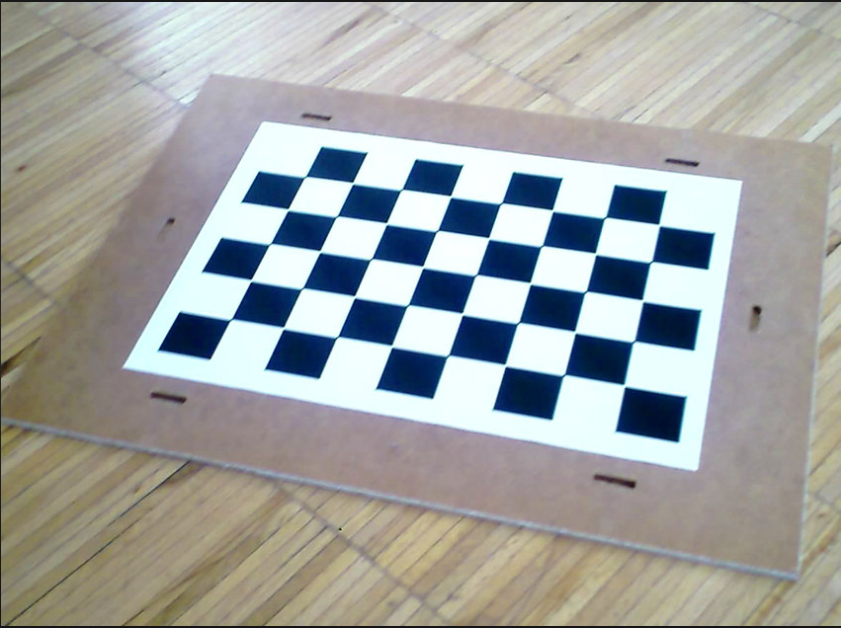
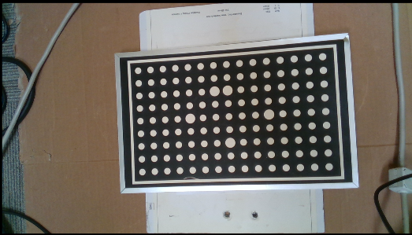
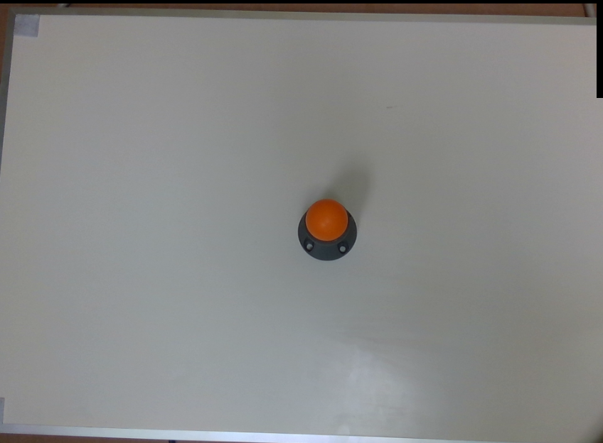

3D Calibration Nodes
========================

The purpose of these nodes is to perfrom 3D calibration between robot and the camera. We provide two different nodes for 3D calibration. One is the calibration node and the other is sphere calibration. They both obtain the 3D transformations 
between different coordinate systmes. However, the difference lies in the calibration tools that are used and the computation methods. In the following, each of these nodes are explained with some examples. 

Calibration node
~~~~~~~~~~~~~~
In order to perfrom calibration using this node, we need to capture camera images of the calibration tool from different views. The calibration tools that can be used in this node are grid circles and gird chessboards that examples of each are shown below. 

    
|

    
|
 
Note that the captured images should contain a variety of images with differnt position and rotation angles to ensure a good calibration result. Once you have captured calibrartion images, you can add the calibration node into the flowchart to perfrom calibration. (Templates provided in the software)
When adding this node to the flowchart, you will see the option for choosing the calibration mode. We provide three modes for the calibration node.
First, the accumulation mode is used to load the captured images, poses and point clouds from the calibration board and detect the corner points (chessboard) or circle center points (circle borad). When you choose the accumulation mode, you will be able to set differnt options and inputs. 

 .. image:: Images/calibration_node/accumulation.jpg
    :align: center
    
| 

 .. image:: Images/calibration_node/accumulation1.jpg
    :align: center
    
|

As shown in the above image, the user has to choose the hand-eye configuration. Also, the other inputs include the captured image, robot pose (base in gripper) and point cloud for each robot position. In addition, the user has to choose the used grid board type (calibration tool). Note that you can see the result of the 
acculumation node (detected points) by clicking on the node. In case the algorithm is not able to detect the corner/circle points, the image will be skipped and not used for final calbbration. 

After obtaining the corner/circle points, it is time to use the results and inputs from the accumulation mode to perform robot-camera calibration. This can be done adding another calibraion node in the flowchart and setting the mode to the final mode. The fiaal mode will perfrom the main computation for the calibration.

 .. image:: Images/calibration_node/final.jpg
    :align: center
    
|

In the final node, the user has to specify the reference accumulation node, so, the results then can be used for calibration. Also, as the calibration algorithm will use an optimization based method to obtain the calibration results, 
the user needs to choose the used cost function. In case of using a 3D camera and 3D picking, it is a better option to use the RPDepth cost function as our experiments show better results for this option. However, note that when using RPDepth, you will need to set the option "using the point cloud" in the accumulation mode. By running
the calibration node in the final mode, the calibration results will be obtained. More specifically, the outputs of the final mode are the camera to gripper and base to board 3D transformations in the eye-in-hand scenario. This will be camera to base and gripper to board 3D transfromations in the eye-to-hand scenario. These transformations then can 
be used in the picking flowchart for differnt robot operations.

Another existing mode for calibration mode is the load mode which simply loads the result file saved in the final mode. This can be used to visualize the result of the calibration without a need to run the previous nodes. 

 .. image:: Images/calibration_node/load.jpg
    :align: center
    
|

Sphere Calibration node
~~~~~~~~~~~~~~
The functionality of sphere calibraton node is very similar to calibration node. The main difference lies in the used calibration tool and optimization method used for calibration. An exmaple of the used sphere tool is shown below (orange sphere). This 
sphere can either be mounted to the robot arm (eye-in-hand) or could have a static position(eye-to-hand) and in order to perform calibration the center point of the sphere should be detected in each scene. Again same as the calibration node, the user first needs to capture differnt images from the calibration tool. Note that a variety of robot position and rotation is required for a better calibration result. 

    
|

Once you have captured calibrartion images, you can add the sphere calibration node into the flowchart to perfrom calibration. (Templates provided in the software)
When adding this node to the flowchart, you will see the option for choosing the calibration mode. We provide three modes for the calibration node.
First, the accumulation mode is used to load the calculated sphere poses (obtained in verification node) and robot poses. When you choose the accumulation mode, you will be able to set differnt options and inputs. 

 .. image:: Images/sphere_calibration_node/accumulate.jpg
    :align: center
    
| 

As shown in the above image, the user has to choose the hand-eye configuration. Also, the other inputs include the robot pose, sphere pose (position of sphere center point in the point cloud).  In the sphere calibration case, the transformations to be obtained are the 3D transformation of TCP to camera and the translation of sphere to base for eye-in-hand scenarios. This 
would be the 3D transformation of base to camera and the translation of sphere to TCP in the eye-to-hand case. Also, there is an option to set initial value for the 
trnaslation of TCP to camera (eye-in-hand) and sphere to gripper (eye-to-hand). This is then used as an initialization for the optimization. The default value for this case is zero translation.      
 
After accumulationm the next step to use perform robot-camera calibration. This can be done by adding another sphere calibraion node in the flowchart and setting the mode to final mode. The final mode will perfrom the main computation for the calibration.

 .. image:: Images/sphere_calibration_node/final.jpg
    :align: center
    
|

In the final mode, the user has to specify the reference accumulation node, so, the results then can be used for calibration. Also, the user has to determine a file name where the calibration results (obtained transformations) will be saved in.
By running
the calibration node in the final mode, the calibration results will be obtained. More specifically the outputs of the final mode are the gripper to camera, camera to gripper 3D transformations and sphere to base translation for the eye-in-hand scenario. 
This will be base to camera and camera to base 3D transfromations and the translation of sphere to gripper for the eye-to-hand scenario. These transformations then can 
be used in the picking flowchart for differnt robot operations. 

Another existing mode for sphere calibration mode is the load mode which simply loads the result file saved in the final mode. This can be used to visualize the result of the calibration without a need to run the previous nodes. 

 .. image:: Images/sphere_calibration_node/load.jpg
    :align: center
    
|

 
    