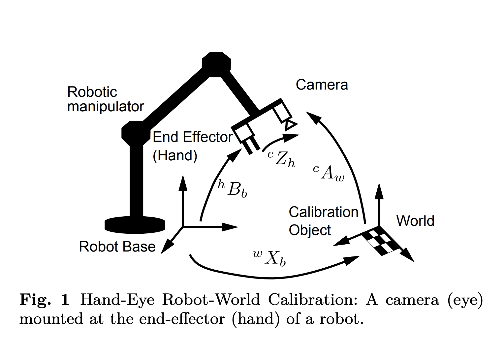
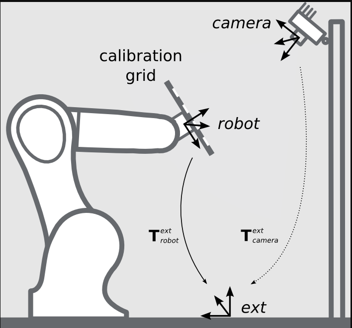

Introduction
========================

In a robot bin picking operation, a camera is used to capture an image from the workspace. Then, using one of the mod_finder, shape_finder or DL nodes (Deep Learning),
a 2D pixel location is determined as the picking position which the robot TCP has to reach to perfrom a specific operation like object picking. However, the question is how 
could we take a 2D pixel location into 3D robot base coordinates. For this purpose, we need a transformation tree or chain of transformations to convert a pixel location in 2D 
image coordiantes to 3D robot base corrdinates. To understand this better, lets first take a look at possible robot-camera configurations. 

Usually, robot-camera configurations can be classified into eye-to-hand and eye-in-hand configurations. In a eye-in-hand scenario, the camera is mounted on the robot arm. This is shown in the image below: 

    
|
 
In contrast, in a eye-to-hand scenario, the camera is mounted to a fixed position and its position does not change with robot arm movements. An exmaple of this configuration is shown below: 

    
|

Regardsless of the robot-camera configuration, the transformation of a detected 2D pixel location to 3D base corrdiantes can be expressed in terms of a transformation tree as below: 
2d image-> 3d cmaera corrdiantes -> 3d base cooridnates.

In other words, we need the transfomration of 2D image pixels to 3D camera coordinates and the transformation between 3D camera corrdiantes to 3D base corrdiantes to obtain the location of 2D pixels in 3D base corrdiantes. The main purpose of using calibration nodes is to find the transformation between different coordiante systems, specifically camera to base transformation. We support differnt methods for calibration and in the
following, the functionality of each of the calibration nodes is explained and a guide on how to use them is provided. 

