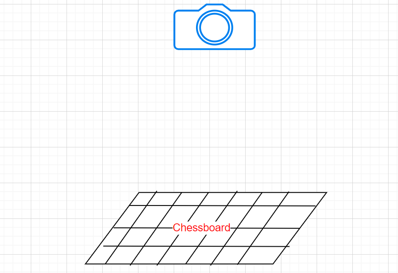
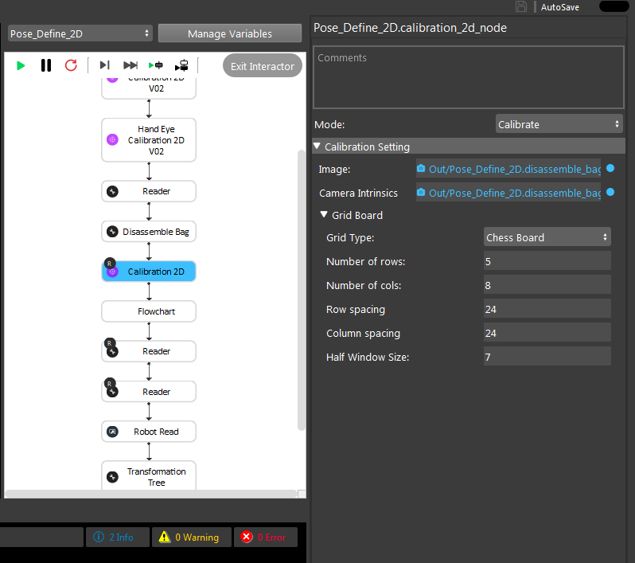
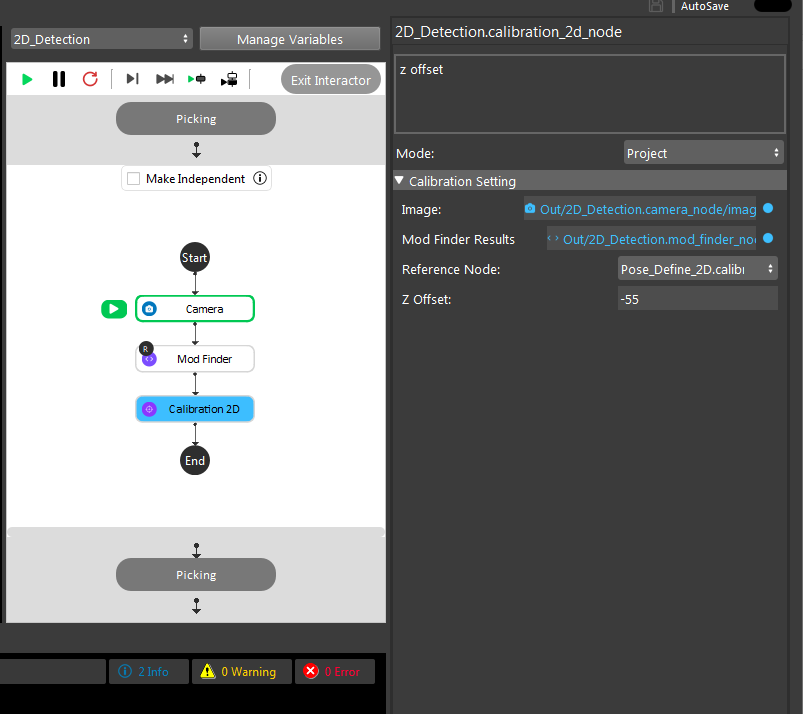

Calibration2D node
==========================

This node perfroms 2D camera calibration and finds the intrinsics and 2D transformation between the camera and the calibration board (chessboard) only using single image capture. 
Also, this node can be used in combination with the HandEyeCalibration2DV02 node in the 2D picking pipeline to peform 2D robot picking.  

Overview
------------------------

Modes 
~~~~~~~~~~~~~~~~~~~~~~~~~~~

* Calibrate : In this mode, camera-world calibration is perfromed. Note that the used camera is 2D and no point cloud is used.  
* Project : In this mode, the ouptut of the Calibrate mode is used to convert a 2D pixel location detected by a mod_finder to the 3D camera corrdinates.

Calibrate mode inputs 
---------

* Image (type:Image) : Image captured from the calibration tool (chessboard or circle grid).
* Camera intrinsics (type:CameraIntrinsics) : Camera intrinsics. This input is optional. If not set, the camera intrinsics will be obtained.  
* Grid Type (type:Int) : The used type of calibration tool. It can be either chessboard or circle grid. 
* Number of rows (type:Int) : The number of rows in the grid board. 
* Number of columns (type:Int) : The number of columns in the grid board. 
* Row spacing (type:Double) : The distance (mm) between every two square corners in a row in the chessboard or the distance between every two circles in a row in the circle grid. 
* Column spacing (type:Double) : The distance (mm) between every two square corners in a column in the chessboard or the distance between every two circles in a column in the circle grid.
* Half Window Size (type:Double) : The size of the window (mm) to detect the chessboard corners. Usually set as the half size of the column/row sapcing. Only used when the used grid type is chessboard.   

Calibrate mode outputs 
---------

context (type:SCalibration2dContext) : 2D calibration results inlcuding the camera intrinsics and the world (calibration tool) to camera 3D transformation (includes only 2D components). This would then be used in the project mode.

Project mode inputs 
---------

* Image (type:Image) : Image captured from the calibration tool (chessboard or circle grid).
* Mod Finder Results (type:MapSModResultData) : The result of the mod_finder node which includes the 2D orientation and pixel location (usually center point) of the detected model.
* Reference Node (type:String) : The reference calibration_2d node in calibrate mode which its output will be used in the project mode.  
* Z Offset (type:Double) : The distance (mm) from the detection surface to the calibration surface. For exmaple, if the detection surface is below the calibration surface for 20mm, you should input 20 and vice-versa.  

Project mode outputs 
---------

poses (type:MapVectorBPPose) : The 3D poses in camera coordinate system of the 2D pixels detected by mod_finder node.  

Procedure for Using Calibration Node
------------------------------------------

In the previous section, we provided details on the HandEyeCalibration2DV02 node which obtains transformation between the world and the robot virtual plane. However, in order to be able to perfrom the 2D picking succesfully, we need a way
to obtain the transformation between a camera and the world. This can be done using the Calibration2D node which obtains the transformation between the world (chessboard) and the camera ony using a single capture. 

|

By adding the Calibration2D node, you can see that this node operates in two modes. One is the calibrate mode which simply usues the captured image from the chessboard or circle grid to obtain the intrinsic parameters of the camera as well as the 
transformation of camera to world (gird). 

|

The other mode of the Calibration2D node is the project mode. This mode is used in the 2D picking pipeline to convert a detected 2D pixel (from a mod_finder node) into the 3D world coordiante system.   

|

Note that as the picking process is 2D and as mentioned before, the picking height is hardcoded. This vlaue can be set in the Zoffset filed of the project mode in calibration2D node ad shown above. This is the distance from the 
detection surface surface to the chessbaord surface. If the detection surface is above the calibration surface for 20mm, wou shoould enter -20 and vice-versa. 

By obtaning the transforation of a 2D pixel to 3D world corrdiantes system using the Calibration 2D node and the transfomration of world to robot plane from the HandEyeCalibration2DV02 Node, the transformation from 2D pixels to robot base can obtained which then can be used in the 2D picking pipeline. 

 
