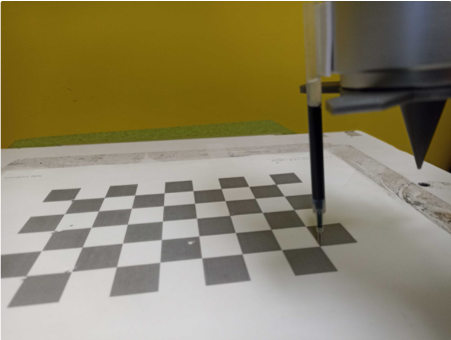

HandEyeCalibration2DV02 node
==========================

This node is used to perform robot-world 2D calibration for 2D random bin picking. In other words , it finds the 2D transformation between the world (chessboard) and a virtual robot plane.

Overview
------------------------

Modes 
~~~~~~~~~~~~~~~~~~~~~~~~~~~

* Accumulate : In this mode, the calibration node accumualtes (loads) the needed data and calibration settings to be used in the final mode for calibration computation.
* Final : In this mode, the calibration node uses the data from the accumulation mode and perfrom the acutal robot calibration.  
* Load : In this mode, the calibration node loads the ouput from the final for future use. This can help to load previous calibration results without a need to run previous modes. 

Accumulate mode inputs 
~~~~~~~~~~~~~~~~~~~~~~~~~~~

* Pose (type:Pose) : Pose collected from robot read node. 

Accumulate mode outputs 
~~~~~~~~~~~~~~~~~~~~~~~~~~~

* pointerToHandEyeCalibration2dV02 (type:HandEyeCalibration2dV02) : This output includes the inforamtion about the calibration settings alongside with the data needed for performing calibration computation in the final mode. 
* status (type:Int) : This output indicates if there were any erros during the node excecution. If the value is 0, no error has occured. However, if the value is non-zero, an error has occured during excecution and an error message will be printed in the console.

Final mode inputs 
~~~~~~~~~~~~~~~~~~~~~~~~~~~

* Reference node (type:String) : The reference calibration in accumulation mode which its output will be used to perform calibration. 
* File name (type:String) : The filename used to save the outputs of the node. The outputs will be saved in a file with the user specified name in the "pin_calibrations" folder in the workspace directory.
* Number of rows (type:Int) : Number of the rows in the used chessboard that robot bin touches. Should be a positive integer. 
* Number of cols (type:Int) : Numebr of columns in the used chessboard that the robot pin touches. Should be a positive integer.
* Row spacing (type:Double) : The distance (mm) between each pin location on the chessbiard in a row. Should be a positive double. 
* Column Spacing (type:Double) : The distance (mm) between each pin location on the chessbiard in a column. Should be a positive double. 
* Use initial guess (type:Bool): The initial guess for the translation of the pin to TCP. This will be then used as optimization initialization when perfroming calibration computation. The translation value value is zero if not set.    

Final mode outputs 
~~~~~~~~~~~~~~~~~~~~~~~~~~~

* PlaneToWorld (type:BPPose::Ptr) : The 3D transformation from the robot plane to world (chessboard). Note that as we are performing 2D calibration, this tramsformation only includes 2D compenents (x,y and Rz).  
* WorldToPlane (type:BPPose::Ptr) : The 3D transformation from world (chessboard) to robot plane. Note that as we are performing 2D calibration, this tramsformation only includes 2D compenents (x,y and Rz).
* PinToTcp (type:BPPose::Ptr) : The 3D translation from pin to robot TCP. Note that as we are performing 2D calibration, this translation only includes 2D compenents (x,y).
* pointerToHandEyeCalibration2dV02 (type:HandEyeCalibration2dV02) : This output includes the inforamtion about the calibration settings alongside with the data needed for performing calibration computation in the final mode. 
* status (type:Int) : This output indicates if there were any erros during the node excecution. If the value is 0, no error has occured. However, if the value is non-zero, an error has occured during excecution and an error message will be printed in the console.

Load mode inputs 
~~~~~~~~~~~~~~~~~~~~~~~~~~~

* File name (type:String) : The filename to load the outputs from the final mode.

Load mode outputs 
~~~~~~~~~~~~~~~~~~~~~~~~~~~

The same as the final mode.

Procedure for Using HandEyeCalibration2DV02 Node
------------------------------------------

This node is one of the nodes used to perform robot-world 2D calibration for random bin picking. More specifically, this node calculates the 2D transformation between a robot virtual plane and the world (chessboard) where it is assumed that bin picking 
is performed on a 2D plane. In other words, this type of calibration can be used in scenarios where the picking height is constant. An overview of the calibration setup is shown below. 

.. image:: Images/hand_eye_calibration_v2/calibration_overview.jpg
    :align: center
|
    
As shown above, this type of calibration requires the user to place the chessboard on the object tray. We will refer to the chessboard coordiante system as the world coordinate system in the rest of this section.
Also, a pin is attached to the robot arm and a robot virtual plane is defined using the robot pendent which should be parallel to the chessboard. Each robot type (robot brand) provides a way to define a virtual plane. Please 
refer to your robot manual for more details on how to do this.

In order to create this virtual plane, the user needs to define 3 different TCP positions. Then, the robot will automatically create a virtual plane with the Z axis directing upwards. Note that for the case of our calibration, we need to define 
the 3 TCP positions such that the pin touches the 3 corners of the chessboard on the tray.  

|

Once this virtual plane is created, We need to gather the calibration data needed. For this purpose, the robot operator needs to move the the pin to corner points in the chessboard. The choice of the number of 
chessboard points to touch is arbitrary. However, our experiment with 12 points and using a row and column spacing of 2 squares is shown to give us a good and stable result. 
To better undertand this,  as shown in the image below, the robot operator has to giude the robot to touch (nearly touch) the corner points of the chessboard in a zig zag pattern. Note that the distance between every two pin points in a 
row is called the row spacing value and the distance between every two pin points in a column is called the column spacing value (2 squares in this image). When touching the chessboard with the pin, the TCP value in the plane should have a Z value of 
near zero. Also, make sure the Rx and Ry values should be set to zero. Finally, use a variety of random rotation values for the Rz at each pin point on the chessboard to ensure a good calibration result. Once the robot pose (TCP in plane) for each pin position is 
collected, the user needs to save them for further use of the HandEyeCalibration2DV02 node. (Please refer to 2D picking flowchart template). 

Now that the data has been collceted, the HandEyeCalibration2DV02 node can be used to perfrom robot plane- world calibration. As mentioned before, the goal of this node is to find the 2D transformation between the robot plane and the world (chessboard).
When adding the HandEyeCalibration2DV02 node, you will see that this node has three modes. The first mode is the accumulation mode which is used to load the calibration data (robot poses) needed for the calibtaiton calculation.
    
.. image:: Images/hand_eye_calibration_v2/H2D_accumulate.jpg
    :align: center
|

After accumualtion, the next step is to perfrom the calibration computation and find the needed transformations. This is done using the final mode of HandEyeCalibration2DV02 node.  

.. image:: Images/hand_eye_calibration_v2/H2D_final.jpg
    :align: center
|

The output of the final mode is the 2D transfomation of plane to world and world to plane alongside with the 2D translation of pin to TCP (saved in a 3D transformation format only including 2D components). 
The inputs of the node in the final mode inlcude the refernce node which is the reference accumualtion node. Also, the user has to specifiy the number of used row and columns for the pin points and 
distance between these points in each row and column (row spacing and column spacing). Also, the user can specifiy an intital value for the translation of pin to TCP which is then used as an initialization for the optimization peformed 
for claibration. Finally, the filename is the name of the file that the calibration results will be saved into. This then can be used to use the load mode to load the results later on without a need for performing the previous steps again as shown in the image below. 

.. image:: Images/hand_eye_calibration_v2/H2D_load.jpg
    :align: center
|