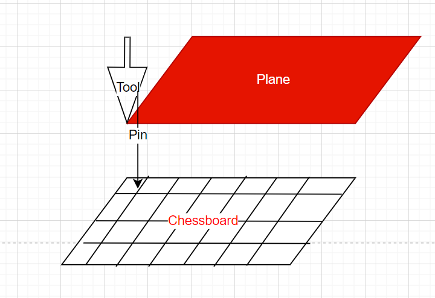
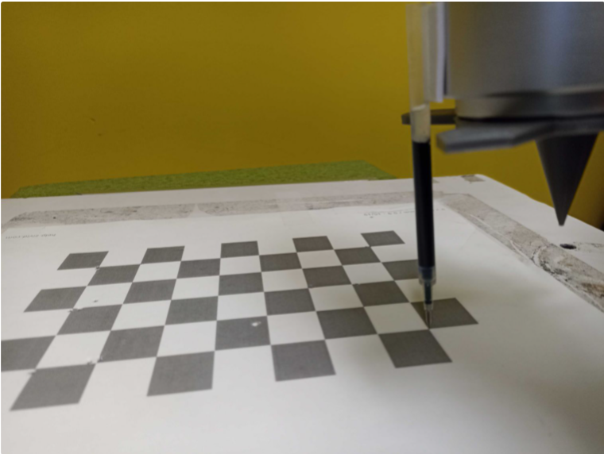
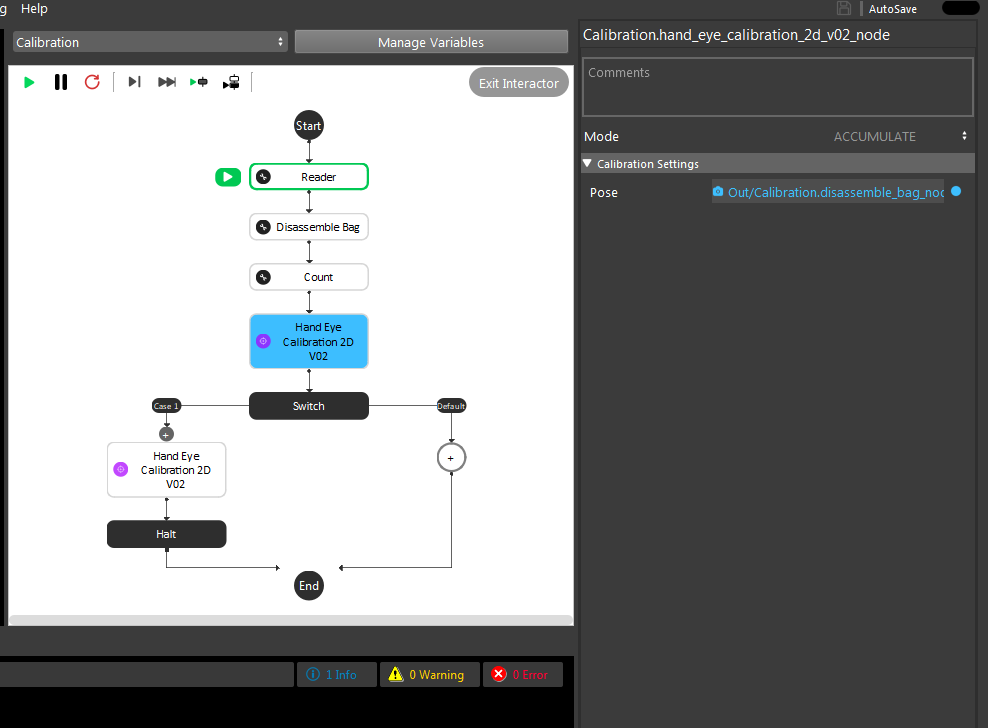
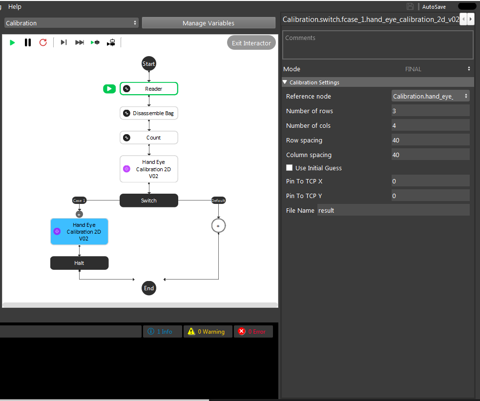
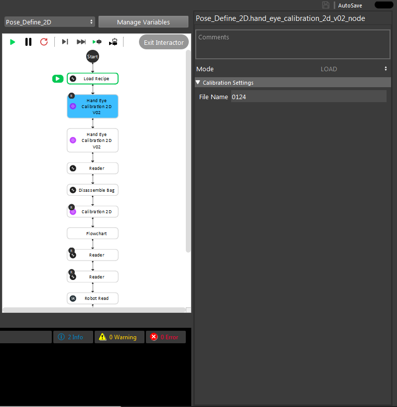

Procedure for Using HandEyeCalibration2DV02 Node
=================================================

This node is one of the nodes used to perform robot-world 2D calibration for random bin picking. More specifically, this node calculates the 2D transformation between a robot virtual plane and the world (chessboard) where it is assumed that bin picking 
is performed on a 2D plane. In other words, this type of calibration can be used in scenarios where the picking height is constant. An overview of the calibration setup is shown below. 

|
    
As shown above, this type of calibration requires the user to place the chessboard on the object tray. We will refer to the chessboard coordiante system as the world coordinate system in the rest of this section.
Also, a pin is attached to the robot arm and a robot virtual plane is defined using the robot pendent which should be parallel to the chessboard. Each robot type (robot brand) provides a way to define a virtual plane. Please 
refer to your robot manual for more details on how to do this.

In order to create this virtual plane, the user needs to define 3 different TCP positions. Then, the robot will automatically create a virtual plane with the Z axis directing upwards. Note that for the case of our calibration, we need to define 
the 3 TCP positions such that the pin touches the 3 corners of the chessboard on the tray.  

|

Once this virtual plane is created, We need to gather the calibration data needed. For this purpose, the robot operator needs to move the the pin to corner points in the chessboard. The choice of the number of 
chessboard points to touch is arbitrary. However, our experiment with 12 points (3 rows and 4 columns) and using a row and column spacing of 2 squares is shown to give us a good and stable result. 
To better undertand this,  as shown in the image below, the robot operator has to giude the robot to touch (nearly touch) the corner points of the chessboard in a zig zag pattern. Note that the distance between every two pin points in a 
row is called the row spacing value and the distance between every two pin points in a column is called the column spacing value (2 squares in this image). When touching the chessboard with the pin, the TCP value in the plane should have a Z value of 
near zero. Also, make sure the Rx and Ry values should be set to zero. Finally, use a variety of random rotation values for the Rz at each pin point on the chessboard to ensure a good calibration result. Once the robot pose (TCP in plane) for each pin position is 
collected, the user needs to save them for further use of the HandEyeCalibration2DV02 node. (Please refer to 2D picking flowchart template). 

Now that the data has been collceted, the HandEyeCalibration2DV02 node can be used to perfrom robot plane- world calibration. As mentioned before, the goal of this node is to find the 2D transformation between the robot plane and the world (chessboard).
When adding the HandEyeCalibration2DV02 node, you will see that this node has three modes. The first mode is the accumulation mode which is used to load the calibration data (robot poses) needed for the calibtaiton calculation.
    

|

After accumualtion, the next step is to perfrom the calibration computation and find the needed transformations. This is done using the final mode of HandEyeCalibration2DV02 node.  

|

The output of the final mode is the 2D transfomation of plane to world and world to plane alongside with the 2D translation of pin to TCP (saved in a 3D transformation format only including 2D components). 
The inputs of the node in the final mode inlcude the refernce node which is the reference accumualtion node. Also, the user has to specifiy the number of used row and columns for the pin points and 
distance between these points in each row and column (row spacing and column spacing). Also, the user can specifiy an intital value for the translation of pin to TCP which is then used as an initialization for the optimization peformed 
for calibration. Finally, the filename is the name of the file that the calibration results will be saved into. This then can be used to use the load mode to load the results later on without a need for performing the previous steps again as shown in the image below. 

|