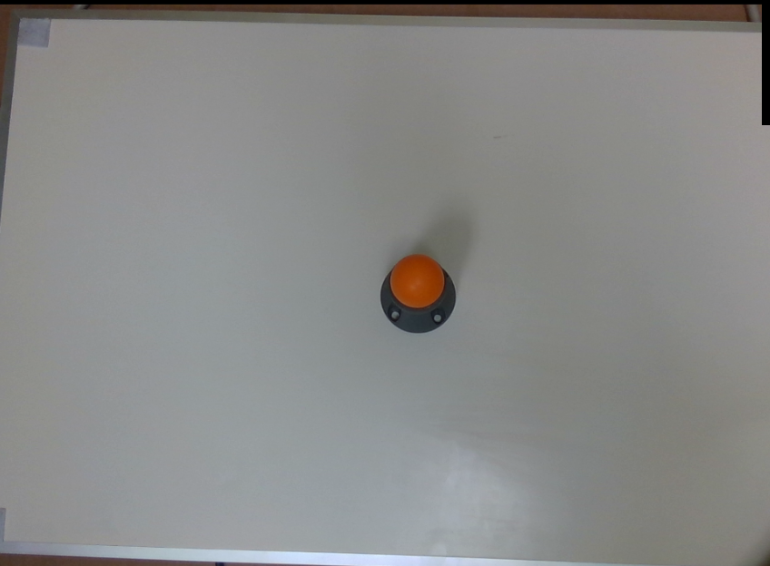

Sphere Calibration node
~~~~~~~~~~~~~~

This node perfrorms 3D robot calibration using a sphere as the calibration tool. This node can be run in three different modes.  

Overview
------------------------

Modes 
~~~~~~~~~~~~~~~~~~~~~~~~~~~

* Accumulate : In this mode, the calibration node accumualtes (loads) the needed data and calibration settings to be used in the final mode for calibration computation.
* Final : In this mode, the calibration node uses the data from the accumulation mode and perfrom the acutal robot calibration.  
* Load : In this mode, the calibration node loads the ouput from the final for future use. This can help to load previous calibration results without a need to run previous modes. 

Accumulate mode inputs 
~~~~~~~~~~~~~~~~~~~~~~~~~~~

* Hand Eye Confg (type:Pose) : Robot camera configuration. Either eye-to-hand (sphere mounted on robot arm) or eye-in-hand (camera mounted on robot).
* Robot Pose (type:Pose) : Robot pose (TCP in base).  
* Sphere Pose (type:Pose) : Pose of detected spheres.
* Use Intitial guess (type:Bool) : An option to set the initial value for the translation of gripper to camera (eye-in-hand) or the translation of sphere in gripper (eye-to-hand).

Accumulate mode outputs 
~~~~~~~~~~~~~~~~~~~~~~~~~~~

* pointerToSphereCalibration (type:SphereCalibration) : This output includes the inforamtion about the calibration settings alongside with the data needed for performing calibration computation in the final mode. 
* status (type:Int) : This output indicates if there were any erros during the node excecution. If the value is 0, no error has occured. However, if the value is non-zero, an error has occured during excecution and an error message will be printed in the console.

Final mode inputs 
~~~~~~~~~~~~~~~~~~~~~~~~~~~

* Reference node (type:String) : The reference calibration node in accumulation mode which its output will be used to perform calibration. 
* File name (type:String) : The filename used to save the outputs of the node in. This file is saved in the folder 'sphere_calibrations' in the workspace folder.

Final mode outputs 
~~~~~~~~~~~~~~~~~~~~~~~~~~~

* gripper_in_cam (type:Pose) : The 3D transformation from the gripper (TCP) to camera. Only has value in eye-in-hand situaltions.
* cam_in_gripper (type:PPose) : The 3D transformation from the camera to gripper (TCP). Only has value in eye-in-hand situaltions. 
* sphere_in_base (type:PPose) : The 3D translation from sphere to robot base. Only has value in eye-in-hand situaltions. 
* base_in_cam (type:Pose) : The 3D transformation from robot base to camera . Only has value in eye-to-hand situaltions. 
* cam_in_base (type:PPose) : The 3D transformation from camera to robot base. Only has value in eye-to-hand situaltions.
* sphere_in_gripper (type:Pose) : The 3D transformation from sphere to the gripper (TCP). Only has value in eye-to-hand situaltions. 
* pointerToSphereCalibration (type:SphereCalibration) : This output includes the inforamtion about the calibration settings alongside with the data needed for performing calibration computation in the final mode. 
* status (type:Int) : This output indicates if there were any erros during the node excecution. If the value is 0, no error has occured. However, if the value is non-zero, an error has occured during excecution and an error message will be printed in the console.

Load mode inputs 
~~~~~~~~~~~~~~~~~~~~~~~~~~~

* File name (type:String) : The filename to load the outputs from the final mode.

Load mode outputs 
~~~~~~~~~~~~~~~~~~~~~~~~~~~

Same as the final mode. 

Procedure for Using Sphere Calibration Node
------------------------------------------

The functionality of sphere calibraton node is very similar to calibration node. The main difference lies in the used calibration tool and optimization method used for calibration. An exmaple of the used sphere tool is shown below (orange sphere). This 
sphere can either be mounted to the robot arm (eye-in-hand) or could have a static position (eye-to-hand). Again same as the calibration node, the user first needs to capture differnt 3D images from the calibration tool. Note that for each robot and sphere position, the robot pose and the 2D and 3D image of the scene should be captured. The next step is to detect the spheres in each capture to obataion the 
sphere poses ine ecah capture. For this please refer to the sphere calibration flowchart template. 

    
|

Once you have captured calibrartion images and detected the sphere poses, you can add the sphere calibration node into the flowchart to perfrom calibration. 
When adding this node to the flowchart, you will see the option for choosing the calibration mode. We provide three modes for the sphere calibration node.
First, the accumulation mode is used to load the calculated sphere poses and robot poses for each robot position. When you choose the accumulation mode, you will be able to set differnt options and inputs. 

 .. image:: Images/sphere_calibration_node/accumulate.jpg
    :align: center
    
| 

As shown in the image above, the user has to choose the hand-eye configuration. Also, the other inputs include the robot pose, sphere pose (position of sphere center point in the point cloud).  In the sphere calibration case, the transformations to be obtained are the 3D transformation of TCP to camera and the translation of sphere to base for eye-in-hand scenarios. This 
would be the 3D transformation of base to camera and the translation of sphere to TCP in the eye-to-hand case. Also, there is an option to set initial value for the 
translation of TCP to camera (eye-in-hand) and sphere to gripper (eye-to-hand). This is then used as an initialization for the optimization. The default value for this case is zero translation.      
 
After accumulation, the next step is to perform robot-camera calibration. This can be done by adding another sphere calibraion node in the flowchart and setting the mode to final mode. The final mode will perfrom the main computation for the calibration.

 .. image:: Images/sphere_calibration_node/final.jpg
    :align: center
    
|

In the final mode, the user has to specify the reference accumulation node, so, the results then can be used for calibration. Also, the user has to determine a file name where the calibration results (obtained transformations) will be saved in.
By running
the calibration node in the final mode, the calibration results will be obtained. More specifically the outputs of the final mode are the gripper to camera, camera to gripper 3D transformations and sphere to base translation for the eye-in-hand scenario. 
This will be base to camera and camera to base 3D transfromations and the translation of sphere to gripper for the eye-to-hand scenario. These transformations then can 
be used in the picking flowchart for differnt robot operations. 

Another existing mode for sphere calibration mode is the load mode which simply loads the result file saved in the final mode. This can be used to load the calibration results without a need to run the previous nodes. 

 .. image:: Images/sphere_calibration_node/load.jpg
    :align: center
    
|
