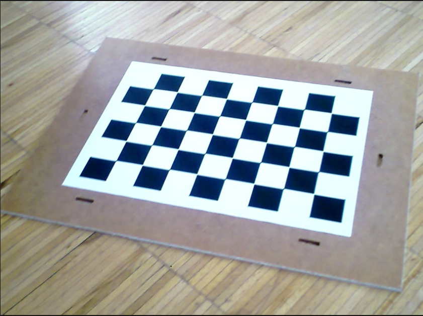
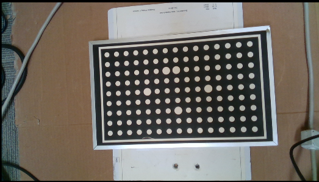

Procedure of Using DA Calibration Node
==========================================

In order to perfrom calibration using this node, we need to capture camera images of the calibration tool from different views. The calibration tools that can be used in this node are grid circles and gird chessboards that examples of each are shown below. 

    
|

    
|
 
Note that the captured images should contain a variety of images with differnt position and rotation angles to ensure a good calibration result. Once you have captured calibrartion images, you can add the calibration node into the flowchart to perfrom calibration. (Templates provided in the software)
When adding this node to the flowchart, you will see the option for choosing the calibration mode. We provide three modes for the calibration node.
First, the accumulation mode is used to load the captured images, poses and point clouds from the calibration board and detect the corner points (chessboard) or circle center points (circle borad). When you choose the accumulation mode, you will be able to set differnt options and inputs. 

 .. image:: images/DA_calibration/accumulate.png
    :align: center
    
| 

 .. image:: images/DA_calibration/detected_corners.png
    :align: center
    
|

As shown in the above image, the user has to choose the hand-eye configuration. Also, the other inputs include the captured image, robot pose (base in gripper) for each robot position. In addition, the user has to choose the used grid board type (calibration tool). Note that you can see the result of the 
acculumation node (detected points) by clicking on the node. In case the algorithm is not able to detect the corner/circle points, the image will be skipped and not used for final calibration. 

After obtaining the corner/circle points, it is time to use the results and inputs from the accumulation mode to perform robot-camera calibration. This can be done by adding another calibraion node in the flowchart and setting the mode to the final mode. The final mode will perfrom the main computation for the calibration.

 .. image:: images/DA_calibration/final.png
    :align: center
    
|

In the final node, the user has to specify the reference accumulation node, so, the results then can be used for calibration. Also, as the calibration algorithm will use an optimization based method to obtain the calibration results, 
the user needs to choose the used cost function. In case of using a 3D camera and 3D picking, it is a better option to use the RPDepth cost function as our experiments show better results for this cost function. However, note that when using RPDepth, you will need to set the option "using the point cloud" in the accumulation mode. By running
the calibration node in the final mode, the calibration results will be obtained. More specifically, the main outputs of the final mode are the camera to gripper and base to board 3D transformations in the eye-in-hand scenario. This will be camera to base and gripper to board 3D transfromations in the eye-to-hand scenario. These transformations then can 
be used in the picking flowchart for differnt robot picking operations.

Another existing mode for calibration mode is the load mode which simply loads the result file saved in the final mode. This can be used to visualize the result of the calibration without a need to run the previous nodes. 

 .. image:: images/DA_calibration/load.png
    :align: center
    