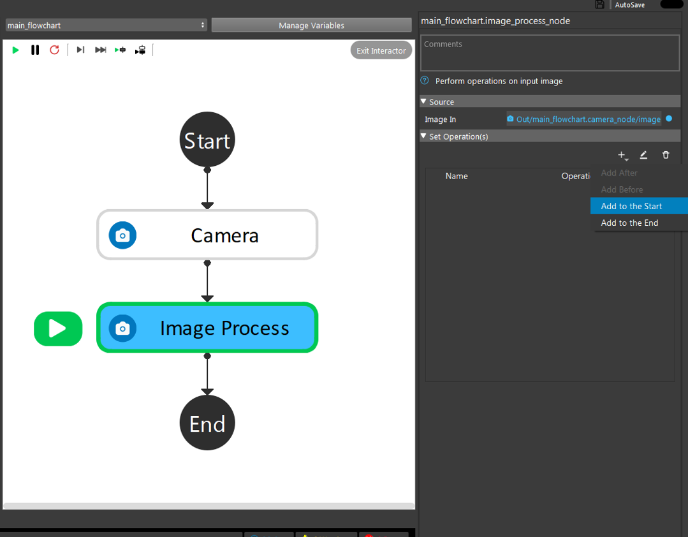
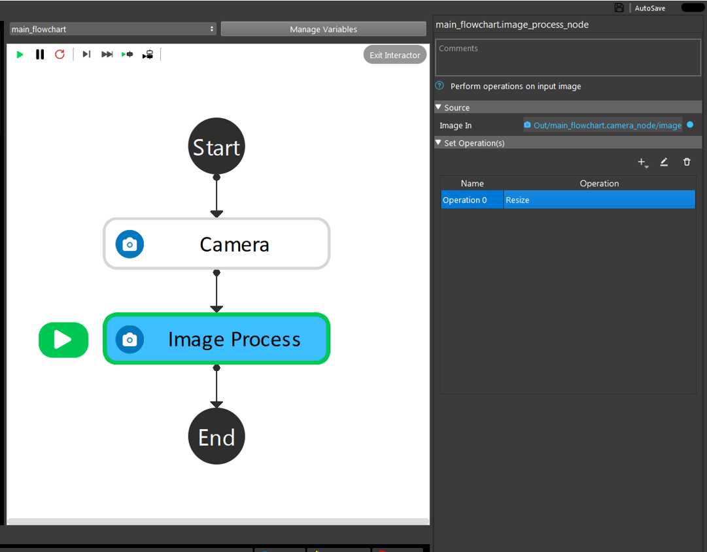
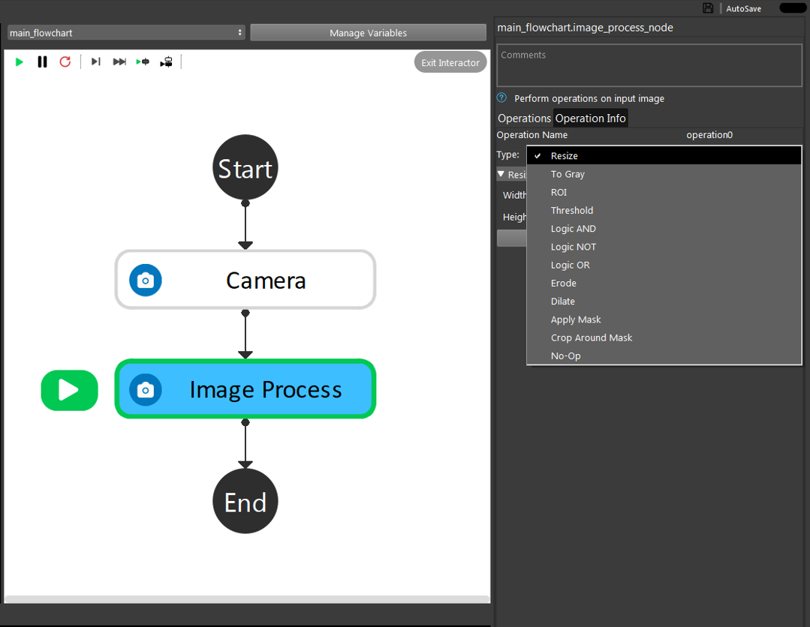

Image Process Node
========================

Image processing node gives you the ability to perform several image processing operations on input images. The input of
this node is an image which is usually linked to the reader or the camera node. An example of an input image and linking the input is shown below. 

.. image:: Images/img1.png
    :align: center
    
|

    
|

In order to choose an opertation or a set of operations, the user can choose the plus sign under the 'Set Operations' section. 

    
|

By clicking the add buttion, an operation will be added to the operation list. By default, this operation will be a "Resize" operation. In order to change the chosen operation, click on the added opration. Then, as shown below, you will 
be able to see a set of operations to choose from. 

    
|

    
|

Note that base on your needs, you can choose as many as operations you want to be performed by order on the input image. In the next section, each of the availble operations are explained with examples. 

