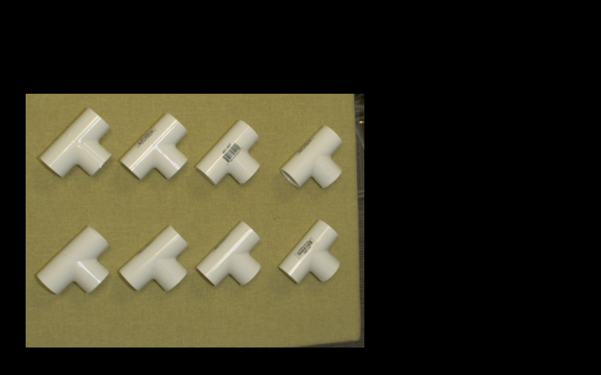
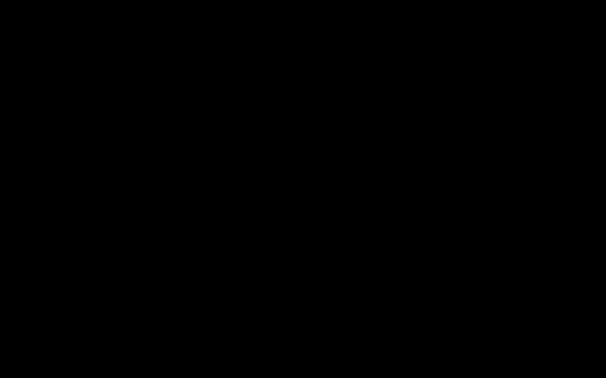

Image Processing Operations
========================

Resize
~~~~~~~~~~~~~~
This operation resizes the input into a user specified size.

To Gray
~~~~~~~~~~~~~~
This operation converts the input image into a gray scale image. 
    
ROI
~~~~~~~~~~~~~~
Using this operation, you can define a Region Of Interest (ROI) in the input image and crop it out as the output. Examples of the input and output image using this operation is shown below.

    
|

    
|

Threshold
~~~~~~~~~~~~~~
This operation, performs a global thresholding (binarization) on the input image based on the user specified threshold value.

.. image:: Images/threshold/in.png
    :align: center
    
|

.. image:: Images/threshold/out.png
    :align: center
    
|

Logic AND
~~~~~~~~~~~~~~
This operation performs logic AND operation between the input image and user specified mask. Example of the input image, input mask and output using this operation is shown below.

.. image:: Images/logic_and/in.png
    :align: center
    
|

    
|

    
|

Logic NOT
~~~~~~~~~~~~~~
This operation performs logic NOT operation on the input image. Example of the input image and output using this operation is shown below.

.. image:: Images/logic_not/in.png
    :align: center
    
|

.. image:: Images/logic_not/out.png
    :align: center
    
|

Logic OR
~~~~~~~~~~~~~~
This operation performs logic OR operation between the input image and user specified mask. Example of the input image, input mask and output using this operation is shown below.

.. image:: Images/logic_or/in.png
    :align: center
    
|

.. image:: Images/logic_or/in1.png
    :align: center
    
|

    
|

Erode
~~~~~~~~~~~~~~
This operation performs erosion operation on the input image using the user specified parameters (number of erosion iterations and used kernel size). Example of the input image and output using this operation is shown below.

.. image:: Images/erode/in_erode.png
    :align: center
    
|

    
|

Dilate
~~~~~~~~~~~~~~
This operation performs erosion operation on the input image using the user specified parameters (number of erosion iterations and used kernel size). Example of the input image and output using this operation is shown below.

    
|

    
|

Apply mask
~~~~~~~~~~~~~~
This operation applies a mask to the input image. The mask input can be linked to a node which produces a mask, or by reading in a mask image using a Reader/Camera node.

Crop Around Mask
~~~~~~~~~~~~~~
This operation crops the image around a mask with size of the user’s specifications in pixels. This operation was added to produce cropped images which can then be fed into DL models. 

No-Op
~~~~~~~~~~~~~~
This option ouptus the same image as the input image.

    