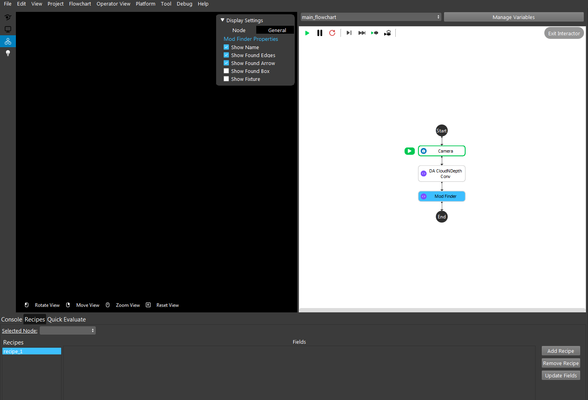
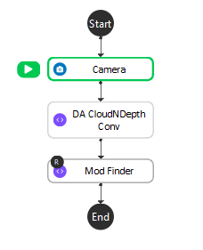
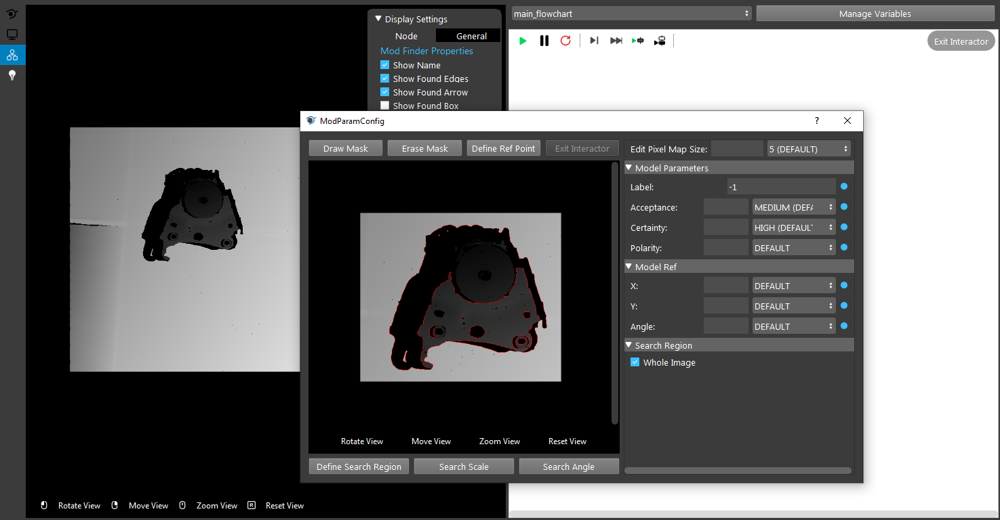

Recipe and Recipe nodes
========================

This section contains basic introduction about the concept of the recipe and how to use the 
recipe nodes.

What are Recipes
-------------------

Recipes add a way to easily switch between different IN and OUT (only for definition nodes) values for nodes easily. 
A recipe can contain many different nodes and can be used to quickly switch between workspace-wide configurations, enabling fast and convenient adjustments based on use case. 
The purpose of the recipes are to minimize the effort required by field operator, to a point where total automation is possible,
once they are correctly configured. 
For example, a user can define differnt model to search in different recipes. Then, by switch recipe, the user can quickly change what model to search
without re-doing the configuration.

Processing Nodes Vs Definition Nodes
--------------------------------------

Processing nodes are nodes that doesn't require re-configuration in field. For example, camera nodes. Due to such reason these nodes are not able to store configuration in recipe
Definition Nodes, on the other hand, are nodes that may have changing configuration in field application, or their configuration requires user interaction (such as adjust 
bounding box filtering in cloud process node). These nodes are able to store information in the recipe.

Complete List of Definition Nodes
~~~~~~~~~~~~~~~~~~~~~~~~~~~~~~~~~~~~

* Mesh Process
* Calibration
* Mod Finder 
* Sphere Calibration
* Reader
* Hand Eye Calibration 2d
* Hand Eye Calibration 2d V2
* Calibration 2d
* DA Calibration
* Gripper
* Assemble possible
* DL segmentation
* DL classification
* Object Finder 3d

An Exmaple on How to Use the Recipe Feature
--------------------------------------------

We use this simple workspace to illustrate how we can use recipe. In this workspace, camera node captures a point cloud, then the point cloud is converted 
to a depth image, based on this depth image mod finder finds the 3d locations of defined objects in the camera scene. By default, we have only 1 recipe, and no
nodes store info in recipe now.

Add/Remove Recipe, Add Node to Recipe
~~~~~~~~~~~~~~~~~~~~~~~~~~~~~~~~~~~~~~

From the recipe panel on the bottom of the mainwindow you can add and remove recipe. To tell a node to store its information in recipes, right click on the node
and select "Add Node To Recipe". Once that's successful, you will see a small R icon on the top left of the node.

Switch Recipes
~~~~~~~~~~~~~~~~~~~~~~~~

Now we have two recipes are we want to define a model for mod finder node for each recipe. In recipe 1,
We run the flow chart from the start to mod finder node, and define a model 

Double click recipe_2 in the recipe panel to switch to recipe_2, re-run the process to define another model

