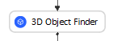
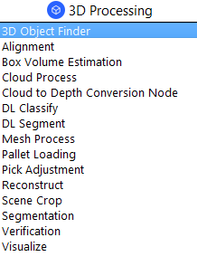
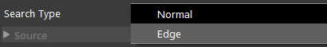
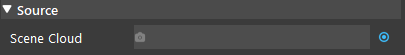
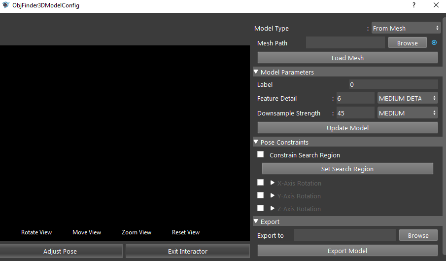
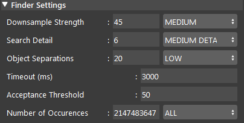
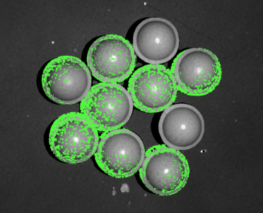
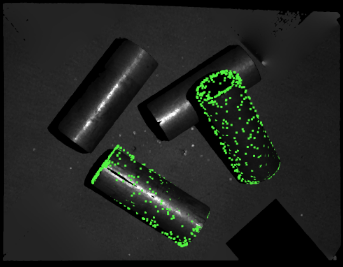
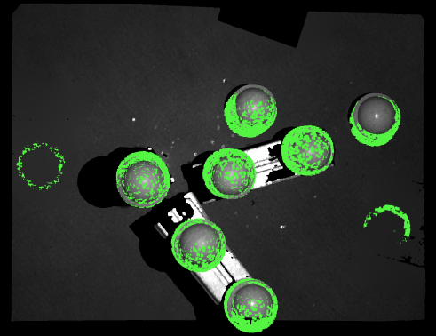
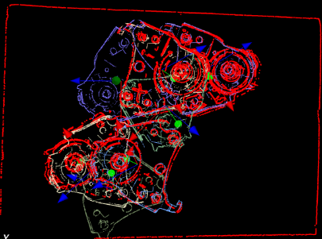

3D Object Finder Node
==========================

Overview
-----------

The 3D Object Node is used to find the 3D locations of an object using point cloud features related algorithms.
At the creation of the node, users need to select which type of point cloud features to use (normal or edge mode).

.. image:: Images/3d_obj_finder/3d_object_finder_overview_2.png
   :align: center





Input and Output
----------------------

+-------------------------+-------------------+------------------------------------------------------------------------+
| Input                   | Type              | Description                                                            |
+=========================+===================+========================================================================+
| Search Type             | Int32             | Select from one of Normal and Edge search type.                        |
+-------------------------+-------------------+------------------------------------------------------------------------+
| Scene Cloud             | Cloud             | A vector of point clouds to find objects within.                       |
+-------------------------+-------------------+------------------------------------------------------------------------+

+-------------------------+-------------------+------------------------------------------------------------------------------------------------+
| Output                  | Type              | Description                                                                                    |
+=========================+===================+================================================================================================+
| cloudModel              | Cloud             | The cloud of the active model used for searching.                                              |
+-------------------------+-------------------+------------------------------------------------------------------------------------------------+
| edgesModel              | Cloud             | The edge of the active model used for searching. Available in Edge mode.                       |
+-------------------------+-------------------+------------------------------------------------------------------------------------------------+
| meshModel               | Mesh              | The mesh of the active model used for searching. Available only for model defined by mesh.     |
+-------------------------+-------------------+------------------------------------------------------------------------------------------------+
| resultPoses             | vector<Pose>      | A list of poses representing the result of search.                                             |
+-------------------------+-------------------+------------------------------------------------------------------------------------------------+
| success                 | bool              | Indicates whether the search is successful (found at least one position).                      | 
+-------------------------+-------------------+------------------------------------------------------------------------------------------------+

|

Node Settings
--------------

Search Type
`````````````


Select a search type from one of Normal and Edge.

For the Edge search type, the scene cloud needs to be to pre-processed to contain normals.
This is because after edge extraction is performed on point cloud, it will be very hard to compute its normals, which are used in searching. 
This can be done using Cloud Process node's "Normal" operation.

Source
`````````


Scene Cloud
   A vector of point clouds to find objects within.

|

Models
`````````



There are two ways to define a model, "From Mesh" and "From Scene".

"From Mesh":
   1. Select "From Mesh" model type.
   2. Click browse to select the mesh file for the model.
   3. Click "Load Mesh" to Load the model.

"From Scene":
   1. Select "From Scene" model type.
   2. Click "Define Model".
   3. Use the bounding box to define the model from the source Scene Cloud.
   4. Click "Exit Interactor" to finish defining the model.

Model Parameters
`````````````````

- Label (Default: 0)
   The label for this model.

- Feature Detail (Default: MEDIUM DETAIL)
   Controls the amount of model features calculated.

- Downsample Strength (Default: MEDIUM)
   Controls the strength of the downsample filter applied to the model.


Pose Constraints
`````````````````
- Constraint Search Region (Default: false)
   Controls whether to use the user-defined search region.

- X-Axis/Y-Axis/Z-Axis rotation (Default: false)
   Controls whether to enable X/Y/Z axis rotation constraints when searching for object poses.

- Min. angle (Default: -180)
   Minimum rotation angle about the X/Y/Z axis when searching for object poses.

- Max. angle (Default: 180)
   Maximum rotation angle about the X/Y/Z axis when searching for object poses.

Export
````````
- Export to
   The path used when exporting the model as a .ply or .pcd file, depending on how the model is defined. The file type will be .ply for "From Mesh" and .pcd for "From Scene".

|

Finder Settings
`````````````````



- Downsample Strength (Default: MEDIUM)
   Controls the strength of the downsample filter applied to the scene.

- Search Detail (Default: MEDIUM DETAIL)
   Controls the quality of the search. Larger values mean more thorough search.

- Object Separations (Default: LOW)
   Controls expected distance between target objects. Larger values mean more separation expected between objects.

- Timeout (Default: 3000 ms)
   Timeout in milliseconds. The search stops when exceed the timeout value.

- Acceptance Threshold (Range: [0,inf]; Default: 50)
   Controls the threshold used when filtering possible poses.

|

Edge Settings (available in Edge search type)
```````````````````````````````````````````````

- NAN Edges filter (Default: true)
   When enabled, extract edges based on borders of invalid point cloud regions.

- RGB/Depth Smoothness (Range: [0,100]; Default: NONE)
   Edge smoothness (denoising strength). Larger values provide stronger noise reduction.

- Occluding (Range: [1,100]; Default: MEDIUM DETAIL)
   The occluding edge detail level. Larger values provide more edges.

- Depth Edges (Range: [1,100]; Default: MEDIUM DETAIL)
   The Depth detail level. Larger values provide more edges.

- RGB Edges (Range: [1,100]; Default: MEDIUM DETAIL)
   The RGB detail level. Larger values provide more edges.

|

Procedure to Use
------------------

`Here <https://daoairoboticsinc-my.sharepoint.com/:u:/g/personal/xchen_daoai_com/ETxcvbNzx4lEujEFmOq-bFYBYDY-PNAbbzlmg-MPjDajiQ?e=jdBuBc>`_ are the files used in this section. We will demonstrate the Edge search type here, so we will need a Cloud Process node.

1. Insert Camera, Cloud Process, and 3D Object Finder.
    .. image:: Images/3d_obj_finder/3d_object_finder_procedure_1_1.png
       :scale: 80%

    .. image:: Images/3d_obj_finder/3d_object_finder_procedure_1_2.png
       :scale: 60%

2. Create a virtual camera with the provided file. Please refer to :ref:`Camera Node` for more detailed instructions.
    .. image:: Images/3d_obj_finder/3d_object_finder_procedure_2.png
       :scale: 80%

3. In the Cloud Process node, link to the Camera's pointCloud output. Since the Edge search type requires pre-processed point cloud, add a "Normal" operation, and run the node. There is no visual changes for this operation.
    .. image:: Images/3d_obj_finder/3d_object_finder_procedure_3_1.png
       :scale: 60%

    .. image:: Images/3d_obj_finder/3d_object_finder_procedure_3_2.png
       :scale: 90%

    .. image:: Images/3d_obj_finder/3d_object_finder_procedure_3_3.png
       :scale: 70%

4. In the 3D Object Finder node, select the "Edge" search type.
    .. image:: Images/3d_obj_finder/3d_object_finder_procedure_4.png
       :scale: 80%

5. In the 3D Object Finder node, link Scene Cloud to Cloud Process' outputCloud.
    .. image:: Images/3d_obj_finder/3d_object_finder_procedure_5.png
       :scale: 60%

6. Click '+' to add a model. Double click "model_1" to start defining the model. Since we have the mesh file for the object, select "From Mesh". Please refer to the :ref:`Model` section on defining a mesh model.
    .. image:: Images/3d_obj_finder/3d_object_finder_procedure_6_1.png
       :scale: 80%

    .. image:: Images/3d_obj_finder/3d_object_finder_procedure_6_2.png
       :scale: 60%

7. Run the 3D Object Finder node, and you can see the result on the display.
    .. image:: Images/3d_obj_finder/3d_object_finder_procedure_7.png
       :scale: 80%

8. In the display window you can select what to display: use "Show Model" to show found occurrence of model in the scene, "Show Scene" to show the scene cloud (in edge mode this will be edge cloud extracted from the original scene cloud), "Show Downsample" to show the downsampled scene cloud.
    .. image:: Images/3d_obj_finder/3d_object_finder_procedure_8.png
       :scale: 100%

|

Exercise
------------------
Please select the correct option for the following questions.

1. You noticed 3D Object Finder failed to detect all objects. What could you do to improve the detection?





A. Increase search detail, and increase acceptance threshold.
B. Increase search detail, and decrease acceptance threshold.
C. Decrease search detail, and increase acceptance threshold.
D. Decrease search detail, and decrease acceptance threshold.

|

2. 3D Object Finder finds many false positives. Which option could improve the detection?





A. Increase downsample strength, and increase feature detail.
B. Increase downsample strength, and decrease feature detail.
C. Decrease downsample strength, and increase feature detail.
D. Decrease downsample strength, and decrease feature detail.

|
|
|
|
|
|
|
|
|
|
|
|
|
|
|

Answers for Exercise
----------------------
1. (B) Increase search detail, and decrease acceptance threshold.

* Increase the search detail. This will increase the number of computed scene features.
* Decrease acceptance threshold. This lowers the acceptance threshold of the score filter, keeping poses with lower scores

.. image:: Images/3d_obj_finder/search_detail_low.png
   :scale: 80%

.. image:: Images/3d_obj_finder/search_detail_high.png
   :scale: 76%

.. image:: Images/3d_obj_finder/acceptance_low.png
   :scale: 70%

.. image:: Images/3d_obj_finder/acceptance_high.png
   :scale: 70%

|

2. (C) Decrease downsample strength, and increase feature detail.
      
* This makes the downsample voxel size smaller, preserving more detail in the scene and remove false positives. 
* Reducing downsample strength can also improve poses that are badly oriented.
* Increasing model feature detail will increase the amount of model features calculated, making it more likely to accurately find the object in the scene.

Downsample strength low vs. medium:
   .. image:: Images/3d_obj_finder/downsample_low.png
      :scale: 80%

   .. image:: Images/3d_obj_finder/downsample_medium.png
      :scale: 80%

|

Model downsample strength low vs. medium:
   .. image:: Images/3d_obj_finder/model_downsample_low.png
      :scale: 70%

   .. image:: Images/3d_obj_finder/model_downsample_medium.png
      :scale: 71%

|

Feature detail high vs low:
   .. image:: Images/3d_obj_finder/feature_detail_high.png
      :scale: 70%

   .. image:: Images/3d_obj_finder/feature_detail_low.png
      :scale: 71%

|
