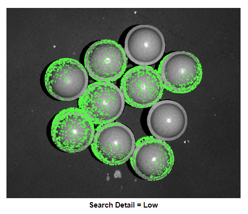
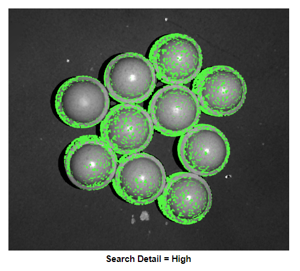
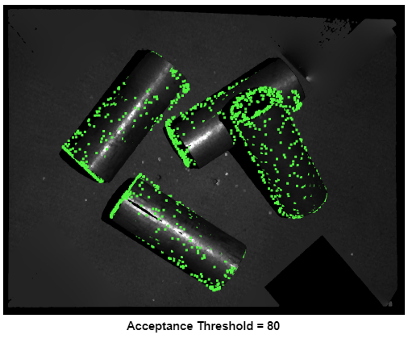
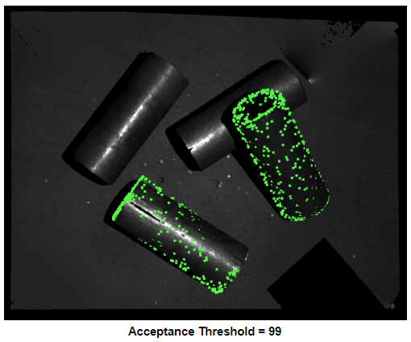
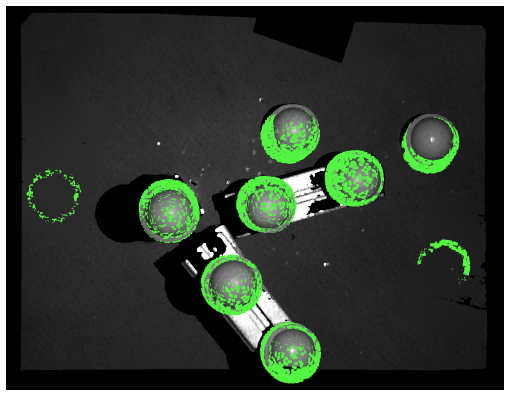
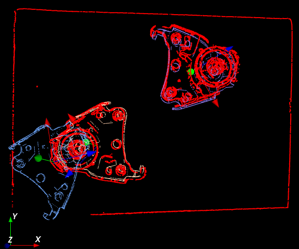
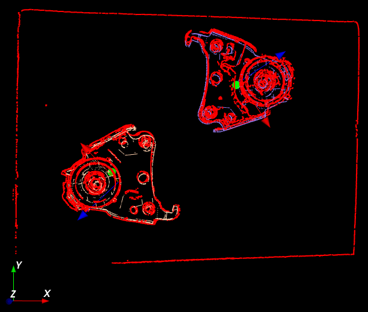
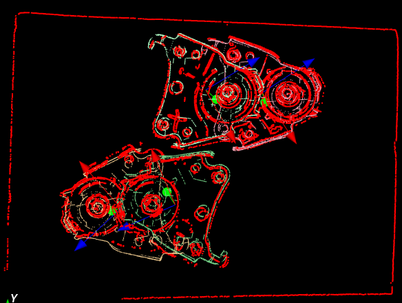
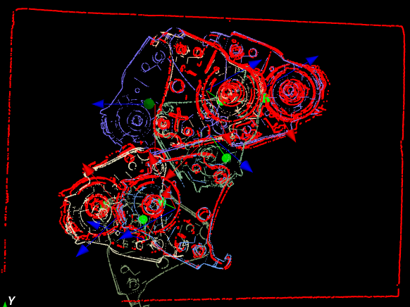

Parameter Tunning Guide
---------------------------

This guide will walk through some rules of thumb when it comes to adjusting parameters to get better detection.

Not detection all objects
~~~~~~~~~~~~~~~~~~~~~~~~~~~~~~

* Increase the search detail. This will increase the number of computed scene features
* Decrease acceptance threshold. This lowers the acceptance threshold of the score filter, keeping poses with lower scores

False positive
~~~~~~~~~~~~~~~~~~~~~~~~~~

* Reduce downsample strength. This makes the downsample voxel size smaller, preserving more detail in the scene. Reducing downsample strength can also improve poses that are badly oriented.

.. image:: Images/3d_obj_finder/downsample_low.png
   :width: 100%

downsample strength low

downsample strength medium

Model parameters
~~~~~~~~~~~~~~~~~~~~~~~~~~~~~~

* Adjust model feature detail. Increasing model feature detail will increase the amount of model features calculated, making it more likely to accurately find the object in the scene
* Adjust model downsample strength. Reducing downsample strength can remove false positives

feature detail low

feature detail high

downsample strength low

downsample strength medium