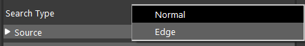
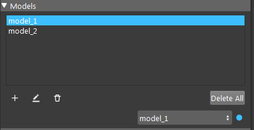
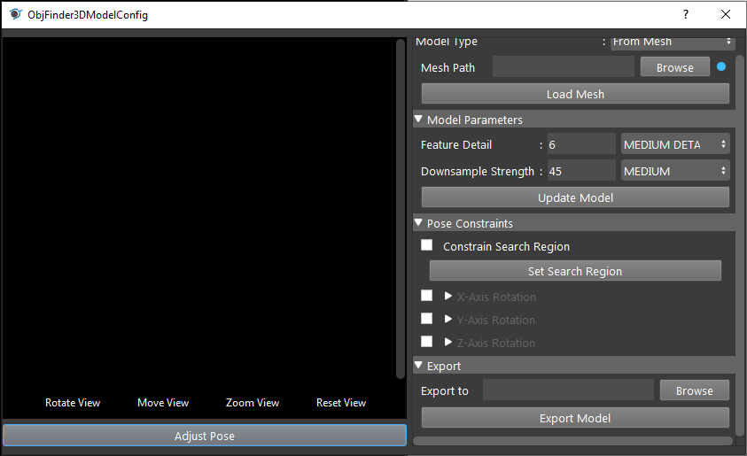
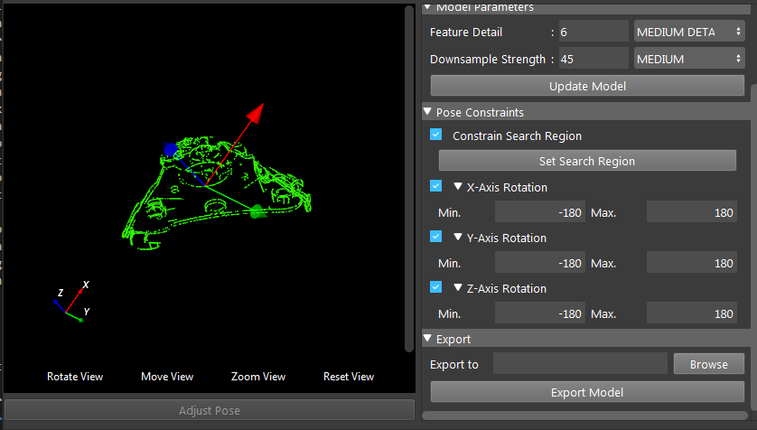
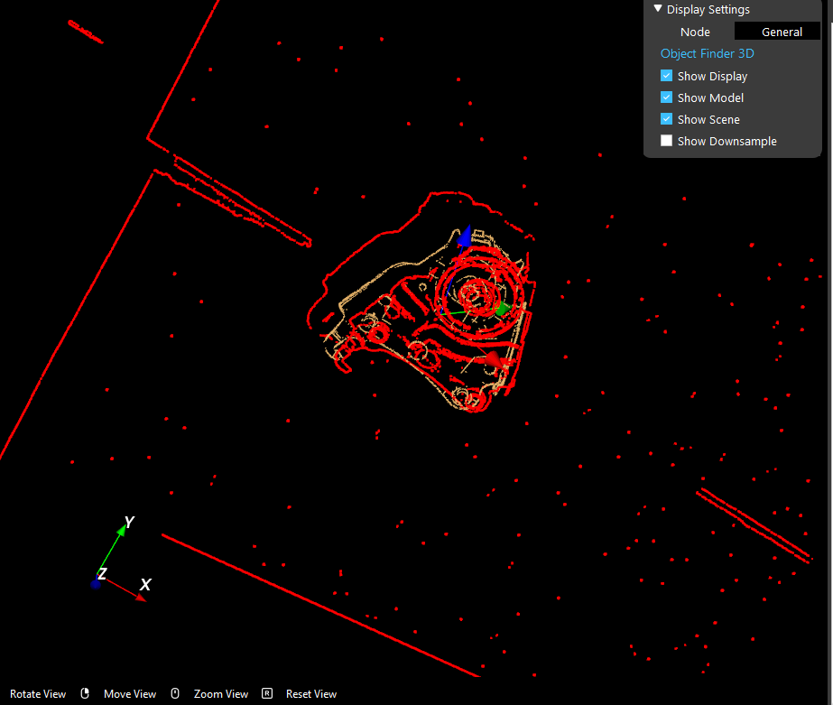

Procedure for Using 3d Object Finder Node
------------------------------------------

1. Pre-process scene point cloud (only in edge mode)
2. Define model
3. Search model
4. Use result to compute picking poses

Pre-process Point Cloud In Edge Mode
~~~~~~~~~~~~~~~~~~~~~~~~~~~~~~~~~~~~~

To get proper search result using edge point, the scene cloud must be preprocess to contain normals. This is because after edge extraction is performed on point cloud
it will be very hard to compute its normals, which are used in searching. Simply use cloud process node's normal operation to pre-process the point cloud

Before you can see the nodes detailed config, you need to set the search type of the node to be either normal or edge.

Model Creation and Processing
~~~~~~~~~~~~~~~~~~~~~~~~~~~~~~~~~~~~

Then in the model section, users are able to add/delete model, the dropdown list on the bottom shows the current active model to search. You can also double click model entry
to edit model. You will see a model config page, where you are able to see the model and ajust its parameters.

Model Parameters:

* Define type : int
   * How the model will be defined, either “from mesh” or “from scene”
* Mesh path : string
   * Mesh path used when define type is “from mesh”
* Export path : string
   * Path used when exporting the model
* Feature detail : int
   * Controls the amount of model features calculated
* Downsample strength : int
   * Controls the strength of the downsample filter applied to the model
* use search region : bool
   * Controls whether to use the user-defined search region
* constrain x-axis/y-axis/z-axis rotation : bool
   * Controls whether to enable x/y/z axis rotation constraints when searching for object poses
* min angle : double
   * Minimum rotation angle about the x/y/z axis when searching for object poses
* max angle : double
   * Maximum rotation angle about the x/y/z axis when searching for object poses

The first way to define a model is to define from a scene point cloud. In model config page, select model type to be "From scene", then click "Define Model".
Then the mainwindow display will prompt a bounding box interactor (or console will give error message if the "Scene Cloud" input is not linked or is invalid).
Use the bounding box to include the points of the model, then hit 0 or click "Exit Interactor" button to save your change. After that the processed model (with default model parameter)
will be shown in the config page.

.. image:: Images/3d_obj_finder/model_from_scene.png
   :width: 100%

The second way to define a model is to define from a polygon mesh file. In model config page, select model type to be "From Mesh", then browse the .ply file and click "Load Model".

Adjust Model Parameters
~~~~~~~~~~~~~~~~~~~~~~~~~~~~~~

After the model is defined users can adjust model perameters in the model config page. The most common adjustment of model parameters are downsample strength and search detail. Remember to
click "Update Model" if these two settings are changed.

You can define search region by checking "Constrain Search Region" and use "Set Search Region" button. This will enter the interaction mode where you need to draw a bouding box to include
the search reagion, similar to defining a model from scene.

You can also define the range of rotation of the model. Click "Adjust Pose" to enter the interaction mode where you can rotate the model around origin by click and drag on the model cloud.
This will define a base pose. Then you can speficy the X,Y,Z rotation range based on the base pose.

You can also save the model as a pcd file by using export model.

Detect Model in Scene
~~~~~~~~~~~~~~~~~~~~~~~~~~~~~

After the model is defined you can search the position of the model in scene.

Scene Matching Parameters:

* Selected model : string
   * The name of the model that will be searched for 
* Downsample strength : int
   * Controls the strength of the downsample filter applied to the scene
* Search detail : int
   * Controls the quality of the search. Larger values mean more thorough search.
* Object separation : int
   * Controls expected distance between target objects. Larger values mean more separation expected between objects.
* Timeout : double
   * Timeout in ms
* Acceptance threshold : double
   * Controls the threshold used when filtering possible poses

In the display window you can select what to display: use "Show Model" to show found occurrence of model in the scene, use
"Show Scene" to show the scene cloud (in edge mode this will be edge cloud extracted from the orginal scene cloud), use "Show Downsampled"
to show the downsampled scene cloud.

Edge Extraction (Only In Edge Mode)
~~~~~~~~~~~~~~~~~~~~~~~~~~~~~~~~~~~~~
When the search type is set to Edge, we perform edge extraction on both the model and scene 

Edge Parameters:

* Enable NaN edges : int
* Enable RGB edges : int
* Enable Occluding edges : int
* Enable Depth Edges : int
* rgb detail : int
   * The rgb edge detail level, larger values provide more edges.
* depth detail : int
   * The depth edge detail level, larger values provide more edges.
* occluding detail : int
   * The occluding edge detail level, larger values provide more edges.

After the edge extraction setting is changed, redefine the model using new edge extraction parameters.
