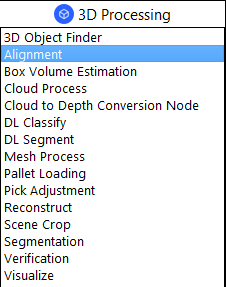
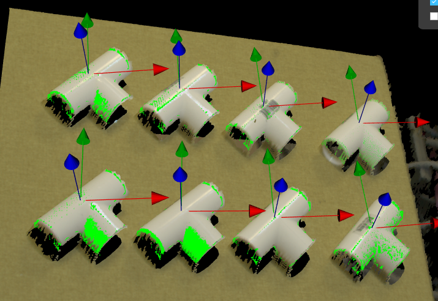
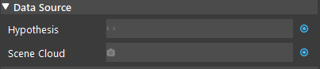
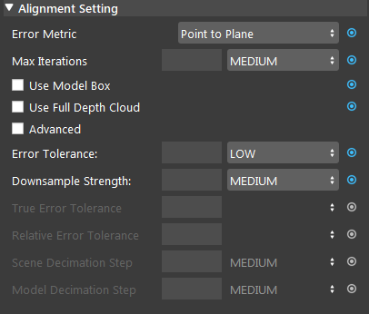

Alignment Node
==============

Overview
-----------------

The **Alignment** Node uses an iterative algorithm to refine poses for better alignment.
Given initial poses, an input model mesh is iteratively aligned toward an input scene cloud by sampling points, matching them between the model and scene,
and minimizing the error between matched points.
This node should be used when reasonably accurate poses have already been obtained, such as following after the Scene Match Node or Mod Finder Node, 
in which case these poses can be further refined.

This node should be used when reasonably accurate poses have already been obtained, 
such as following after the **Reconstruct** Node or **Mod Finder** Node, in which case these poses can be further refined.





Input and Output
-----------------

+----------------------------------------+-------------------------------+---------------------------------------------------------------------------------+
| Input                                  | Type                          | Description                                                                     |
+========================================+===============================+=================================================================================+
| Hypothesis                             | Vec<3DPoses>                  | The results of poses. Usually from Mod Finder, Reconstruct etc.                 |
+----------------------------------------+-------------------------------+---------------------------------------------------------------------------------+
| Scene Cloud                            | Point Cloud                   | The Point Cloud model from objects(Cloud Process, Virtual Camera, Reader etc.)  |
+----------------------------------------+-------------------------------+---------------------------------------------------------------------------------+

+-------------------------+-------------------+------------------------------------------------------------------------+
| Output                  | Type              | Description                                                            |
+=========================+===================+========================================================================+
| poses                   | Vec<Pose3D>       | Vector of 3D poses generated from "Hypothesis".                        |
+-------------------------+-------------------+------------------------------------------------------------------------+
| size                    | int               | Size of the vector of objects aligned.                                 |
+-------------------------+-------------------+------------------------------------------------------------------------+

Models
-----------------

.. image:: Images/alignment/alignment_node_model.png

- **Model Type**: (Default value: **From Scene**)

   Choose how to load the model, capture from scene, read from file, or link to output of another node (eg. Cloud Process node)

Model Parameters
~~~~~~~~~~~~~~~~

.. note::
   A good model should have the center of axis close to the object as in the image below.

- **Model Pose**:
   .. image:: Images/alignment/alignment_node_model_pose.png

   Specifies the object location with respect to the Hypothesis position.

Node Settings
-----------------

Data Source
~~~~~~~~~~~



- **Scene Cloud**

   The Point Cloud from scene(camera, reader etc.)

- **Hypothesis**

   The initial guess for the poses, usually obtained from Reconstruct node or 3D Mod Finder node. 

Alignment Setting
~~~~~~~~~~~~~~~~~



- **Error Metric**: (Default value: **Point-to-Plane**)
   
   **Point-to-Point** is representative of the true error, while **Point-to-Plane** is representative of error relative to orientation. The change of relative pose that gives the minimal **Point-to-Plane** error is usually solved using standard nonlinear least-squares methods, which are often very slow. Generally, it is **recommended using Point-to-Point** error metric unless the geometry and amount of overlap between the hypothesis and scene are large to use the **Point-to-Plane** metric.

- **Max Iterations**: Range [1,∞) (Default value: MEDIUM: 20)

   Maximum iteration steps. The higher the number is, the longer it would take for alignment, but the alignment quality will be better with more iteration. 

- **Use Model Box**: 

   If checked, the node will use the model point cloud's extraction box to limit the points during alignment. 

- **Use Full Depth Cloud**: 

   If checked, the node will use the full depth cloud to compute alignment, this can be helpful when the height difference between objects are large.

- **Advanced**:

   If checked, will use advanced error and decimation settings.

- **Error Tolerance**: (Range: [VERY LOW, LOW, MEDIUM, HIGH, VERY HIGH] Default value: **LOW**)

   Available if Advanced is not checked. Controls error tolerance of the alignment. Larger values mean there is more acceptable error.

- **Down Sample Strength**: Range [LOW, MEDIUM, HIGH] default: MEDIUM

   Available if Advanced is not checked. Control overall downsample intensity for the scene and model. Larger vales means stronger downsample.

- **True Error Tolerance** (Advanced): Range [1,∞) (Default value: MEDIUM)

   Controls the threshold used to stop iterating when true error is small. Larger values mean more error will be accepted.

- **Relative Error Tolerance** (Advanced): Range [1,∞) (Default value: MEDIUM)

   Controls the threshold used to stop iterating when error difference between iteration is small. Larger values mean more error will be accepted.

- **Model Decimation Step** (Advanced): Range [1,∞) (Default value: MEDIUM)

   Available if Advanced is not checked. Step size for sampling points in the model. This is similar to Scene Decimation Step.

- **Scene Decimation Step** (Advanced): Range [1,∞) (Default value: MEDIUM)
   
   Available if Advanced is not checked. Step size for sampling points in the scene. The larger the step size means the more points it will skip for the alignment algorithm. Generally, the smaller the step will result in more accuracy. 


Procedure to use
-----------------

1. Link input Hypothesis (from reconstruct, mod finder or 3D object finder node) and Scene Cloud (from Camera or Cloud Process node).
   .. image:: Images/alignment/alignment_node_steps_1.png

2. 1, Click the '+' button to add a model. 2, Double click the creaeted model. 3, You may optionally select how you define your model. 
4, Click define model and the model will display on the area to the left. 5, select a pose (link from output of transformation tree) if the axis is far away from the model.
6, Then click Define Model Pose will update the model with the pose given and the axis should be close to the model (like in the image).
   .. image:: Images/alignment/alignment_node_steps_2.png

3. You may optionally adjust the node settings

Error Tolerance: HIGH
   .. image:: Images/alignment/alignment_node_steps_3_1.png

Error Tolerance: VERY LOW
   .. image:: Images/alignment/alignment_node_steps_3_2.png

4. Run the node, and you should get your alignemnt result on the display window.
   .. image:: Images/alignment/alignment_node_steps_4.png


Exercise
-----------------

Try to come up with the setting on **Alignment** node according to the requirements below. You can work on these exercise with the help of this article. We also have answers attached at the end of this exercise.

This is some helpful resource when you are working on the exercise:

Scenario 1
~~~~~~~~~~

There is a project which requires the robot to pick all the occurrences of the T-tube in scene. 
Your colleague has setup the 3D camera and robot in the lab for experiment. 
Here's a `link to .dcf file <https://daoairoboticsinc-my.sharepoint.com/:u:/g/personal/tzhang_daoai_com/EUaL8LFp-JlJugrB-VYSCr8BODvs7cyJszjIywupMCNDDg?e=XCPFjb>`_ which are used as camera input.

You need to help him setup the **Alignment** node in main_flowchart. Please choose the all correct answers from the options:

1. First you will need to link the input, which of the following node should you link to Hypothesis & Scene Cloud?
	.. image:: Images/alignment/alignment_excerise_1.png
		:scale: 60%

	A. Mod Finder(2D) & Camera
	B. Camera & Mod Finder(2D)
	C. Reconstruct & Camera
	D. Camera & Reconstruct

2. Then you need to define your model from scene, suppose that the mod finder node uses the top-right object as model. Which object should you use as your model for Alignment?
	.. image:: Images/alignment/alignment_excerise_2.png
		:scale: 40%

	A. top-right object
	B. top-left object
	C. bottom-right object
	D. bottom-left object

3. As the image below, the model defined is off in z-axis (lower than the center of axis). And you find that there is a transformation tree node Available. 
What should you do to bring the object to the center of axis.
	.. image:: Images/alignment/alignment_excerise_3.png
		:scale: 100%

	A. Link the Model Pose to the transformation tree node.
	B. Link the Model Pose to the mod finder(2D) node.
	C. Lower the camera so that it is closer to the object.
	D. Raise the object heigher so that it's closer to the pysical camera.

Answers for Excercises
~~~~~~~~~~~~~~~~~~~~~~

Scenario 1
```````````````

1. **Answer: C**

**Explanation**: Hypothesis refers to the less accurate estimate of the objects positions. Mod Finder (2D) will give us only the 2d location, 
and Reconstruct computes the 3d location from 2d location, hence hypothesis should link to Reconstruct Node. Scene Cloud is captured from Camera and should
link to Camera node.

2. **Answer: A**

 .. image:: Images/alignment/alignment_answer_2.png
	:scale: 40%

**Explanation**: Since mod finder node used the top-right object as model, then by default, you should also use the top right object as models. However, you may use other models
but it requrie you to do extra settings to the transformation tree node.

3. **Answer: A**

**Explanation**: The transformation tree node is there to help you define your pose transformations, and we should use it. 
