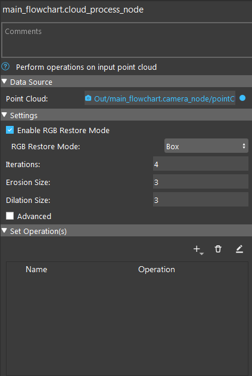

Cloud Process Node
==========================

Cloud process node is a utility node that performs arbitrary number of operations on the input point cloud.

.. toctree::
   :maxdepth: 1

   cloud_process_overview
   cloud_process_operation
