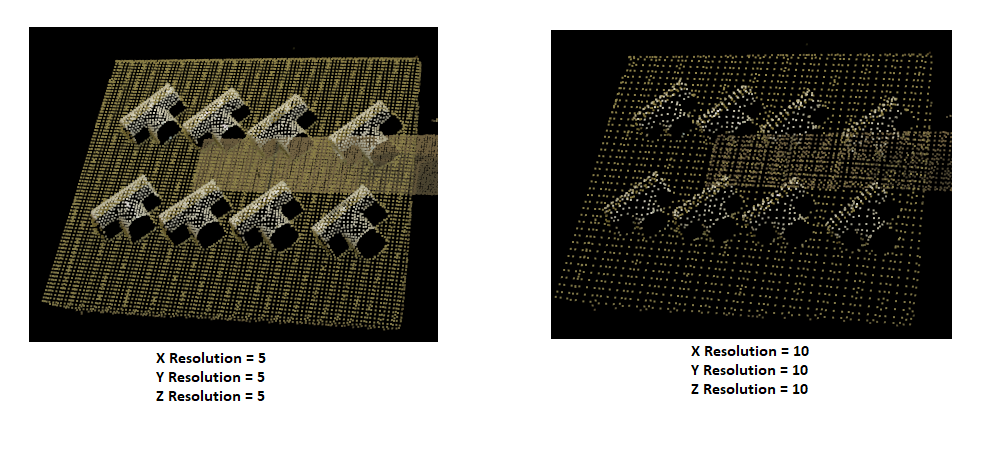
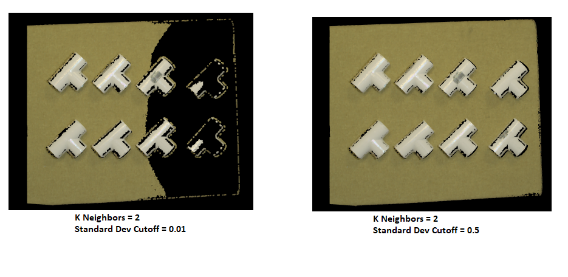
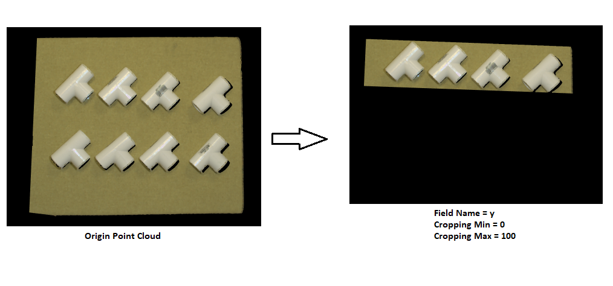
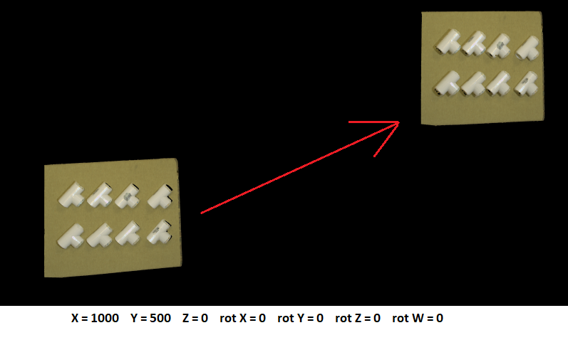
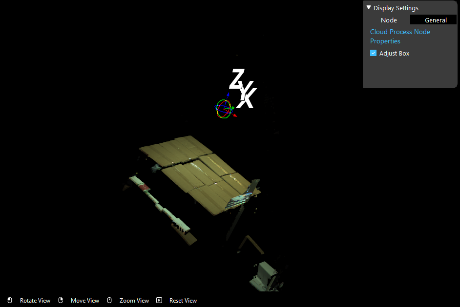
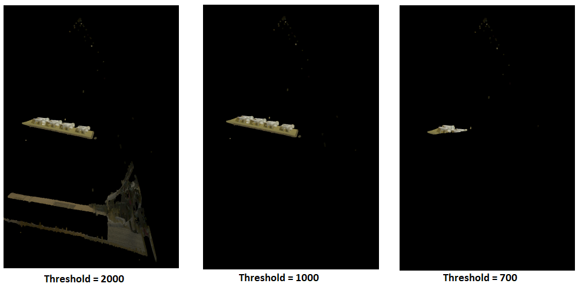
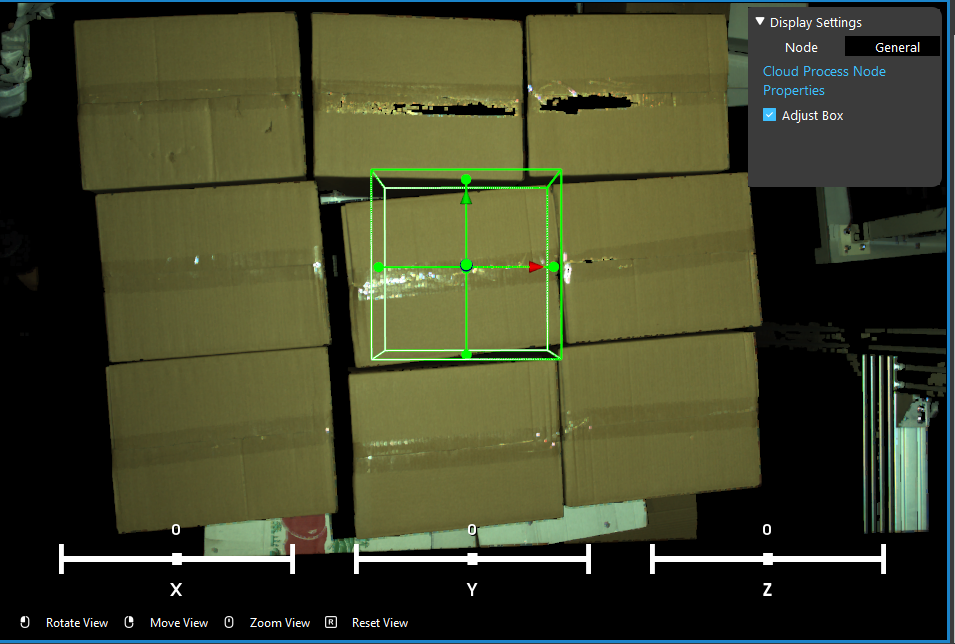
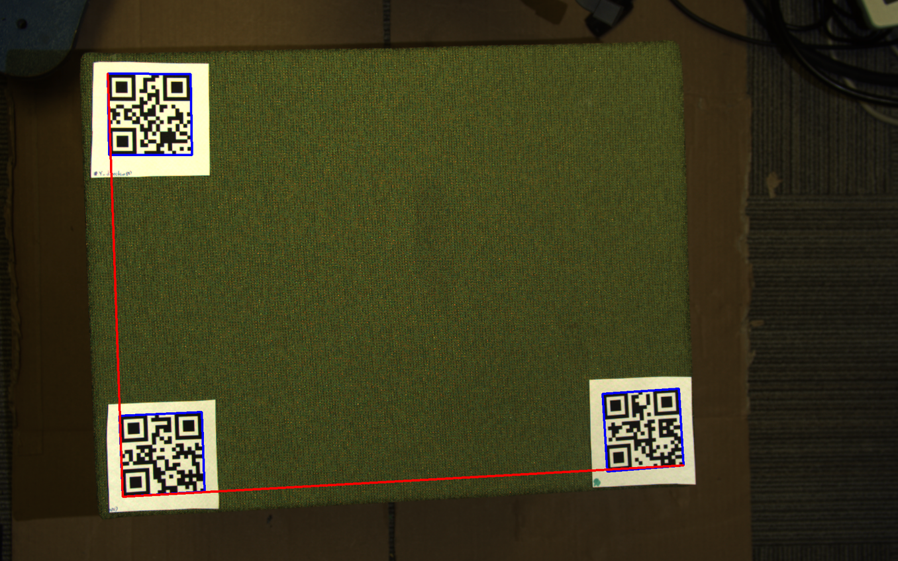
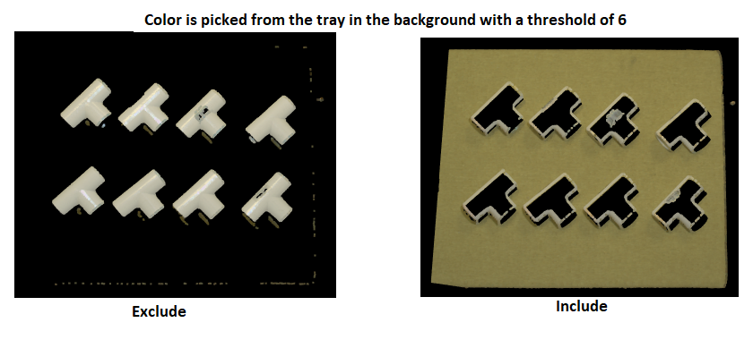
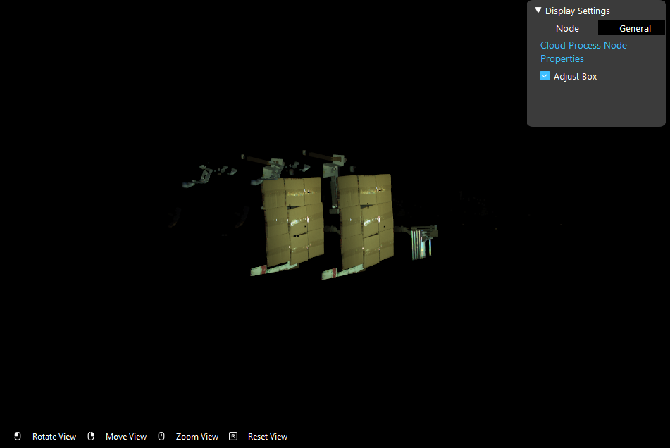

Operations and Parameters
==============================

This node supports a variety of operations. Each of them has unique parameters.

Downsample
~~~~~~~~~~~~~~

This operation takes in 3 spatial resolutions (x, y, z). We use this resolution to define a voxel grid size from which to subsample the points. 
The output of this operation will be a new cloud that is subsampled to contain fewer points than the original. 
Note this does not maintain the organized structure of the output cloud (output only contains a height of 1).

Outlier Removal
~~~~~~~~~~~~~~~~
This operation is similar to downsample. It reduces the number of points in the cloud; however, it uses the mean and variance of the distance between points. 
Based on the input values (k and cutoff) it calculates the mean and variance in the distance of the given point from its K immediate neighbors. 
For all points whose mean distances are outside an interval defined by the global distances mean and standard deviation can be considered as outliers and trimmed from the dataset. 
Specifically, we calculate the following to determine if the point is an outlier or not. 

Crop a Regiion
~~~~~~~~~~~~~~~~~~~

This operation takes in a field name (“x” “y“ or “z”) and the bounds for that region. The output of this operation will return a cloud with that specific region cropped.

Normals
~~~~~~~~~~~~~~~~~~~~~~~~~~~

With the Normals operation, we estimate the surface normal of each region in the point cloud. 
The operation takes in three values(depth factor, normal smoothness, and k neighbors). 
Most of the time there is no need to modify any of the default values. This operation has no visual effect.

* Normal Depth Factor: The depth change threshold for computing object borders
* Normal Smoothness: The factor which influences the size of the area used to smooth normals
* Normal K Neighbors: This input is only required if the input cloud is unorganized and, combined with the normal smoothness value, defines the search region.

 The computed normal data will be stored with the point cloud object. 

Transform Coordinates
~~~~~~~~~~~~~~~~~~~~~~~~

This applies a 3D affine transform to the input point cloud and returns the transformed version of the cloud.

Set Reference Frame 
~~~~~~~~~~~~~~~~~~~~~~~~~

Define a refernce coordinate using the interactor.

Dynamic Box Filter
~~~~~~~~~~~~~~~~~~~~~~

This operation crops the z region of the cloud by finding the point that is highest and cropping everything below a certain threshold. 
This operation is usually used when the users want to keep point cloud within a certain range in depth (e.g. the top layer of a pile of boxes).

Please note that this filter is based on the reference coordinate defined in the previous operation. Before using this operation, use set reference frame 
operation to set the reference coordinate.

The filtering process starts from the origin of the reference coordinate. It divides point cloud into partitions along z- direction. The starting partition 
is the frist partition with points more than *Points Threashold* (user defined parameter). Then the filter will keep points withing the following *Distance Threshold* mm.

* Threshold: range in millimeter along z axis, the points in range will be kept
* Points Treshold: number of points a segmentation along z axis must have to be considered a staring point of filtering, this determines the top of the dynamic box.

Adjust Bounding Box
~~~~~~~~~~~~~~~~~~~~~

This operation crops the cloud by placing a bounding box that the user can adjust by clicking on the adjust box option. 
Once the user sets the bounding box the first time it will remember this choice so that the user does not have to reconfigure the box again. 
The user can uncheck the Adjust box option so that they do not have to interact with the box once the adjustments are finished.

To enable the Adjust Bounding Box function, make sure to check the Adjust Box before running. 

When the Adjust Box is checked, a bounding box will display in the scene every time the Cloud Process Node is being run. To adjust the bounding box:

* Mouse left key on the box surface to rotate the box
* Mouse right(press down) key on the box to move around the whole box
* Mouse left key outside the box to rotate the scene
* Mouse left(press down) key outside the box to move the whole scene
* Mouse mid(roll) key to zoom in/out the scene
* Drag on the sliding box to adjust box's rotation around x,y,z axis
* Press 0 or Exist Interactor button to confirm change

When the Adjust Box is unchecked, the bounding box will the the same as last time when the user defines a box, or the default one if it's never defined.

Also, the width of the bounding box can be detected using QR-Code. If the object in the scene is marked by QR markers, the initial width and depth of the bounding box will be determined by
3 QR markers.

Color Filter
~~~~~~~~~~~~~~~~~~~~~~~~~~

The Color Filter Operation can filter out or keep the color that is selected from the scene. 

The step of picking a color and define a threshold are:
1. Define if you want to keep(Include) or remove(Exclude) the points with the color you select.
2. Input the RGB value or click the Pick Color button to pick a color from the screen.
3. Set the Color Threshold. If the RGB value of a point in the scene falls inside the range of Color Spec +/- Threshold * 10. This point will be Exclude/Include in the scene.

Merge Point Clouds 
~~~~~~~~~~~~~~~~~~~~~~~~~

This operation takes in another point cloud as an input and merge these two point clouds. The user is also able to define the pose of the second point cloud. The below image shows merging 
two point clouds with the second one being translated along z axis.

Depth Inpainting & Smoothing
~~~~~~~~~~~~~~~~~~~~~~~~~~~~~~~

Apply smoothing to and inpaint the depth image of the input point cloud. This operation helps to reduce the noise in the point cloud

Depth Diff
~~~~~~~~~~~~~~~~

Subtract points from the input cloud using cloud b.

* Cloud b The cloud we are subtracting from the input. Result is input cloud - cloud_b.
* Distance Threshold: The allowable depth difference between corresponding points for them to be considered to have the same value. Larger values remove more points.

Apply Mask 
~~~~~~~~~~~~~~~~~~~~~~~

Apply a 2d mask to the point cloud.

* Mask: Mask Image, the point cloud has to be organized and the mask image must have the same width and depth with the point cloud

RGB Restore Mode
~~~~~~~~~~~~~~~~~~~~~~~~~

Sometimes during the cloud process the rgb information of some poitns inside the region of interest are lost, because the corresponding clouds are noise.
This mode restores some of the rgb information using the average of neighboring points.

* Mode: box mode, where the rgb is the average of points in a square kernal; or tight mode, where the rgb is the average of neighboring valid points.
* Iteration: number of times the rgb restore operation is applied.
* Dilation size: size of dilation kernel, bigger the number, more rgb information maybe restored.
* Erosion size: size of erosion kernel, bigger the number, more rgb information maybe restored.