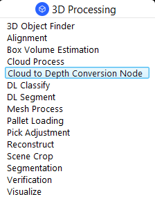
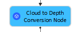
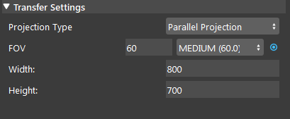

Cloud To Depth Conversion Node
================================

Overview
-----------------

| Generate calibrated depth map image from point cloud input. 
| **Cloud To Depth Conversion** node is generally used when we need a calibrated depth image from point cloud to do 3D searching in nodes such as 3D Mod Finder V2.  

Input and Output
-----------------

+----------------------------------------+-------------------------------+---------------------------------------------------------------------------------+
| Input                                  | Type                          | Description                                                                     |
+========================================+===============================+=================================================================================+
| Point Cloud                            | Point Cloud                   | The point cloud data to be convert (From Camera etc.).                          |
+----------------------------------------+-------------------------------+---------------------------------------------------------------------------------+

+-------------------------+-------------------+-------------------------------------------------------------------------------+
| Output                  | Type              | Description                                                                   |
+=========================+===================+===============================================================================+
| 8bit_depth              | Image             | 8 bit depth image.                                                            |
+-------------------------+-------------------+-------------------------------------------------------------------------------+
| cloud                   | cloud             | The input point cloud used for depth map conversion.                          |
+-------------------------+-------------------+-------------------------------------------------------------------------------+
| depth                   | Image             | 16 bit depth image composed of 8 bit grey scale image and 8-bit depth info.   |
+-------------------------+-------------------+-------------------------------------------------------------------------------+
| mask                    | Image             | A mask of the valid points in the depth map.                                  |
+-------------------------+-------------------+-------------------------------------------------------------------------------+

Node Settings
-----------------

- **Projection Type**:
   Choose between Pinhole or Parallel projection when generating depth. 

- **FOV**:
   Controls the horizontal FOV used in Pinhole projection mode.

- **Width**:

   Width in pixels of the ouput depth map.

- **Height**:

   Height in pixels of the ouput depth map.

Procedure to use
-----------------

1. We will also need a Camera node to demonstrate Cloud To Depth Conversion node. Right click insert node and insert a Camera node, and a Cloud To Depth Conversion node.
   
   .. image:: Images/cloud_to_depth/step_1.png
      :scale: 60%

2. Here's a `link to tee.dcf file <https://daoairoboticsinc-my.sharepoint.com/:u:/g/personal/tzhang_daoai_com/EUaL8LFp-JlJugrB-VYSCr8BODvs7cyJszjIywupMCNDDg?e=XCPFjb>`_ for the camera input. Add a virtual Camera in the Platform Config and link the tee.dcf file as its input.
   
   .. image:: Images/cloud_to_depth/step_2.png
      :scale: 80%

3. Link the source input to an appropriate node (eg. Camera or Cloud Process node). In this case, link to the pointCloud output of the previous Camera node.
   
   .. image:: Images/cloud_to_depth/step_3.png
      :scale: 60%

4. Run the node and select a bounding box region that captures the area of interest.
   
   .. image:: Images/cloud_to_depth/step_4.png
      :scale: 60%
   
5. If you see the following result which contains visible grid lines, you need to adjust the Width and Height to downsample your image until there are no visible grid lines.
   
   .. image:: Images/cloud_to_depth/step_5.png
      :scale: 50%
   
   .. image:: Images/cloud_to_depth/step_5_1.png
      :scale: 57%

|

Exercise
--------

Try to come up with the setting on **Cloud To Depth Conversion** node according to the requirements below. You can work on these exercise with the help of this article. We also have answers attached at the end of this exercise.
|
There is a project which requires the robot to pick all the occurrences of the T-tube in scene. 
Your colleague has setup the 3D camera and robot in the lab for experiment. 
Here's a `link to .dcf file <https://daoairoboticsinc-my.sharepoint.com/:u:/g/personal/tzhang_daoai_com/EUaL8LFp-JlJugrB-VYSCr8BODvs7cyJszjIywupMCNDDg?e=XCPFjb>`_ for the Camera input.

You need to help him setup the **Cloud To Depth Conversionv** node in main_flowchart. Please choose the all correct answers from the options:

1. You are given a worskpace that has the camera and Cloud To Depth Conversion node set up, but you find that the result of Cloud To Depth Conversion is strange, as in the image below. How should you fix this?
	.. image:: Images/cloud_to_depth/step_5.png
		:scale: 70%

	A. Increase the FOV
	B. Change Parallel to Pinhole for projection type.
	C. Decrease the Width/Height value in the settings. 
	D. Increase the Width/Height value in the settings. 

|
|
|
|
|
|
|
|
|
|
|
|
|
|
|

Answers for Exercises
------------------------

1. **Answer: C**
	.. image:: Images/cloud_to_depth/step_5_1.png
		:scale: 70%
**Explanation**: Recall in "Procedure to use" step 4, if you encouter the result containing grid lines, that means the width and height of the depthmap is too high.
Should reduce them accordingly to remove the gridlines.

