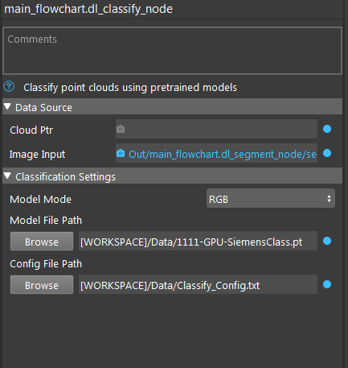

Deep Learing Classification Node
======================================

The DL Classification Node offers state-of-the-art classification of point clouds using pretrained models. 
The setup of this node is very similar to DL Segmentation with the only difference being the task at hand.

.. toctree::
   :maxdepth: 1

   dl_classify_overview
   dl_classify_procedure
