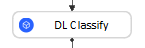
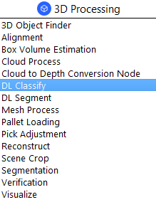
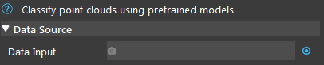
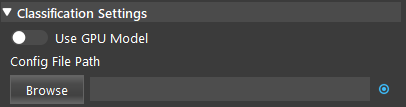
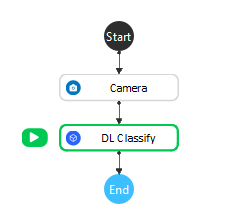
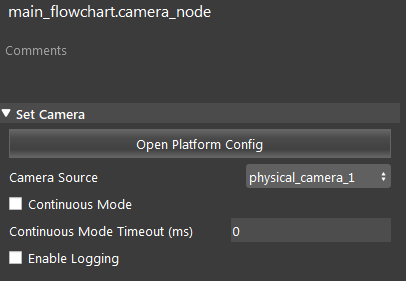
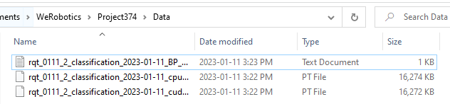
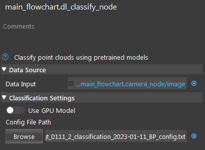
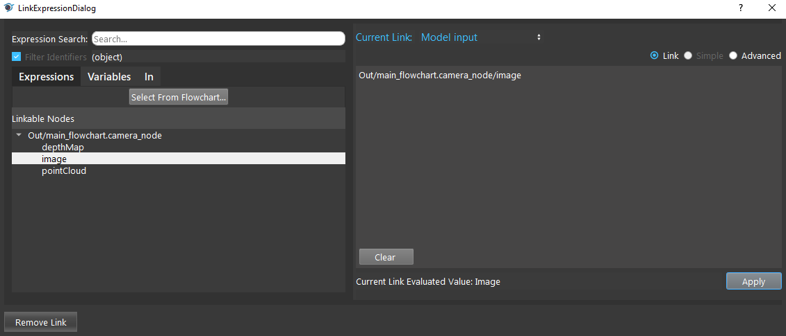

Deep Learning Classification Node
======================================

Overview
--------------------
The **DL Classification Node** offers state-of-the-art classification using pre-trained models. 
Deep learning classification can be performed on any point cloud or image. 

|

Input and Output
--------------------

+----------------------------------------+-------------------------------+-----------------------------------------------------------------------------------------------+
| Input                                  | Type                          | Description                                                                                   |
+========================================+===============================+===============================================================================================+
| Data Input                             | Image / Point Cloud           | The RGB image / point cloud used for classification (Camera, Reader, DL Segment etc.).        |
+----------------------------------------+-------------------------------+-----------------------------------------------------------------------------------------------+
| Use GPU Model                          | Bool                          | Use the GPU Model when true.                                                                  |
+----------------------------------------+-------------------------------+-----------------------------------------------------------------------------------------------+
| Config File Path                       | String                        | The path to deep learning config file.                                                        |
+----------------------------------------+-------------------------------+-----------------------------------------------------------------------------------------------+

+-------------------------+-------------------+------------------------------------------------------------------------+
| Output                  | Type              | Description                                                            |
+=========================+===================+========================================================================+
| classLabel              | int               | The class label for the most confident prediction.                     |
+-------------------------+-------------------+------------------------------------------------------------------------+
| confidence              | double            | The score for the most confident class from 0 to 1.                    |
+-------------------------+-------------------+------------------------------------------------------------------------+

|

Node Settings
--------------------

Data Source
~~~~~~~~~~~

- **Data Input**:
   The input scene to generate the prediction from.
      - For RGBD, use point cloud. 
      - For RGB, use image or point cloud.
      - For DEPTH, use depth image or point cloud.

**Classification Settings**
~~~~~~~~~~~~~~~~~~~~~~~~~~~

Please refer to `the Deep Learning page <https://daoai-robotics-inc-daoai-vision-user-manual.readthedocs-hosted.com/en/latest/deep-learning/index.html#deep-learning>`_ for instructions on collecting dataset and training a model.

- **Use GPU Model** (Default: false):
   Use the GPU Model when true. 

- **Config File Path**:
   The file path for the .txt deep learning config file.

|

Procedure to Use
--------------------

1. Insert Camera, and DL Classify node.

2. Put the classification model files into the project's Data file. You can use the data `here <https://daoairoboticsinc-my.sharepoint.com/:u:/g/personal/xchen_daoai_com/EUtovfHMSiVDigdkxL8L97QBhVFpUvYqrNoe-plD1lzUVA?e=EaegC1>`_ .

3. Set up the Camera node. Please refer to :ref:`Camera Node` for more instructions on creating a virtual camera.

4. Click the DL Classify node. Link the Camera output and select the config file.

5. Run the two nodes. You can see the predicted class and probability from the label.

.. image:: Images/dl_classify/dl_classify_procedure_5.png
   :scale: 90%