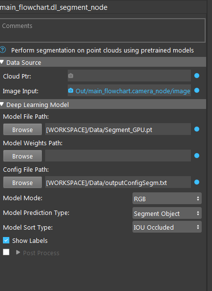

Deep Learning Segmentation Node
======================================

The DL Segmentation Node offers state-of-the-art segmentation of point clouds using pretrained models. 
The Node can be used anywhere that normal segmentation is used and offers the same functionality with less configuration. 

.. toctree::
   :maxdepth: 1

   dl_segment_overview
   dl_segment_procedure
