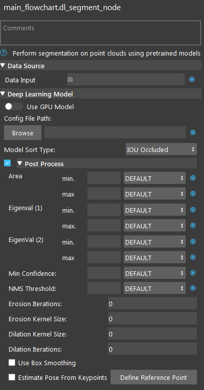
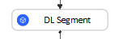
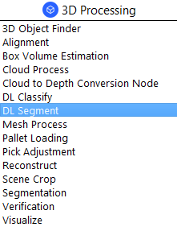
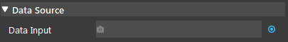
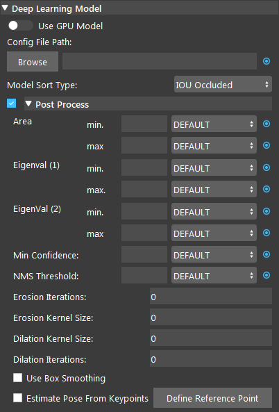
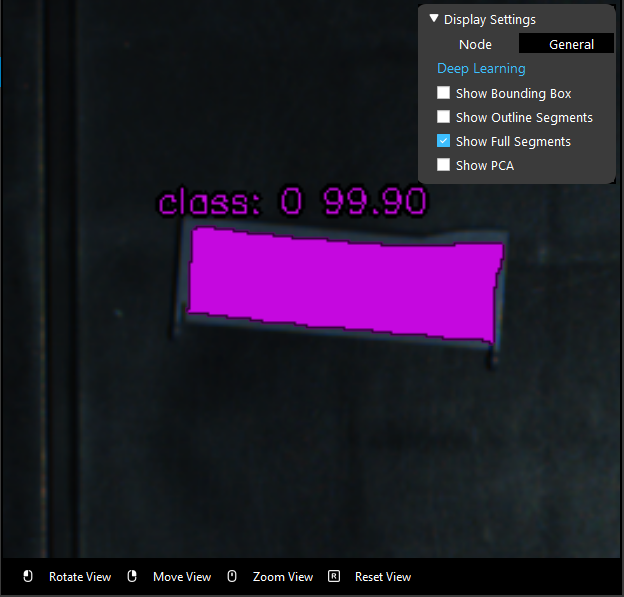

DL Segment Node
======================================

Overview
-------------
The Deep Learning (DL) Segment Node offers state-of-the-art segmentation of point clouds using pre-trained models. 

DL segmentation can be performed on one of point cloud, image, or both.
Note that DL segmentation works best when the input contains background information around the object. 
In pre-processing, avoid using filters like color filter that may remove the background and only keep the object.

Input and Output
-----------------

+----------------------------------------+-------------------------------+---------------------------------------------------------------------------------+
| Input                                  | Type                          | Description                                                                     |
+========================================+===============================+=================================================================================+
| Data Input                             | Image / Point Cloud           | The RGB image or point cloud used for segmentation.                             |
+----------------------------------------+-------------------------------+---------------------------------------------------------------------------------+
| Use GPU Model                          | bool                          | Whether to use the GPU Model or not. Will be used if the option is toggled on.  |
+----------------------------------------+-------------------------------+---------------------------------------------------------------------------------+
| Config File Path                       | String                        | The path to deep learning config file (.txt).                                   |
+----------------------------------------+-------------------------------+---------------------------------------------------------------------------------+

+-------------------------+-------------------+---------------------------------------------------------------------------------------------------------------------------+
| Output                  | Type              | Description                                                                                                               |
+=========================+===================+===========================================================================================================================+
| bboxResults             | vector<Box2f>     | A vector of bounding boxes of the segments. Each element contains top-left, bottom-right coordinate of each bounding box. |
+-------------------------+-------------------+---------------------------------------------------------------------------------------------------------------------------+
| maskOnScene             | Image             | - Masked image showing all segments in the input image.                                                                   |
+-------------------------+-------------------+---------------------------------------------------------------------------------------------------------------------------+
| maskedScene             | Image             | RGB image showing all segments in input image.                                                                            |
+-------------------------+-------------------+---------------------------------------------------------------------------------------------------------------------------+
| numDetected             | int               | Number of segments detected.                                                                                              |
+-------------------------+-------------------+---------------------------------------------------------------------------------------------------------------------------+
| segmResults             | vector<Segm>      | - A vector of all the segmentation results.                                                                               |
|                         |                   | - segmentResultsOfLabel[]: Segment results of a specific label (class).                                                   |
+-------------------------+-------------------+---------------------------------------------------------------------------------------------------------------------------+
| segmentLocations        | vecPose2D         | - 2D poses of obtained segments including the center point, score and label for each segment.                             |
|                         |                   | - segmentLocationsOfLabel[]: Segment locations of a specific label (class).                                               |
|                         |                   | - segmentLocations[]: Segment location of a specific segment.                                                             |
+-------------------------+-------------------+---------------------------------------------------------------------------------------------------------------------------+
| segmentMasks            | vecImage          | - Masked images of obtained segments.                                                                                     |
|                         |                   | - segmentMasksOfLabel[]: Segment masks of a specific label (class).                                                       |
|                         |                   | - segmentMasks[]: Mask of a specific segment.                                                                             |
+-------------------------+-------------------+---------------------------------------------------------------------------------------------------------------------------+
| segmentRGBs             | vecImage          | Images of obtained segments.                                                                                              |
+-------------------------+-------------------+---------------------------------------------------------------------------------------------------------------------------+
| success                 | bool              | Whether the segmentation is successful (found at least one segment).                                                      |
+-------------------------+-------------------+---------------------------------------------------------------------------------------------------------------------------+

|

Node Settings
---------------

Data Source
~~~~~~~~~~~~~~

- Data Input:
   The input scene to generate the segmentation from. 
      - If RGBD, use point cloud.
      - If RGB, use image or point cloud.
      - If Depth, use depth image.

|

Deep Learning Model
~~~~~~~~~~~~~~~~~~~~~

- Use GPU Model (Default: false)
   Whether to use the GPU Model or not. Will be used if the option is toggled on.

- Config File Path
   The path to deep learning config file (.txt).

- Model Sort Type (Default: IOU Occluded)
   Set the model sort type of the result. Select from one of IOU Occluded, Binary Occluded, Area.
      - IOU Occluded: sort by calculating Intersection over Union (IOU) between segments to determine overlapping percentage, and determines which segment occupies the most amount of area in the overlapping region. So that we pick up the objects that are not occluded first.
      - Binary Occluded: similar to IOU Occluded, but uses two values to denote if any other segment overlaps a given segment.
      - Area: sort by area size.

- Area min./max. (Range: [0,1.0])
   Avaiblae in Post Process. Values which represent the percentage of the image and segment can occupy.

- Eigenval (1)/(2) min./max. (Range: [0,1])
   Avaiblae in Post Process. Similar to how the segmentation calculates the Principal Component Analysis (PCA) of each segment we calculate that here and limit the eigen values. Eigen value 1 is the longer axis.

- Min Confidence (Range: [0,1])
   Avaiblae in Post Process. The minimum confidence for detecting predicted objects.

- NMS Threshold (Range: [0,1]; Default: 0.8)
   Avaiblae in Post Process. The threshold for applying soft NMS to the bounding boxes. This removes boxes that are too close together.

- Erosion/Dilation Kernel Size (Range: [0, 100]; Default: 0)
   Avaiblae in Post Process. The kernel size used for erosion/dilation applied to segmentation mask and segmentation RGB image.

- Erosion/Dilation Iterations (Range: [0, 100]; Default: 0)
   Avaiblae in Post Process. The number of times erosion/dilation is applied to segmentation mask and segmentation RGB image.

The initial result of the DL segmentation node may not contain all the points of the object because many deep learning model use dowmsampling for prediction.
You can adjust the segment mask size based on your need (to reduce possible noise or to include as much object information as possible) using erosion
and dilation post-processing option.

Below image shows the result of using erosion, the resulting mask is smaller than the actual object.

- Use Box Smoothing (Default: false)
   Avaiblae in Post Process. Whether to smooth the segment mask in to a boxed shape or not. Useful for boxed shape objects with non smooth masks.

- Estimate Pose From Keypoints (Default: false)
   Avaiblae in Post Process. Calculate a pose for the object based on the key points located in the image. Available for the keypoint model type.

|

Procedure to Use
-----------------
Here is the `link to the files in this demonstration <https://daoairoboticsinc-my.sharepoint.com/:u:/g/personal/yli_daoai_com/EQh24oMOww5CkyPonUR9etsBM_PIr3KPy9jhtf-pnfT6aQ?e=ObUSfz>`_ .

1. Insert Camera, Cloud Process, and DL Segment.
    .. image:: Images/dl_segment/dl_segment_procedure_1.png
       :scale: 80%

|

2. Add a virtual Camera with the file daoai_0.dcf. Please refer to :ref:`Camera Node` for more detailed instructions.
    .. image:: Images/dl_segment/dl_segment_procedure_2.png
       :scale: 60%

|

3. Use Cloud Process to improve DL Segment's search efficiency (optional) by using the "Adjust Bounding Box" operation to define the region of interest (ROI).
    .. image:: Images/dl_segment/dl_segment_procedure_7_1.png
       :scale: 60%

    .. image:: Images/dl_segment/dl_segment_procedure_7_2.png
       :scale: 67%

4. In DL Segment, link Cloud Process's image output.
    .. image:: Images/dl_segment/dl_segment_procedure_3.png
       :scale: 70%

|

5. In DL Segment, select the Config File Path by clicking "Browse".
    .. image:: Images/dl_segment/dl_segment_procedure_5.png
       :scale: 70%

|

6. Make sure the model files are in the project's Data folder.
    .. image:: Images/dl_segment/dl_segment_procedure_4.png
       :scale: 80%

|

7. Run the flowchart till DL Segment. You can see the segmentation results from the display by selecting "Show Full Segments". The label (e.g. cls 0: tee 100.0) are the class number, class name, and confidence respectively.
    .. image:: Images/dl_segment/dl_segment_procedure_6.png
       :scale: 60%

|

After segmentation, there are a couple ways you can make use of its output. For example, you can use the center point of the segments as the 2D positions of object and estimate their 3D positions using Reconstruct node and use these 2D/3D poses to determine picking positions. Other than Reconstruct, you can also use Scene Crop to divide a scene point cloud into a vector of point clouds, each contains point cloud of one object. We will demonstrate using Reconstruct here.

8. Insert a Reconstruct node.
    .. image:: Images/dl_segment/dl_segment_procedure_8.png
       :scale: 80%

|

9. Link Camera's pointCloud output as Point Cloud, DL Segment's segmentLocations as the Object Locations, Camera's intrinsicParam as Camera Intrinsics, and DL SegmentMasks as the Object Masks. For Z-Computation Method, choose Averaging masking area. Run the node, you can see the objects' pose from the display.
    .. image:: Images/dl_segment/dl_segment_procedure_9_1.png
       :scale: 70%

    .. image:: Images/dl_segment/dl_segment_procedure_9_2.png
       :scale: 81%

|

Exercise
------------

1. You notice DL Segment is outputing inaccurate results. How can you fix it by changing the settings in DL Segment node?
    .. image:: Images/dl_segment/dl_segment_exercise_1.png
       :scale: 80%

|

2. You have a `depth model <https://daoairoboticsinc-my.sharepoint.com/:u:/g/personal/yli_daoai_com/ETqXsPWM6SRMl4fRkpItI8IBHLbysOtqS-aUFR1IogThEg?e=tExgEc>`_ at hand, try to setup the flowchart.
    .. image:: Images/dl_segment/dl_segment_exercise_2.png
       :scale: 80%

|
|
|
|
|
|
|
|
|
|
|
|
|
|
|

Answers for Exercise
---------------------
1. You can filter out the less confident results by changing the "Min Confidence" value in Post Process.
Set Min Confidence to 0.96 gives the following result:
    .. image:: Images/dl_segment/dl_segment_answer_1.png
       :scale: 80%

|

2. First, link the pointCloud output from Camera as the DA CloudNDepth Conv's Object.
    .. image:: Images/dl_segment/dl_segment_answer_2_1.png
       :scale: 80%

|

3. In DL Segment, link DA CloudNDepth's 8bit_depth output.
    .. image:: Images/dl_segment/dl_segment_answer_2_2.png
       :scale: 80%

|

4. Link the Config File.
    .. image:: Images/dl_segment/dl_segment_answer_2_3.png
       :scale: 80%

|

5. Run the flowchart, and you can see the result as in the image.
    .. image:: Images/dl_segment/dl_segment_answer_2_4.png
       :scale: 80%

|