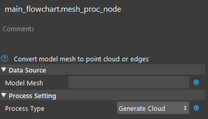
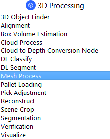
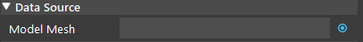

Mesh Process Node
============================

Overview
--------------------

The Mesh Process Node processes an input polygon mesh and generates a point cloud that can be used for finding model features.

Input and Output
--------------------

+-------------------------+-------------------+------------------------------------------------------------------------+
| Input                   | Type              | Description                                                            |
+=========================+===================+========================================================================+
| Model Mesh              | Mesh              | A polygon mesh for the model (.ply). Usually from Reader node.         |
+-------------------------+-------------------+------------------------------------------------------------------------+
| Process Type            | Int32             | The type of mesh processing performed.                                 |
+-------------------------+-------------------+------------------------------------------------------------------------+

+-------------------------+-------------------+--------------------------------------------------------------------------------------------------------+
| Output                  | Type              | Description                                                                                            |
+=========================+===================+========================================================================================================+
| cloud                   | Cloud             | Point cloud or edge cloud converted from polygon mesh.                                                 |
+-------------------------+-------------------+--------------------------------------------------------------------------------------------------------+
| mass center             | Point4f           | The mass center of the resulting point cloud. Point4f is a normal point in 4D.                         |
+-------------------------+-------------------+--------------------------------------------------------------------------------------------------------+

Node Settings
----------------

Data Source
~~~~~~~~~~~~

- Model Mesh
   A polygon mesh for the model (.ply). Usually from Reader.

Process Settings
~~~~~~~~~~~~~~~~

.. image:: Images/mesh_process/mesh_process_process_settings.png
   :align: center

- Process Type (Default: Generate Cloud)
   The type of mesh processing performed. Select from one of "Generate Cloud" or "Generate Edge".
      - Generate Cloud: Generates a dense cloud of the mesh's surface. 
      - Generate Edge: Generates a point cloud with the mesh's edges. Recommended for flat objects.

|

Procedure to Use
----------------

1. Insert a Reader, and a Mesh Process node.
    .. image:: Images/mesh_process/mesh_process_procedure_1.png
       :align: center

2. In the Reader node, read a mesh file. `Here <https://daoairoboticsinc-my.sharepoint.com/:u:/g/personal/xchen_daoai_com/ES9oE9HAqZdBkvjZUvM9jL4Baau8q4B9Q1keKE4_pL1Oog?e=mBwJXO>`_ is a mesh file if you need one.
    .. image:: Images/mesh_process/mesh_process_procedure_2.png
       :align: center

3. In the Mesh Process node, link to the Reader's outputMesh.
    .. image:: Images/mesh_process/mesh_process_procedure_3.png
       :align: center

4. You can visualize the output by checking the checkboxes beside the display window.
    .. image:: Images/mesh_process/mesh_process_procedure_4.png
       :align: center

5. Select Generate Edge and run the node.
    .. image:: Images/mesh_process/mesh_process_procedure_5.png
       :align: center

6. Select Generate Cloud and run the node.
    .. image:: Images/mesh_process/mesh_process_procedure_6.png
       :align: center

|

Exercise
--------------------------------------

You are given this mesh object, which looks like this:

.. image:: Images/mesh_process/mesh_process_exercise_1.png
       :align: center

What Process Type is better for this particular object?

|
|
|
|
|
|
|
|
|
|
|
|
|
|
|

Answers for Exercise
--------------------------------------

Since the object is very flat, the "Generate Edge" process type is the better option.
