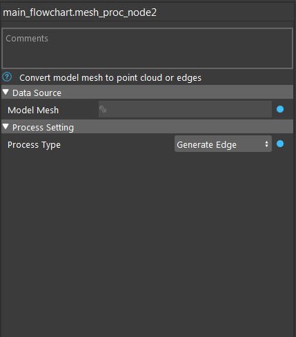
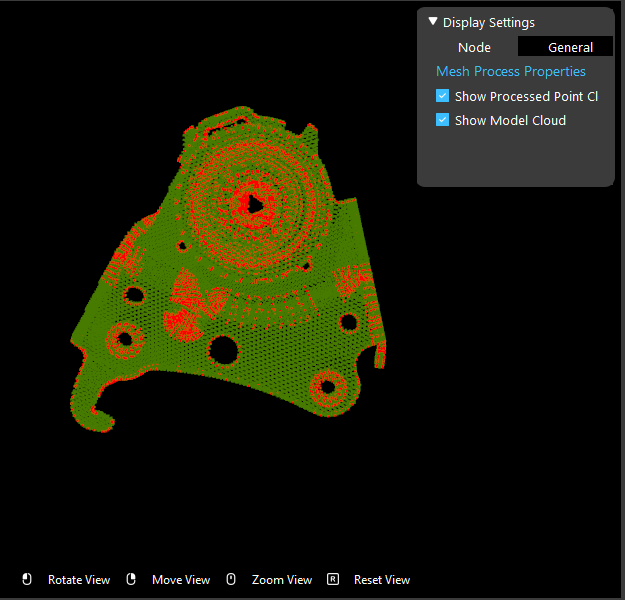
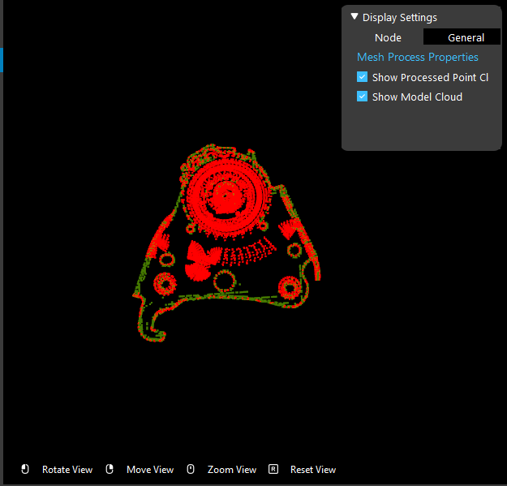

Mesh Process Node
============================

Often, polygon meshes contain sparse points, relying more on polygons to represent surfaces. The Mesh Process Node processes an input polygon mesh and generates a point cloud that can be used for finding model features.

Two process types are available:
* Generate Cloud: Generates a dense cloud of the mesh's surface
* Generate Edge: Generates a point cloud with the mesh's edges

Input
--------------------

* Model Mesh: A polygon mesh

Output
----------------------

* cloud: point cloud or edge cloud converted from polygon mesh
* mass center: mass center of the result point cloud

