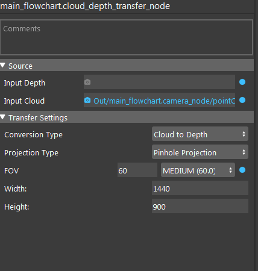
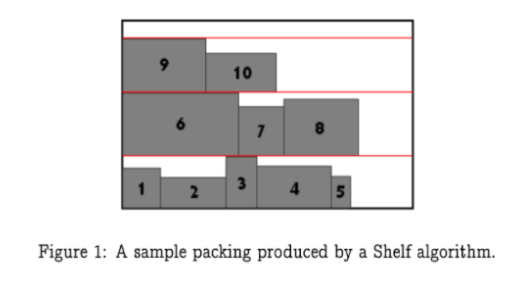
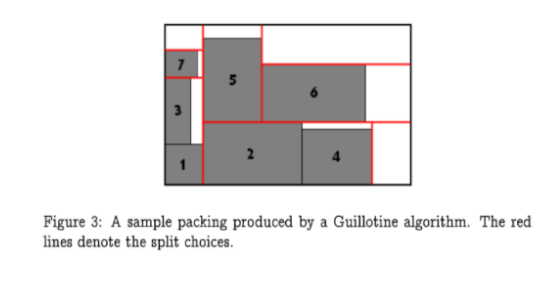
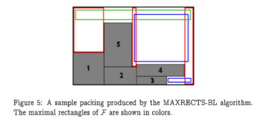
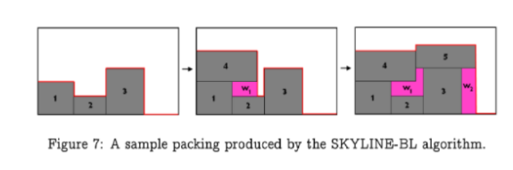

Pallet Loading Node
==============================

The purpose of the pallet loading node is to take the 'Dimensions' output from the Box Volume Estimation node and systematically generate poses for each box in order to load them onto a pallet. 
There are many different loading algorithms for the user to choose from: Shelf, Guillotine, Max Rects, and Skyline packing, each with their own heuristics. 
Boxes will be loaded one at a time onto the pallet layer by layer. Boxes can be placed slightly outside the bounds of the pallet, based on the level of tolerance specified by the user. 
Once a layer is deemed to be full, poses will be generated for the next layer. 
In order to prevent boxes being stacked over empty space (or mostly empty space), any empty space near the edges of the pallet will be ignored on subsequent layers. 
As an example, let's say that we have a pallet with dimensions 500x500, and that the pallet has been filled such that the boxes are arranged in a gapless rectangle with dimensions 490x470. Since the layer has been determined to be full, we don't want boxes to be placed over the empty space near the edges. Therefore, the next layer will be loaded under the dimensions of 490x470, plus tolerance. 
The user has complete control of the size and height of the pallet. 

While a layer is being filled, the maximum height of the boxes in the current layer is kept track of. 
Once a layer is filled, this maximum height becomes the new “ground” for the next layer. Therefore, for obvious reasons, it is best to use boxes of similar height when using this node.

Once the config page has been set and boxes have been loaded onto the pallet, the user cannot go back and change the config settings until the pallet has been cleared. 
Users can do so by clicking the 'Reset Pallet' button. Additionally, there is automated control modes where the user can choose to remove the most recent box from the pallet (e.g. if the robot gripper dropped or misplaced the last box) before placing the next one, or to automatically clear the pallet before loading the next box.

Users also have the option of electing to manually determine the dimensions of the next box, instead of using the 'Dimensions' output from a Box Volume Estimation node. 

Input
----------------

* Box volume: a vector of box volumes from the output of box volume estimation node

Output
---------------
* Stored Poses: a vector of poses representing the placement of each box.

Parameters
-------------------

* Run Type: Integer that gives the node instructions on what to do with the current saved pallet before attempting to add the current box. Can only be set in the GUI by linking an output from another node or by linking some variable. The three accepted integers are as follows:
   * REGULAR (0): Do not modify the current pallet
   * RESTART (1): Delete the current pallet and load the current box onto an empty pallet
   * REDO (2): Delete the previously added box from the pallet.
* Pallet X: Width of the pallet, in mm. 
* Pallet Y: Length of the pallet, in mm.
* Pallet Height: Maximum height that objects can be stacked to before determining the entire pallet to be full.
* Bin Packing Algorithm: Determines how the boxes are fit together on the pallet.
   * Shelf: Has the following heuristic choices for choosing an ideal location for each incoming box:
      * Shelf Next Fit: Create a new shelf if the box cannot fit in the current shelf
      * Shelf First Fit: Place box in first shelf it can fit
      * Shelf Best Area Fit: Place box as to maximize total used shelf area
      * Shelf Worst Area Fit: Place box as to maximize total available shelf area
      * Shelf Best Height Fit: Place box as to minimize leftover height
      * Shelf Best Width Fit: Place rectangle such that remaining width of shelf space is minimized
      * Shelf Worst Width Fit: Place rectangle as to minimize used shelf space
      * Use Waste Map: Should the algorithm keep track of wasted space, and place boxes into that space if they fit?
   * Guillotine:Has the following heuristic choices for choosing how to split up remaining free space on the layer:
      * Split Shorter Leftover Axis: Creates free boxes by splitting shorter leftover axis
      * Split Longer Leftover Axis: Creates free boxes by splitting larger leftover axis
      * Split Minimize Area: Creates free boxes by making the difference in areas as large as possible
      * Split Maximize Area: Creates free boxes by making the difference in areas as small as possible
      * Split Shorter Axis: Creates free boxes by splitting shorter overall axis
      * Split Longer Axis: Creates free boxes by splitting longer overall axis
      * Best Area Fit: Pick smallest free rectangle where current rectangle will fit
      * Best Short Side Fit: Pick free rectangle as to minimize length of shorter leftover side
      * Best Long Side Fit: Pick free rectangle as to minimize length of longer leftover side
      * Worst Area Fit: Pick free rectangle as to maximize length of both leftover sides
      * Worst Short Side Fit: Pick free rectangle as to maximize length of shorter leftover side
      * Worst Long Side Fit: Pick free rectangle as to maximize length of longer leftover side
      * Merge: Should the algorithm attempt to combine free rectangles of space and potentially find a better placement?
   * Max Rects: Has the following heuristic choices for choosing where to place each new box.
      * Best Short Side Fit: Positions the box against the short side of a free box into which it fits the best
      * Best Long Side Fit: Positions the box against the long side of a free box into which it fits the best.
      * Best Area Fit: Positions the box into the smallest free box into which it fits.
      * Bottom Left Rule: Does the Tetris placement.
      * Contact Point Rule: Chooses the placement where the box touches other boxes as much as possible.
      * Allow Flip: Should the algorithm be able to rotate the box when determining how to place it?
   * Skyline: Has the following heuristic choices for choosing where to place each new box:
      * Bottom Left: Places each box as close to the bottom-left corner as possible
      * Min Waste Fit: Places each box as to minimize leftover space
      * Use Waste Map: Should the algorithm keep track of wasted space, and place boxes into that space if they fit?
* Optional Fields: If the user elects not to use the 'Dimensions' output from a Box Volume Estimation node, these values will be used instead for the x, y, and z dimensions of the box, respectively. If these values are all 0, the box volume output is used instead.
* Tolerance: Distance, in mm, boxes can be placed such that they may lie slightly outside the bounds of the pallet. Note that this tolerance is applied for the new dimensions on each layer as well. In basic operation mode, this is a single value. In advanced operation mode, users can control the tolerance in both the x and y directions.

