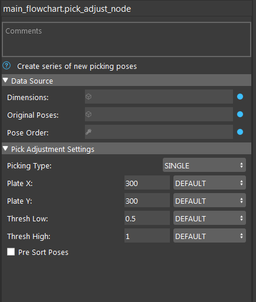

Pick Adjust Node
==============================

The purpose of the Pick Adjust Node is to alter the poses generated by the Box Volume Estimation Node. These boxes may be picked up by a rectangular vacuum picking plate, which may be significantly larger than the box itself. We want to ensure that the plate can safely pick up the box without interfering with any other boxes nearby (which would be the case in a depalletization scenario). 

There are two modes for this node: Single-Box picking and Multiple-Box picking. Single-Box is as it sounds - a single new pose will be generated for each existing box. This pose will be translated such that one corner of the plate is flush with one corner of the box, and that no other boxes are covered by the plate.  Multiple-Box picking will generate poses as to minimize the total number of poses generated - i.e., each pose will try and safely cover as many boxes as possible. The user can specify the dimensions of the picking plate, in mm.

.. toctree::
   :maxdepth: 1

   pick_adjust_overview
   pick_adjust_procedure
   

