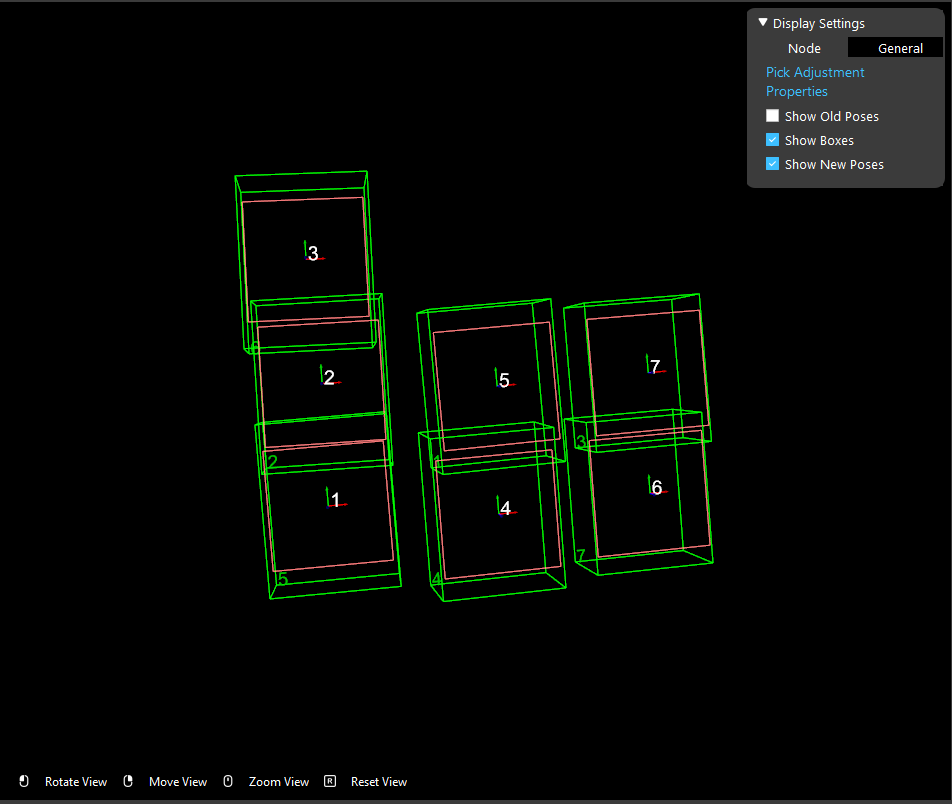

Procedure of Using Pick Adjust Node
===========================================

1. Use box volume estimation node to estimate the width and height of the box, and the picking pose of each box.
2. Use pick sort node to determine the picking pose of the vacuum plate

Set Parameters to Get Picking Poses
----------------------------------------------------

You can check whether the vacuum position is desired in the display. The green boxes are the boxes to pick and the red rectangles means the picking pose of the vacuum plate.
Also each pose is marked with numbers showing the order of the pose.

The parameters must be set correctly to get the desired picking pose.

* Set *plate X* and *plate Y* to be the actual size of the vacuum picking plate
* Set *Threshold Low* to be the minimum coverage ratio when vacuum is able to pick up the box
* Use default *Threshold High*, unless you want to define a maximum coverage ratio that is lower than 1.