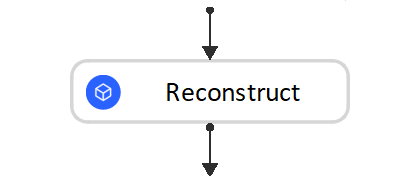
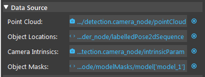
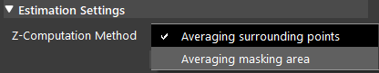
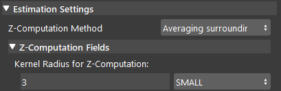
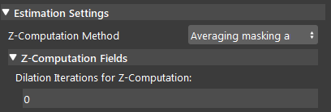
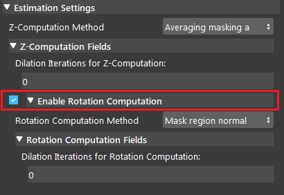
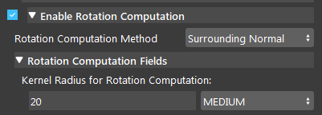
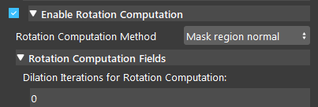

Reconstruct Node
===========================

Overview
**********************

The Reconstruction Node uses the hypothesis position of a detected object and its centroids to generate a 3D pose. 
The hypothesis position and centroid information usually comes from the Mode Finder Node. 
The 3D pose uses the model defined in Mod Finder Node as a reference to compute its translation and rotation(in camera coordinates). 
In order the visualize the pose, it will be displayed in the scene using a small XYZ axis.

Input and Output
**********************

+----------------------------------------+-------------------------------+---------------------------------------------------------------------------------+
| Input                                  | Type                          | Description                                                                     |
+========================================+===============================+=================================================================================+
| Image                                  | Point Cloud                   | The Point Cloud from scene(camera, reader etc.)                                 |
+----------------------------------------+-------------------------------+---------------------------------------------------------------------------------+
| 2D Poses                               | Vec<Pose2D>                   | The results of 2D poses. Usually from Mod Finder, Shape Finder etc.             |
+----------------------------------------+-------------------------------+---------------------------------------------------------------------------------+
| Camera Intrinsic                       | CameraIntrinsic               | Camera Intrinsic from Camera node, used in computation.                         |
+----------------------------------------+-------------------------------+---------------------------------------------------------------------------------+
| Model Masks(Optional)                  | VecImage                      | - Detected model/shape masks from Mod Finder, Shape Finder or DL Segment nodes. |
|                                        |                               | - Used only when the masks are used for rotation or Z computation.              |
+----------------------------------------+-------------------------------+---------------------------------------------------------------------------------+

+-------------------------+-------------------+------------------------------------------------------------------------+
| Output                  | Type              | Description                                                            |
+=========================+===================+========================================================================+
| objectPositions         | Vec<Pose3D>       | Vector of 3D poses generated from "Object Locations"(2D poses).        |
+-------------------------+-------------------+------------------------------------------------------------------------+
| object_positions/size   | int               | Size of the object positions.                                          |
+-------------------------+-------------------+------------------------------------------------------------------------+
| success                 | bool              | Boolean value which indicates if the process is successful.            |
+-------------------------+-------------------+------------------------------------------------------------------------+

Node Settings
**********************

Source Parameter
--------------------------------

* Point Cloud

   The Point Cloud from scene(camera, reader etc.)

* Object Locations

   The results of 2D poses, usually from Mod Finder, Shape Finder DL Segment nodes.
   
* Camera Intrinsic

   Camera Intrinsic from Camera node, used in computation. 
   
* Object Masks
   Detected model/shape masks from Mod Finder, Shape Finder or DL Segment nodes. Used only when the masks are used for rotation or Z computation. This is an optional setting for **Reconstruct** node. You can leave it empty if not needed.

Estimation Setting
---------------------

* Z Computation Method

   This field is the options for computation of Z-value: 

|

The node has two ways of constructing Z-value in 3D poses:

* Averaging Surrounding Points: This is the default method which uses a set of surrounding points  (square kernel) around the reference point and converts them to a point cloud (using the input point cloud) and takes the average Z value of the corresponding 3D points in the point cloud. The size (radius) of the kernel can also be defined by the user. Using a bigger kernel will result in using more surrounding points for Z computation.  

|

* Averaging masking area: This method uses the mask obtained from mod-finder , shape-finder or dl_segm to obtain the Z value by using the non-zero pixels in the mask (model mask, shape mask or segment mask  depending on which node you are using  before reconstruct_node) and taking the average Z value of their corresponding points in the point cloud. There is also a dilation iterations parameter that can be used to dilate the model/shape mask if needed. More dilation results in using more points for Z computation. 

|

Enable Rotation computation
--------------------------------

If this option is checked by the user, the program will compute the rotation of the object with respect to the camera coordinates system. 
The nodes has two ways of constructing rotation: 

* Surrounding Normal Points: This is the default method which uses a set of surrounding points of the reference point to fit a plane in the point cloud and then, uses this plane to find normal vector which is then used for rotation calculation. However, this method can fail if the surrounding points are nan (invalid), especially in cases that the target shape/ model is a hole. However, you have control in the kernel used around the reference point to fit the plane and calculate the rotation. 

|

* Mask Region Normal: This method uses the mask/masks obtained from Mod Finder, Shape Finder or DL Segment node and converts it to a cloud to obtain the Rotation value by using the non-zero pixels in the mask and fitting a plane to the corresponding 3D points. Then, the normal of the plane estimated which is used for rotation calculation. There is also a dilation iterations that can be used to dilate the model/shape/segment mask if needed. More dilation results in using more points for plane fitting and Rotation calculation. This option is especially good for cases that we have detected a shape/model which is actually a hole. In this scenario, most of the cases, the reference point and the surrounding points are nan. Therefore, using the surrounding points is not able to find the normal (unless a big kernel size is used) but using the mask region will use the mask to fit the plane and ignore the nan points. 

|

Procedure of Using Reconstruct Node
************************************

1. Open a workspace in DaoAI Vision Studio.
	.. image:: Images/reconstruct/open_project.png
		:align: center

2. Insert a Camera node to get the source image.
	.. image:: Images/reconstruct/camera.png
		:align: center

3. A virtual image is used to demonstrate. Refer to System Overview, Tutorials on how to connect to camera.
	.. image:: Images/reconstruct/tee.png
		:align: center

4. Insert a Mod Finder node, Shape Finder or DL Segment node to find the T tube, Mod Finder node is used for demonstration here.
	.. image:: Images/reconstruct/3setups.png
		:align: center

5. Click on the blue dot on the right side of "Point Cloud" to link the point cloud from the camera node above as input.
	.. image:: Images/reconstruct/recon_input.png
		:align: center

6. Expand the “Out/main_flowchart.camera_node” on the left window of the LinkExpressionDialog. Click the "image" then Apply.
	.. image:: Images/reconstruct/link_1.png
		:align: center

7. Click on the blue dot on the right side of "Object Locations" to link the 2D poses from the Mod Finder, Shape Finder or DL Segment node above as input.
	.. image:: Images/reconstruct/recon_input_2.png
		:align: center

8. Expand the “Out/main_flowchart.mod_finder_node” on the left window of the LinkExpressionDialog. Click the "labelledPose2dSequence" then Apply. Input "labelledPose2dSequence" referring to all the occurrences of all models. Based on your need, you can choose "modelPoses2D" and fill in the model you want to refer as well.
	.. image:: Images/reconstruct/link_2.png
		:align: center

9. Click on the blue dot on the right side of "Camera Intrinsic" to link the camera intrinsic data from the camera node above as input.
	.. image:: Images/reconstruct/recon_input_3.png
		:align: center

10. Expand the “Out/main_flowchart.camera_node” on the left window of the LinkExpressionDialog. Click the "intrinsicParam" then Apply.
	.. image:: Images/reconstruct/link_3.png
		:align: center

11. Click on the blue dot on the right side of "Object Masks" to link the object masks from the Mod Finder, Shape Finder or DL Segment node above as input.
	.. image:: Images/reconstruct/recon_input_4.png
		:align: center

12. Expand the “Out/main_flowchart.mod_finder_node” on the left window of the LinkExpressionDialog. Click the "modelMasks/model['']" then fill in "model_x"(the model you want to refer) and Apply.
	.. image:: Images/reconstruct/link_4.png
		:align: center

13. Choosing the suitable method for Z-computation according to the requirements. 
	.. image:: Images/reconstruct/recon_input_z_comp_surr.png
		:align: center

**Averaging surrounding point** uses the algorithm to calculate the Z-direction from the average of all the surrounding points. In the image shown above, 20 is the radius which from the center point, 20 pixels surrounding points will be used for this calculation. 

	.. image:: Images/reconstruct/recon_input_z_comp_masking.png
		:align: center

**Averaging masking area** uses the algorithm to to calculate the Z-direction from the average of all the points on the model mask. In the image shown above, 0 is the number of dilation iterations used to perform dilation operation on the mask. This can be used when you want the mask to use more points for Z computation.

14. Choosing the suitable method for Z-rotation computation according to the requirements. 
	.. image:: Images/reconstruct/recon_input_z_rot_surr.png
		:align: center

**Surrounding Normal Points** uses the algorithm to to calculate the Z-rotation from all the surrounding points. In the image shown above, 20 is the radius which from the center point, 20 pixels surrounding points will be used for this calculation. 

	.. image:: Images/reconstruct/recon_input_z_rot_masking.png
		:align: center

**Mask Region Normal** uses the algorithm to to calculate the Z-rotation from the average of all the points on the model mask. In the image shown above, 0 is the number of dilation iterations used to perform dilation operation on the mask. This can be used when you want the mask to use more points for Z-rotation.

.. note::
   All the points which used for calculation are **VALID**. Invalid points will be neglected. Therefore, if your kernel set to a small number, and there are lots of invalid points around your center, the result might be bad. Try increasing the kernel radius.

15. Run the **Reconstruct** node, you can see that all the 2D poses detected from **Mod Finder** node are now becoming 3D poses.
	.. image:: Images/reconstruct/objects_detected.png
		:align: center

