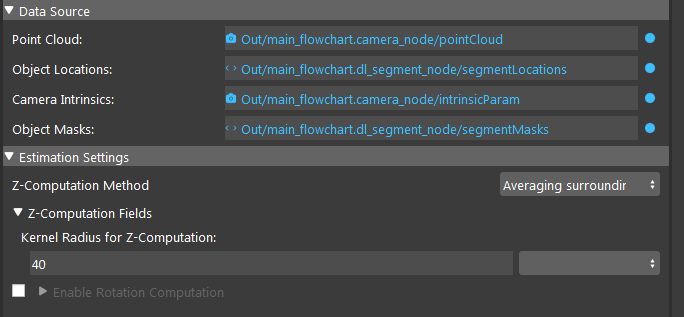

Procedure of Using Reconstruct Node
===========================================

1. Use DL Segmentation, Mod Finder (2D mode), Shape Finder to get a vector of 2D poses.
2. Use Reconstruct Node to estimate 3d poses based on the 2d poses.

Parameter Tunning in Z Computation 
--------------------------------------

There are two ways to estimate Z value of the 3d poses: use the average depth of points in a kernal or use average depth of points of represented by a mask.
If the poses are from a flat surface object (e.g. a box), it is more efficient to use kernal. Otherwise, using the object mask will take the whole shape information into 
computation, leading to a better result. Also, if the point cloud has some noisy points around the boundary of the object it is adviced to use kernal mode.

If the point cloud has many invalid points around the center of 2d pose, try to increase the kernal size or dilation iteration to compensate the information lost due to invalid points.

Parameter Tunning in Rotation Computation 
--------------------------------------------

You can enable rotation estimation of 3d pose using *Enable Rotation Computation* Flag. Simlar to Z Computation, it also has two ways of evaluating
rotation. Use the same principle in choosing computation parameters.