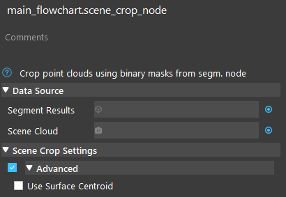
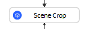
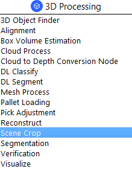
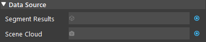
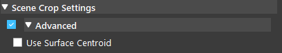
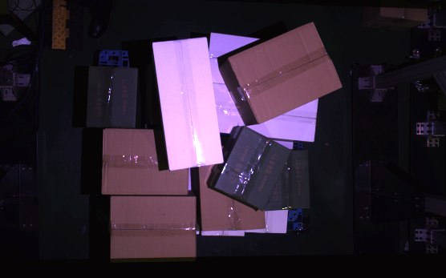

Scene Crop Node
==========================

Overview
---------------------

The Scene Crop Node uses segmentation results to crop a Point Cloud and output a vector of clouds corresponding to each segment.

|

Input and Output
---------------------

+-------------------------+-------------------+-------------------------------------------------------------------------------------------+
| Input                   | Type              | Description                                                                               |
+=========================+===================+===========================================================================================+
| Segment Results         | vector<Segm>      | Segmentation result of objects. Usually from DL Segment, Segmentation node.               |
+-------------------------+-------------------+-------------------------------------------------------------------------------------------+
| Scene Cloud             | pointCloud        | The scene point cloud to be cropped. Usually from Camera, Cloud Process node.             |
+-------------------------+-------------------+-------------------------------------------------------------------------------------------+
| Use Surface Centroid    | bool              | Whether to compute the centroid of the segmented point cloud when computing segmentPoses. |                                        
+-------------------------+-------------------+-------------------------------------------------------------------------------------------+

+-------------------------+-------------------+--------------------------------------------------------------------------------------------------------------------------------------------------+
| Output                  | Type              | Description                                                                                                                                      |
+=========================+===================+==================================================================================================================================================+
| segmentClouds           | SVecCloud         | A vector of point cloud, representing the cropped point cloud for each segment.                                                                  | 
+-------------------------+-------------------+--------------------------------------------------------------------------------------------------------------------------------------------------+
| segmentPoses            | vector<Pose>      | Poses of each point cloud, if the scene cloud has normals (from cloud process node), this pose will represent the surface normal of the segment. |
+-------------------------+-------------------+--------------------------------------------------------------------------------------------------------------------------------------------------+

|

Node Settings
---------------------

Data Source
~~~~~~~~~~~~~~~

- Segment Results
   Segmentation result of objects. Usually from DL Segment, Segmentation node.

- Scene Cloud
   3D point cloud representing the scene. Usually from Camera, Cloud Process node.

|

Scene Crop Settings
~~~~~~~~~~~~~~~~~~~~~

- Use Surface Centroid (Default: false)
   Whether to compute the centroid of the segmented point cloud when computing segmentPoses.

|

Procedure to Use
---------------------

We will need a few more nodes to demonstrate Scene Crop node. `Here <https://daoairoboticsinc-my.sharepoint.com/:u:/g/personal/xchen_daoai_com/EQWywu5KGOtDuXYc6_saFoIBlEw9AGut826AAaTAHWYPiA?e=nrcPpE>`_ are the files that you might need.

1. Insret Camera, DL Segment, and Scene Crop.
    .. image:: Images/scene_crop/scene_crop_procedure_1.png
       :scale: 60%

2. Add a virtual camera with the daoai_0.dcf. See :ref:`Camera Node` for more detailed instructions.
    .. image:: Images/scene_crop/scene_crop_procedure_2.png
       :scale: 60%

3. Make sure the models are stored in the project's Data folder.
    .. image:: Images/scene_crop/scene_crop_procedure_3.png
       :scale: 60%

4. In DL Segment, link camera's image output to the Data Input, select the config file path, and run the node.
    .. image:: Images/scene_crop/scene_crop_procedure_4_1.png
       :scale: 60%
    .. image:: Images/scene_crop/scene_crop_procedure_4_2.png
       :scale: 60%
    .. image:: Images/scene_crop/scene_crop_procedure_4_3.png
       :scale: 60%

5. In Scene Crop, link DL Segment's output as the Segment Results. Since there is only one class in this image, you can pick either one of the two outputs.
    .. image:: Images/scene_crop/scene_crop_procedure_5.png
       :scale: 60%

6. In Scene Crop, link Camera's pointCloud output as the Scene Cloud.
    .. image:: Images/scene_crop/scene_crop_procedure_6.png
       :scale: 60%

7. Run the Scene Crop node, and you can see that the tee tubes are cropped out from the scene cloud.
    .. image:: Images/scene_crop/scene_crop_procedure_7.png
       :scale: 60%

|

Exercise
---------------------

Here is the `link to files <https://daoairoboticsinc-my.sharepoint.com/:u:/g/personal/xchen_daoai_com/EZ0Wrc0cm3xKrP01IHIRQgYB2TGjxR2evYg6xGxy_vlAkA?e=1BLRb2>`_ .

Try to crop out the two dark green boxes in the following scene.

The flowchart should look the same as the one in :ref:`Procedure to Use`.

|
|
|
|
|
|
|
|
|
|
|
|
|
|
|

Answers for Exercise
---------------------

1. Please refer to :ref:`Procedure to Use` for the Camera and DL Segment setup. They are very similar.
    .. image:: Images/scene_crop/scene_crop_exercise_1.png
       :scale: 60%

2. Run the DL Segment node, and check the object's class in the label. The label is "cls 1: green 99.91", so the class is 1.
    .. image:: Images/scene_crop/scene_crop_answer_2.png
       :scale: 60%

3. Since the it is class 1 (cls 1), we need segmentResultsOfLabel[1] as the Segment Results in Scene Crop.
    .. image:: Images/scene_crop/scene_crop_answer_3.png
       :scale: 60%

4. Link Camera's pointCloud as the Scene Cloud. 
    .. image:: Images/scene_crop/scene_crop_answer_4.png
       :scale: 60%

5. Run the node, and we will have the two green boxes.
    .. image:: Images/scene_crop/scene_crop_answer_5.png
       :scale: 60%

|
