Verification Node
===========================

Overview
------------------
Verification checks a matched pose to determine if a model with this pose is well-aligned to the scene cloud. 
It outputs scores for each pose based on the verification mode, and filters out poses with scores below the confidence level.
There are three methods of verification: :ref:`Depth Mode`, :ref:`Edge Mode`, :ref:`Stacking Mode`.

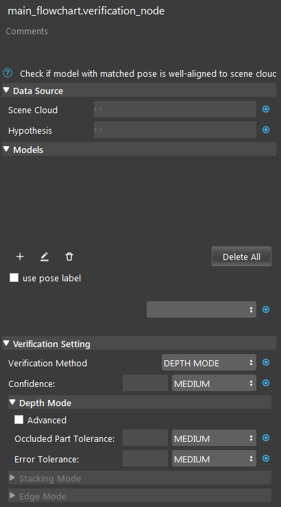

|

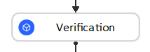

|

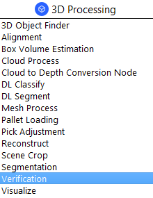

Input and Output
------------------
+----------------------------------------+-------------------------------+---------------------------------------------------------------------------------+
| Input                                  | Type                          | Description                                                                     |
+========================================+===============================+=================================================================================+
| Scene Cloud                            | Point Cloud                   | The Point Cloud from scene (Camera, Reader etc.).                               |
+----------------------------------------+-------------------------------+---------------------------------------------------------------------------------+
| Hypothesis                             | vector<Pose>                  | A vector of poses for each occurrence of model in scene (Alignment Node etc.).  |
+----------------------------------------+-------------------------------+---------------------------------------------------------------------------------+
| Models                                 | Point Cloud / Polygon Mesh    | Represents the model.                                                           |
+----------------------------------------+-------------------------------+---------------------------------------------------------------------------------+

+-------------------------+-------------------+----------------------------------------------------------------------------------------------------------+
| Output                  | Type              | Description                                                                                              |
+=========================+===================+==========================================================================================================+
| poses                   | vector<Pose>      | A vector valid poses after verification, will be sorted if stacking mode is used.                        |
+-------------------------+-------------------+----------------------------------------------------------------------------------------------------------+
| success                 | bool              | Whether the verification was successful.                                                                 |
+-------------------------+-------------------+----------------------------------------------------------------------------------------------------------+

Node Settings
--------------------
Data Source
~~~~~~~~~~~~~~~
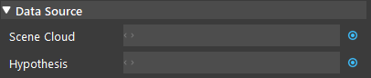

|

- **Scene Cloud**
   The Point Cloud from scene. Usually from Camera, Reader etc.

- **Hypothesis**
   A vector of poses for each occurrence of model in scene. Usually from Alignment Node etc.

Models
~~~~~~~~~~~~~~~
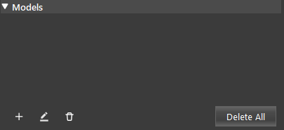

|

Define the model from a point cloud, or polygon mesh. Usually from a Reader node.

Verification Setting
~~~~~~~~~~~~~~~~~~~~~
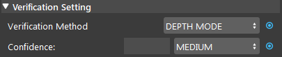

|

- **Verification Method**  (Default: DEPTH MODE):                                                           
   One of Depth Mode, Edge Mode, Stacking Mode.

- **Confidence** (Default: MEDIUM, Range [0,100]): 
   The confidence of a pose to be considered valid. 

+-----------------+-----------------+-----------------+
| LOW = 40        | MEDIUM = 60     | HIGH = 80       |
+-----------------+-----------------+-----------------+

|

Depth Mode
~~~~~~~~~~~~~~~
| Depth-based verification compares the depth difference of points in the scene and in the model at the hypothesis pose. 
| In another word, this mode verifies if the object with that pose is 'above' the scene.
| Depth Mode may fail to filter out false positives on very flat objects where the depth difference cannot be distinguished from the background. 

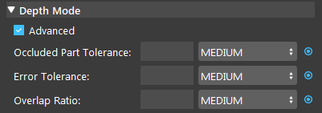

|

- **Occluded Part Tolerance** (Default: 50 (MEDIUM), Range [0, 100]):
   Threshold such that poses with more than this part occluded should be removed. 

+-----------------+-----------------+-----------------+
| LOW = 30        | MEDIUM = 50     | HIGH = 70       |
+-----------------+-----------------+-----------------+

- **Error Tolerance** (Default: MEDIUM, Range [0,100]):
   Error Tolerance: how much error points a pose can have. The higher the tolerance, the more inaccurate results will be kept. 

+-----------------+-----------------+-----------------+
| LOW = 30        | MEDIUM = 50     | HIGH = 70       |
+-----------------+-----------------+-----------------+

- **Overlap Ratio** (Default: MEDIUM, Range is [0,1]):
   Controls the penally low overlap between model and scene. 

+-----------------+-----------------+-----------------+
| LOW = 0.3       | MEDIUM = 0.5    | HIGH = 0.7      |
+-----------------+-----------------+-----------------+

|

Edge Mode
~~~~~~~~~~~~~~~
| Edge-based verification compares the outline of the model at the hypothesis pose versus edges extracted from the point cloud.
| Edge Mode may fail on objects with curved faces instead of edges where the edges cannot be extracted clearly.

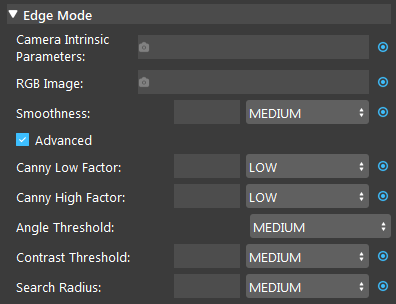

|

- **Camera Intrinsic Parameter**: 
   The Parameters of the Camera that is used for capturing. It provides the parameters for the algorithm to run (from a camera node). 

- **RGB image**: 
   RGB image of the scene. Usually from a Camera Node.

- **Smoothness** (Default: MEDIUM, Range [0,100]): 
   Level of smoothness applied to scene edge. 

- **Canny Low Factor** (Default: LOW): 
   Lower the threshold of canny filter.

- **Canny High Factor** (Default: LOW): 
   Upper the threshold of canny filter.

- **Angle Threshold** (Default: MEDIUM): 
   The angle threshold for smoothing the extracted edges.

- **Contrast threshold** (Default: MEDIUM): 
   The threshold for filtering out edges with low difference in depth.

- **Search Radius** (Default: MEDIUM, Range [1, ∞)): 
   Radius used for edge pixel clustering. 

+-----------------+-----------------+-----------------+
| LOW = 1         | MEDIUM = 5      | HIGH = 10       |
+-----------------+-----------------+-----------------+

|

Stacking Mode
~~~~~~~~~~~~~~~
| Stacking Mode is used to determine which object is “on top” when objects are stacked on top of one another. 
| This mode will sort poses according to the visibility. We calculate the visibility score of each pose then we return the poses sorted by visibility as well as filter poses based on the confidence threshold.

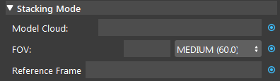

|

- **Model Cloud**:
   This field is only needed if the model is defined using the mesh format (optional). 
   If a mesh model is used then this field should be link to a point cloud of the model.

- **FOV** (Default: MEDIUM, Range: [1.0, 180.0]): 
   The field of view for viewing camera. A greater value means more poses will be seen, and thus kept.

+-----------------+-----------------+-----------------+
| LOW = 45.0      | MEDIUM = 60.0   | HIGH = 90.0     |
+-----------------+-----------------+-----------------+

- **Reference Frame**:
   The default reference frame will be used if none is provided (optional).

Procedure to Use
--------------------
1. We will need a few more nodes for demonstration. Insert nodes: Camera, (2D) Mod Finder, Reconstruct, Transformation Tree, Cloud Process, Writer, Reader, Alignment, and Verification.
    .. image:: Images/verification_procedure_1.png
       :align: center

|

    .. image:: Images/verification_procedure_1_1_1_mod_finder_option.png
       :align: center

|

    .. image:: Images/verification_procedure_1_1.png
       :align: center

2. Click on the Camera node, and link a camera with the tee.dcf scene. You can get the file `here <https://daoairoboticsinc-my.sharepoint.com/:u:/g/personal/tzhang_daoai_com/EUaL8LFp-JlJugrB-VYSCr8BODvs7cyJszjIywupMCNDDg?e=XCPFjb>`_.
    .. image:: Images/verification_procedure_2.png
      :align: center

|

    .. image:: Images/verification_procedure_2_2.png
      :align: center

3. In Mod Finder, link the previous Camera image output as the Image.
    .. image:: Images/verification_procedure_3.png
       :align: center

4. In Mod Finder, set Total Occurance to "All". Then click the '+' icon to add a model from the image and draw a mask for model_1.
    .. image:: Images/verification_procedure_4_mod_finder_models_mask.png
       :align: center

5. Select Mod Finder, run the node. The result should look like this:
    .. image:: Images/verification_procedure_5_mod_finder_run.png
       :align: center

6. In Reconstruct, link camera's pointCloud output as the Point Cloud, Mod Finder's labelledPose2dSequence as the Object Locations, and Camera's intrinsicParam as the Camera Intrinsics.
    .. image:: Images/verification_procedure_6.png
       :align: center

|

    .. image:: Images/verification_procedure_6_6.png
      :align: center

|

    .. image:: Images/verification_procedure_6_6_6.png
       :align: center

7. In Transformation Tree, add a pose item and link Reconstruct's objectPositions/occurrence[0]. Click Next to set Output.
    .. image:: Images/verification_procedure_7.png
       :align: center

|

    .. image:: Images/verification_procedure_7_7.png
       :align: center

|

    .. image:: Images/verification_procedure_7_7_7.png
       :align: center

8. In Transformation Tree, add an output transformation b in a.
    .. image:: Images/verification_procedure_8.png
       :align: center

9. In Cloud Process, link the Camera's pointCloud output as the Point Cloud; Add "Adjust Bounding Box" and "Transform Coordinates" opeartions.
    .. image:: Images/verification_procedure_9.png
       :align: center

10. Check the "Adjust Box" option, then run the cloud process node, and crop the model with the bounding box. Click "Exit Interactor" when you are finished.
     .. image:: Images/verification_procedure_10.png
        :align: center

|

     .. image:: Images/verification_procedure_10_10.png
        :align: center

11. Double click the Transforma Coordinates option to edit it, then link Transformation Tree's output. Run the node.
     .. image:: Images/verification_procedure_11.png
        :align: center

|

     .. image:: Images/verification_procedure_11_11.png
        :align: center

12. In Writer node, select POINT_CLOUD (.pcd) as the Data Type, link the cloud process' cloud output. Select a path and name (tee_v_cloud.pcd) for the file, and run the node.
     .. image:: Images/verification_procedure_12.png
        :align: center

13. In Reader node, select the file tee_v_cloud.pcd, and run the node. 
     .. image:: Images/verification_procedure_13.png
        :align: center

|

     .. image:: Images/verification_procedure_13_13.png
        :align: center

14. In Alignment node, link Reconstruct's objectPositions as the Hypothesis, and Camera's pointCloud as the Scene Cloud. 
     .. image:: Images/verification_procedure_14.png
        :align: center 

|

     .. image:: Images/verification_procedure_14_14.png
        :align: center

15. In Alignment node, click the '+' icon to add a model. Double click 'model_1', choose the "From Link" option for the Model Type, and link the output of the Reader node. Then click "Define Model", and run the node.
     .. image:: Images/verification_procedure_15.png
        :align: center

|

     .. image:: Images/verification_procedure_15_15.png
        :align: center

|

     .. image:: Images/verification_procedure_15_15_15.png
        :align: center

16. You should see the result like this image.
     .. image:: Images/verification_procedure_alignment_scene_eight.png
        :align: center

17. In Verification node, link camera's pointCloud output as the Scene Cloud. Link Alignment's pose output as the Hypotehsis.
     .. image:: Images/verification_procedure_17.png
        :align: center

|

     .. image:: Images/verification_procedure_17_17.png
        :align: center

18. Click '+' to add a model. Link the Reader's cloud output, click "Define Model". 
     .. image:: Images/verification_procedure_18.png
        :align: center

|

     .. image:: Images/verification_procedure_18_18.png
        :align: center

|

     .. image:: Images/verification_procedure_18_18_18.png
        :align: center

19. Select a Verification Mode (Depth/Edge/Stacking). We will use the **Edge Mode** for demonstration here. In the Verification node, change the Verification Method to EDGE MODE. Link Camera Intrinsic Parameters and RGB Image with the output from the Camera node. Then run the node. Only three poses are left after running verification edge mode.
     .. image:: Images/verification_procedure_19.png
        :align: center

|alignmentSceneEdgePic| |edgeAfterPic|

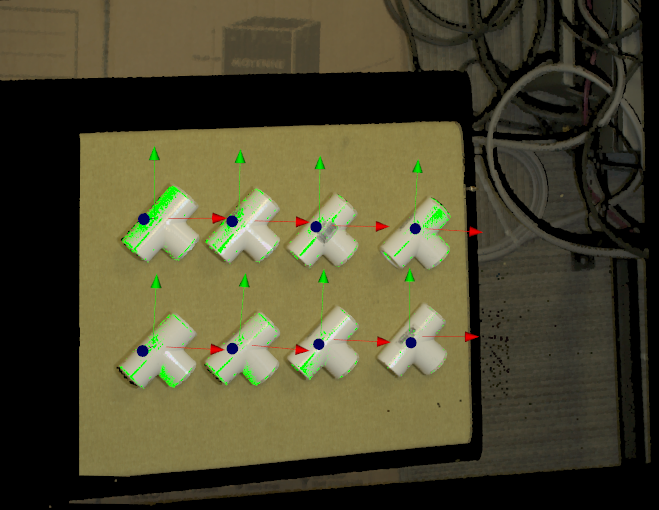

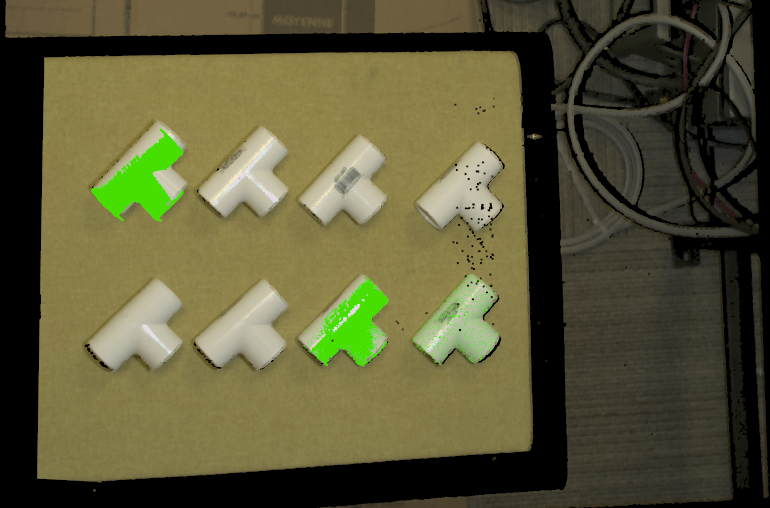

20. You can check the "Show Edges" box to see the edges used.
     .. image:: Images/verification_procedure_edge_see_edge.png
        :align: center

Exercise
--------------------
Given the following flowchart and the output of the Alignment node. Without changing the settings of Mod Finder and Alignment, explain a way to filter out the two models on the ground.
   
   .. image:: Images/verification_exercise_flowchart.png
      :align: center

|

   .. image:: Images/verification_exercise_alignment_scene.png
      :align: center

|
|
|
|
|
|
|
|
|
|
|
|
|
|
|

Answers for Exercise
--------------------
We can utilize the Depth Mode in Verification node. Insert a Verification node. Link the necessary inputs. Change the Verification Method to DEPTH MODE. Then run the node. The two poses on the ground are filtered out by verification depth mode.
   
   .. image:: Images/verification_exercise_depth_mode.png
      :align: center

|

|alignmentSceneDepthPic| |depthAfterPic|

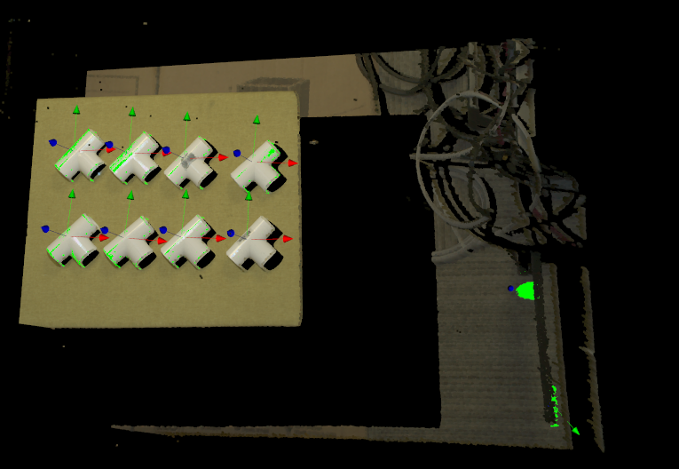

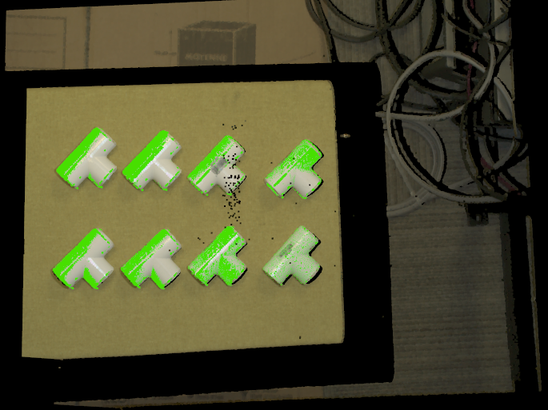

