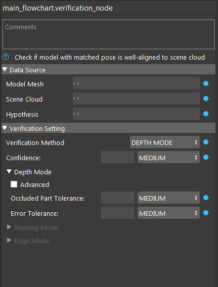

Verification Node
===========================

Verification checks a matched pose to determine if a model with this pose is well-aligned to the scene cloud, and outputs scores for each pose.

Three methods of verification are available:

* Depth-Mode: Depth-based verification compares the depth difference of points in the scene and in the model at the hypothesis pose. In another word, this mode verifies if the oebject with that pose is 'above' the scene.

* Edge-Mode: Edge-based verification compares the outline of the model at the hypothesis pose versus edges extracted from the point cloud.

* Stacking-Mode: Stacking Mode is used to determine which object is “on top” when objects are stacked on top of one another. this mode will sort poses according to the visibility.

Edge Mode may fail on objects with curved faces instead of edges where the edges cannot be extracted clearly.

Depth Mode may fail to filter out false positives on very flat objects where the depth difference cannot be distinguished from the background. Decreasing the Accuracy may improve the performance in these cases.

The Confidence is the most important parameter to adjust when configuring this node. By setting this higher, more poses are filtered out based on their verification scores. A recommended step when configuring the detection pipeline is to vary this parameter and compare the remaining poses to find the best value to filter out false positives while keeping true positives.

In Stacking Mode, we calculate the visibility score of each pose then we return the poses sorted by visibility as well as filter poses based on the confidence threshold.

Verification scores are normalized between 0 and 1 and represent the confidence that the pose is correctly aligned to the scene. Poses are also penalized for occlusion, so this process will favor poses that can be picked.

.. toctree::
   :maxdepth: 1

   verification_overview
   verification_procedure