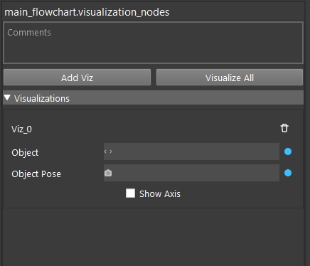

Visualization Node
============================

Visualization node is a utility node that visualizes point clouds or meshes. It can also apply poses to objects before visualizing.
The Node has no output.

Input
---------------------------

* Arbitrary number of visualization items
   * Object: point cloud or mesh, the object to be visualized.
   * Pose: optional, a pose to be applied to the object

