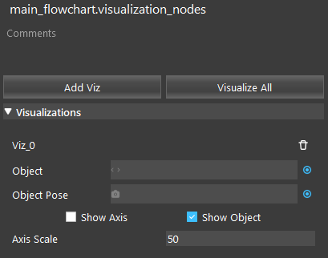
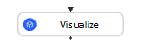
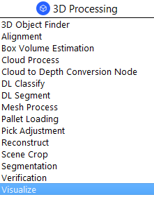
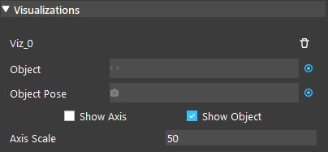
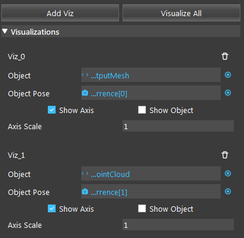
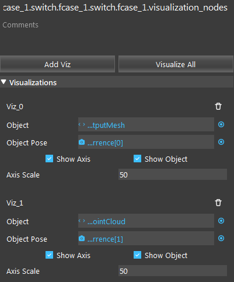
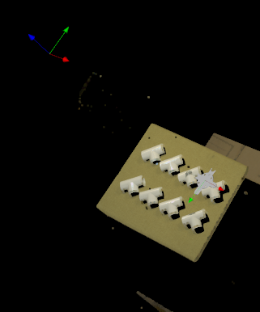

Visualize Node
============================

Overview
-------------
The Visualize node is a utility node that visualizes point clouds or meshes in the same coordinate system using their respective positions. It can also apply poses to objects before visualizing.

Input and Output
---------------------------

+-------------------------+--------------------+------------------------------------------------------------------------+
| Input                   | Type               | Description                                                            |
+=========================+====================+========================================================================+
| Object                  | Point Cloud / Mesh | The object to be visualized.                                           |
+-------------------------+--------------------+------------------------------------------------------------------------+
| Object Pose             | Pose               | The pose to be applied to the object (optional).                       |
+-------------------------+--------------------+------------------------------------------------------------------------+
| Show Axis               | bool               | Whether to display the pose's axis or not.                             |
+-------------------------+--------------------+------------------------------------------------------------------------+
| Show Object             | bool               | Whether to display the object or not.                                  |
+-------------------------+--------------------+------------------------------------------------------------------------+
| Axis Scale              | int                | The size of the axis to be shown.                                      |
+-------------------------+--------------------+------------------------------------------------------------------------+

The Visualize node has no output, it only uses the display.

Node Settings
---------------------------

Visualizations
~~~~~~~~~~~~~~~

There can be an arbitrary number of visualization items.

- Object
   The object to be visualized.

- Object Pose
   The pose to be applied to the object (optional).

- Show Axis (Default: false)
   Whether to display the pose's axis or not.

- Show Object (Default: true)
   Whether to display the object or not.

- Axis Scale (Range: [1,100]; Default: 50)
   The size of the axis to be shown.

Procedure to Use
---------------------------
We will need a few more nodes to demonstrate the Visualize node. You can get the files `here <https://daoairoboticsinc-my.sharepoint.com/:u:/g/personal/xchen_daoai_com/ERwFyz-g2Z9MiW4YPMu6sYwBiDs4NRFnD4YpgVupZkVAHA?e=t7mphp>`_ .

1. Insert a Calibration, 2 Readers, Transformation Tree, and Visualize node.
    .. image:: Images/visualize/visualize_procedure_1.png
       :scale: 60%

2. In Calibration, select Load mode, and input the calibration file name. Make sure the file is stored in the project's calibrations folder. 
    .. image:: Images/visualize/visualize_procedure_2_1.png
       :scale: 60%
    .. image:: Images/visualize/visualize_procedure_2_2.png
       :scale: 60%

3. In the first Reader node, read the gripper's mesh file.
    .. image:: Images/visualize/visualize_procedure_4.png
       :scale: 90%

4. In the second Reader node, read the bag file.
    .. image:: Images/visualize/visualize_procedure_5.png
       :scale: 90%

5. In the Transformation Tree, we need the tool in cloud relation to visualize the gripper. Add a tool in base relation, and link the bag's output pose; Add a cam in base relation, and link calibration's camInBase output; Add a cam in cloud relation, click "Set Pose", change Rot a to 180. Finally, add a tool in cloud output. Remember to click "Apply".
    .. image:: Images/visualize/visualize_procedure_3_1.png
       :scale: 60%
    .. image:: Images/visualize/visualize_procedure_3_2.png
       :scale: 60%
    .. image:: Images/visualize/visualize_procedure_3_3.png
       :scale: 90%
    .. image:: Images/visualize/visualize_procedure_3_4.png
       :scale: 80%

6. In the Visualize node, click "Add Viz" to add a visualization (Viz_0). For Object, link the first reader's outputMesh (gripper). For Object Pose, link the Transformation Tree's output.
    .. image:: Images/visualize/visualize_procedure_6.png
       :scale: 90%

7. Click "Add Viz" to add another visualization (Viz_1). For Object, link the second reader's bag cloud output. You can leave Object Pose empty as the object is the scene.
    .. image:: Images/visualize/visualize_procedure_7.png
       :scale: 90%

8. Run the flowchart, and click on Visualize node. You can see the scene and gripper are displayed.
    .. image:: Images/visualize/visualize_procedure_8.png
       :scale: 80%
|

Exercise
---------------------------
You have this flowchart and are trying to see the visualization of the scene with the gripper. However, when you click on the Visualize node, the display appears to be a black screen. How can you fix the problem, given the following visualizations settings and that the Object and Object Pose links are correct?

.. image:: Images/visualize/visualize_exercise_2.png
   :scale: 68%

|
|
|
|
|
|
|
|
|
|
|
|
|
|
|

Answers for Exercise
---------------------------
| Since "Show Axis" is checked, the screen should show two axes. However, the axis scale is 1, so they are too small to be seen. Let's change it to 50.
| "Show Object" also need to be selected in order to display the objects or scene.
| With the following settings in visualize, the display shows both the axes and the objects.

