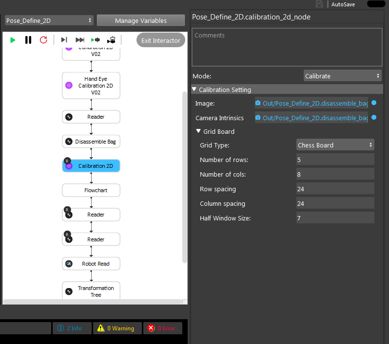
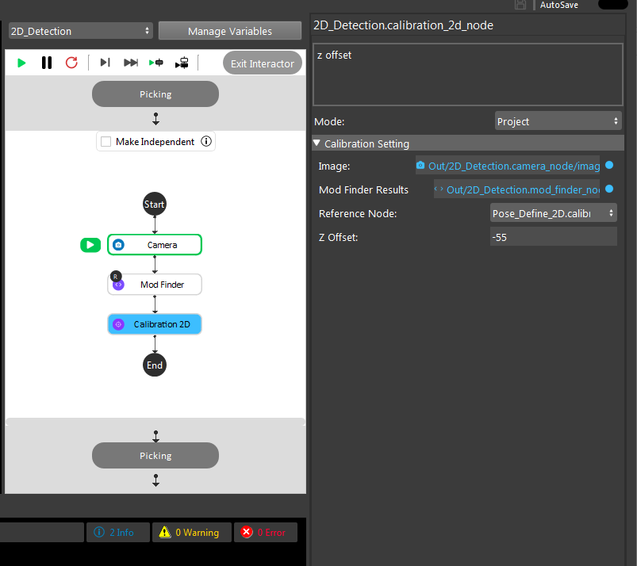

Procedure of Using Calibration Node
------------------------------------------

In the previous section, we provided details on the HandEyeCalibration2DV02 node which obtains transformation between the world and the robot virtual plane. However, in order to be able to perfrom the 2D picking succesfully, we need a way
to obtain the transformation between a camera and the world. This can be done using the Calibration2D node which obtains the transformation between the world (chessboard) and the camera ony using a single capture. 

.. image:: Images/calibration_2d/calibration2d.jpg
    :align: center
|

By adding the Calibration2D node, you can see that this node operates in two modes. One is the calibrate mode which simply usues the captured image from the chessboard or circle grid to obtain the intrinsic parameters of the camera as well as the 
transformation of camera to world (gird). 

|

The other mode of the Calibration2D node is the project mode. This mode is used in the 2D picking pipeline to convert a detected 2D pixel (from a mod_finder node) into the 3D world coordiante system.   

|

Note that as the picking process is 2D and as mentioned before, the picking height is hardcoded. This vlaue can be set in the Zoffset filed of the project mode in calibration2D node ad shown above. This is the distance from the 
detection surface surface to the chessbaord surface. If the detection surface is above the calibration surface for 20mm, wou shoould enter -20 and vice-versa. 

By obtaning the transforation of a 2D pixel to 3D world corrdiantes system using the Calibration 2D node and the transfomration of world to robot plane from the HandEyeCalibration2DV02 Node, the transformation from 2D pixels to robot base can obtained which then can be used in the 2D picking pipeline. 

 
