Perspective Calibration Node
============================

Overview
-----------

The Perspective Calibration node is the replacement node for Calibration 2D node in version later than 2.22.6.0-271.

Perspective Calibration node is able to calibrate with 2D images just like the Calibration 2D node. However, it has more power functions 
than the Calibration 2D node. Perspective Calibration node can undistort images with given calibration board or parallel images with given calibration board.
Other than that, Perspective Calibration node is also able to generate a **object in plane** or **object in world** pose from vector of poses inputs. 
Which means, Perspective Calibration node can use the result of Mod Finder node(or any other nodes which output vector of poses as hypothesis) to generate 
the detection result. This will simplify the Detection pipeline in 2D picking.

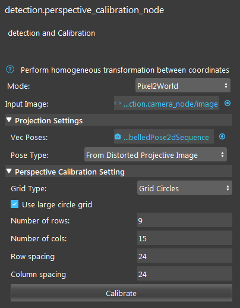

|

Input and Output
-------------------

+----------------------------------------+-------------------------------+---------------------------------------------------------------------------------+
| Input                                  | Type                          | Description                                                                     |
+========================================+===============================+=================================================================================+
| Mode                                   | Dropdown menu                 | The mode which Perspective Calibration node will give different functions.      |
+----------------------------------------+-------------------------------+---------------------------------------------------------------------------------+
| Input Image                            | image                         | The image from scene (camera, reader etc.)                                      |
+----------------------------------------+-------------------------------+---------------------------------------------------------------------------------+
| vecPoses(only in Pixel2World)          | Vec<Poses2D>                  | Vector of 2D poses(Mod Finder, Shape Finder etc.)                               |             
+----------------------------------------+-------------------------------+---------------------------------------------------------------------------------+
| Poses Type                             | Dropdown menu                 | The projection images type.                                                     |             
+----------------------------------------+-------------------------------+---------------------------------------------------------------------------------+

+-------------------------+-------------------+------------------------------------------------------------------------+
| Output                  | Type              | Description                                                            |
+=========================+===================+========================================================================+
| Obj in World Poses 3D   | Vec<Pose3D>       | Vector of 3D poses, poses are the object in world(plane) poses.        |
+-------------------------+-------------------+------------------------------------------------------------------------+
| outputImage             | image             | Output images for selected mode.                                       |
+-------------------------+-------------------+------------------------------------------------------------------------+
| parallelPixelSize       | double            | Size of parallelized pixels.                                           |
+-------------------------+-------------------+------------------------------------------------------------------------+

Node Settings
--------------

General Setting
***************

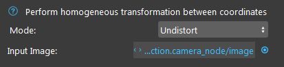

|

* Mode

   Dropdown menu for 3 different mode of Perspective Calibration node: 1. Undistort; 2. Parallel; 3. Pixel 2 world;

   1. Undistort mode

        Undistorting the image with given calibration board. This mode is able to undistort the image view angle changes on the image.

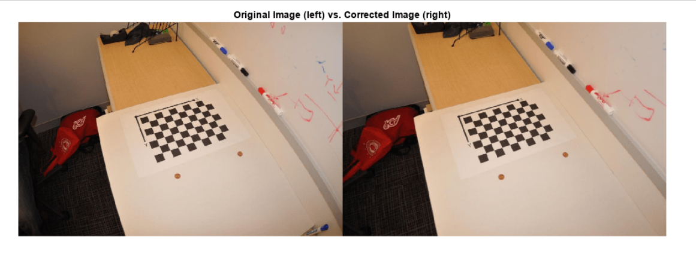

|        

   2. Parallel mode

        Parallelizing the image with given calibration board. This mode is able to parallelize the whole image and its orientations based on the calibration board.

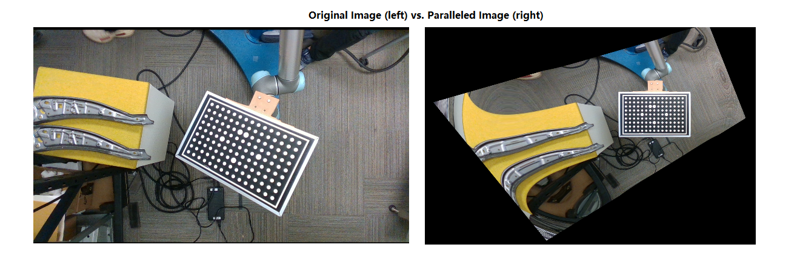

|

   3. Pixel 2 World mode

        Pixel 2 world mode is able to generate the 3D picking pose(based on plane) from 2D poses hypothesis.

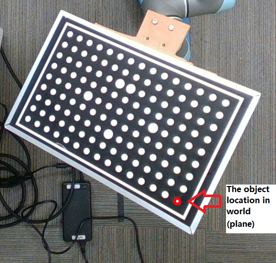

|

Projection Settings(Only available in Pixel2World mode)
*******************************************************

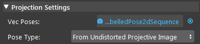

|
   
* Vec Poses

   Vector of 2D poses input. Usually from RGB Mod Finder(2D) or Shape Finder etc. It is the hypothesis for Perspective Calibration node to generate the 3D poses.

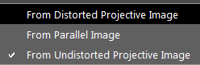

|

* Poses Type

   Types of image input for the poses to be projected on.

Perspective Calibration Setting
*******************************

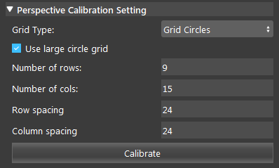

|

* Grid Type

   Types of calibration board you selected.

* Use Large circle grid

   Large circle grid is only available in circle grid board. Checking this option will use the orientation of the board to decide the direction of the **world** you define in Vision. And the **origin** of the world(plane) will be the center location of the board.

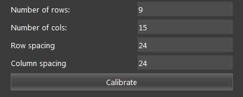

* Board information

   These are the information of the board you are using. Spacing are in unit of **mm**.

Procedure of Using Reconstruct Node
-----------------------------------

1. Open a workspace in DaoAI Vision Studio.
	.. image:: Images/open.png
		:align: center

2. Insert a Camera node to get the source image.
	.. image:: Images/camera.png
		:align: center

3. A virtual image is used to demonstrate. Refer to System Overview, Tutorials on how to connect to camera.
	.. image:: Images/board.png
		:align: center

4. Insert Perspective Calibration node for 2D calibration here.
	.. image:: Images/per_insert.png
		:align: center

5. Select the mode you want for this calibration. Undistort will output a undistorted image based on the board in scene; Parallel will output a paralleled image based on the board's orientation and rotation; Pixel2World is **NOT** the mode you will use when you calibrate the **world** in camera.
	.. image:: Images/mode.png
		:align: center

6. Input all the essential parameters for the board. If you are using **Large Circle Grid**, the **World** coordinate will inherit the same orientation from the board. Clicking on the button **Calibrate** to calibrate. In this example, I used undisort mode since I want to eliminate the error from viewing angle of the camera.
	.. image:: Images/undisort_image.png
		:align: center

7. Now you have finished the Calibration process. And you can keep reading for the 2D detection details.

8. Then, adding a detection engine node such as Mod Finder, Shape Finder or DL Segment node etc. In this example, I will use the Mod Finder node since it is one of the most common node for detection.
	.. image:: Images/mod_finder.png
		:align: center

9. Also, in this example, I use the undistorted image as Mod Finder's input image. In this way, the image will be undistorted, but the shape of the object in image will be slightly changed as well. Therefore, link to Camera node or Perspective Calibration node for Mod Finder based on what you need. And last but not least, define your model in that image as well. If you define the model in undistorted image, but wanted to detect the object in distorted image, this is not going to work.
	.. image:: Images/mod_detection.png
		:align: center

10. Inserting another Perspective Calibration node and select the **Pixel2World** mode. Using the first Perspective Calibration node output image, which is the undistorted image for its input. Then, you should select the Pose Type as **From Distorted Projective Image**.
	.. image:: Images/pers2.png
		:align: center

11. At the end, you can see the hypothesis of the Mod Finder is not transformed into a 3D pose, an **object in world** pose.
	.. image:: Images/obj_in_world.png
		:align: center

World Origin and Orientation
----------------------------

In 2D picking, the world(plane) location/origin and the orientation is important. We need to know where is our world, and where is facing. We recommend the **Use Large Circle Grid** option, since it will provide the standard origin and orientation of the world. Which is easier to operate.

.. note:: 
    Orientations are only available when you enable **Use Large Circle Grid**. If you do not enable this option, orientations will be defined based on calibration result. On another words, **Grid Board** does not generate the world/plane with orientations.

Use Large Circle Grid
*********************

Origin
######

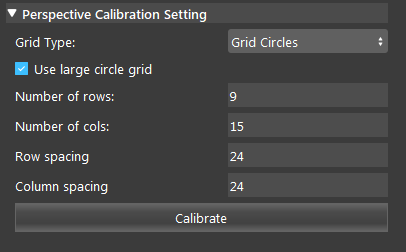

When you checked option **Use Large Circle Grid**, the origin and orientation will be applied on this calibration. 

**Origin will always at the center of the large circles.**

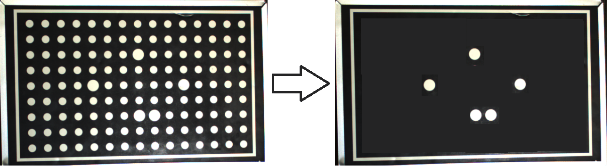

|

Take a close look on the circle board, you can see there are some circles larger than the others. These large circles will determine the origin and orientation of the world. 
If you stripe all the small circles, you can see the board like on the right. You can draw a cross on the them and the center is the origin of the world. 

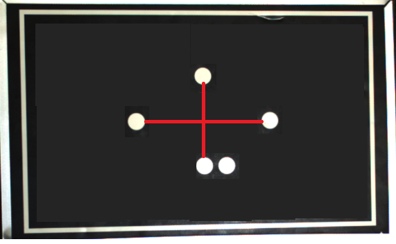

|

Orientation
###########

The Orientations are always applied when calibrated. **X** is the **West** of the origin, when the 2 circles are at the **South**. **Y** is the **North** of the origin, when the 2 circles are at the **South**. Like image shown below.

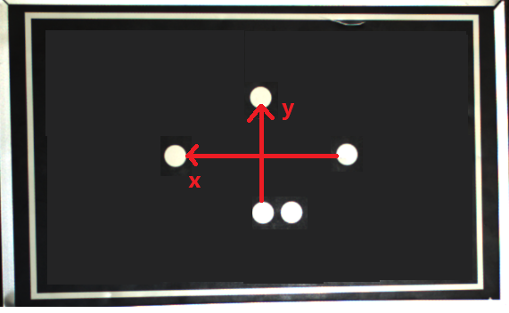

|

Disable Use Large Circle Grid
*****************************

Origin
######

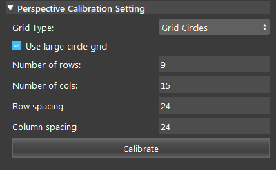

When **Use Large Circle Grid** option is unchecked, no orientations will be applied on this calibration. 

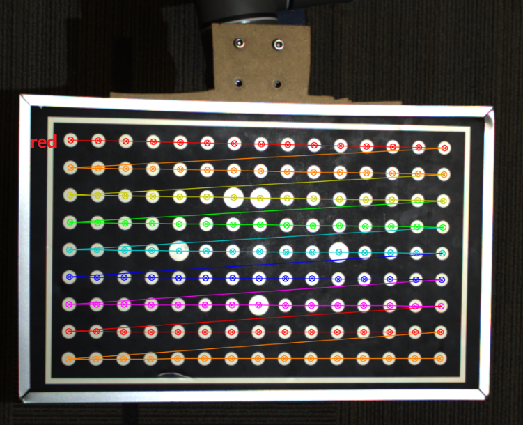

|

The calibration result is shown like the image above. You can see the result will be always starting from a red line, which means the origin of this world/plane will be located at this 
first point of the red line. Like image shown below.

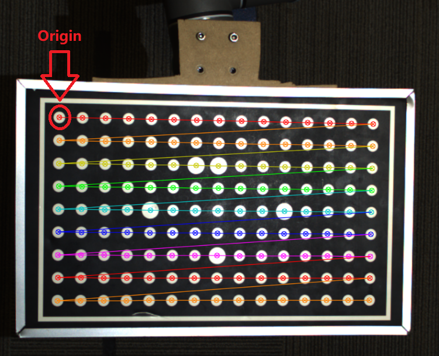

|

The **origin** of this world is the center of this white circle. Therefore, the center of this white circle will have coordinate: **[0,0]** in world. 

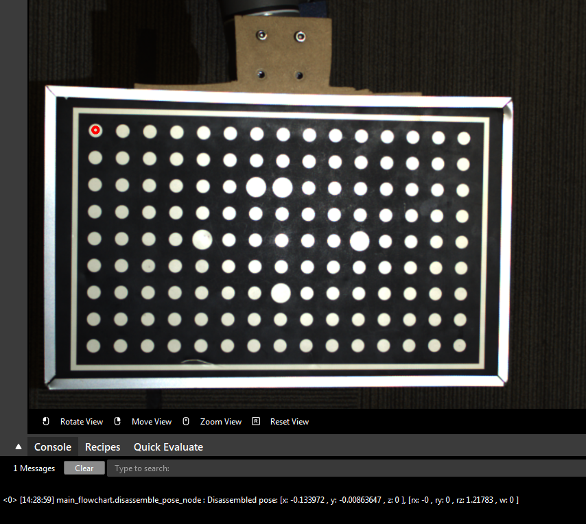

|

**This red dot is the origin of this specific world.**

The origin might be at different locations regarding to the camera's view. But it will **always at the first red point of the first redline on its calibration result**. Therefore, if you are not sure 
where is the origin of your world, you should check your calibration result again. There are some examples of origins in calibration result(Origins are the ones where red arrow pointing):

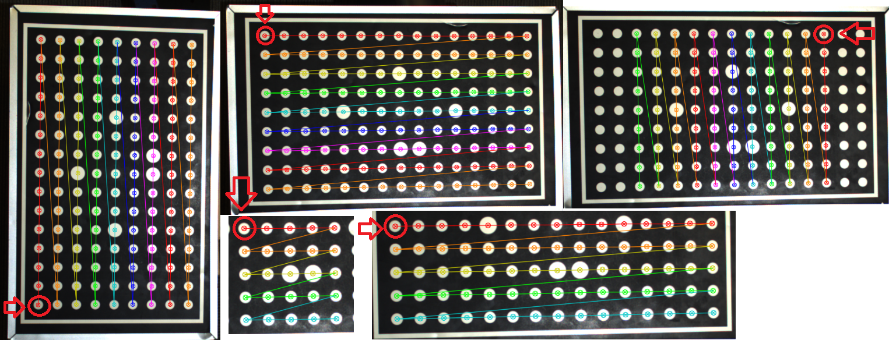

|

.. attention::
    Origin is always the first red point of its first redline on the calibration result!

There are some cases where you see 2 red lines in the calibration result(unlikely to happen, since our calibration boards are designed to distinguish it). If you encountered these edge cases, you will have to check where the origin is. 
You can checkout :ref:`Check your Origin & Orientation <Check your Origin & Orientation>`.

Orientation
###########

The orientation of the world is determined by the calibration result as well. 

|

Starting from the origin, the lines are connecting from the origin. And the direction of this connecting line is essential for the world's orientations. 

**X** is the growing direction of columns; as well as the growing direction of the connected lines from origin. Like image shown below:

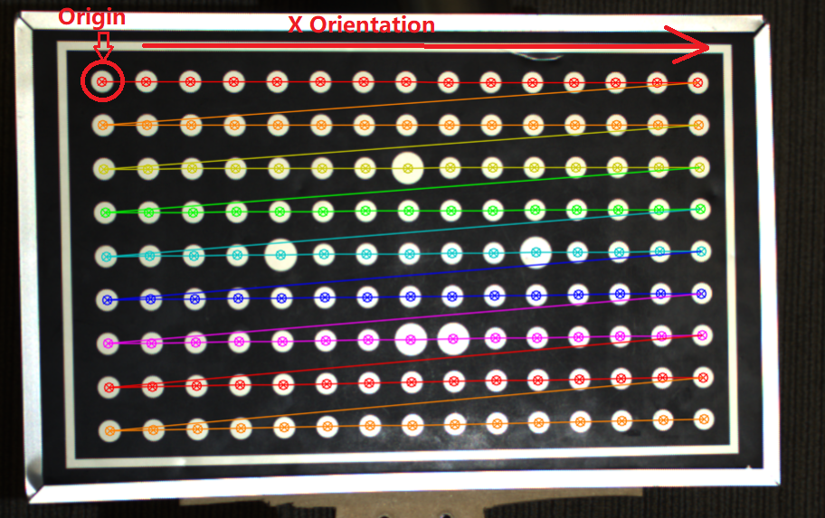

|

**Y** is the growing direction of rows; as well as the growing direction of the levels for connected lines from origin. Like image shown below:

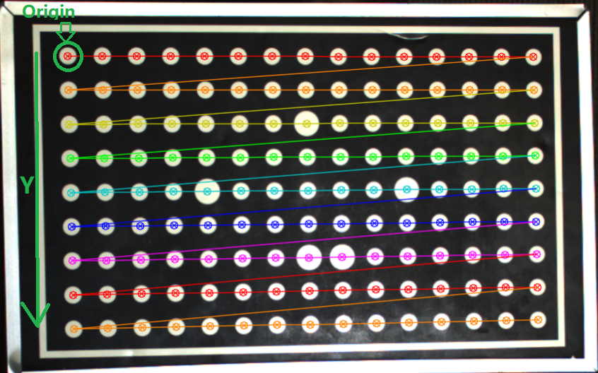

|

There are some examples of orientations in calibration result(Origins are the ones where red arrow pointing):

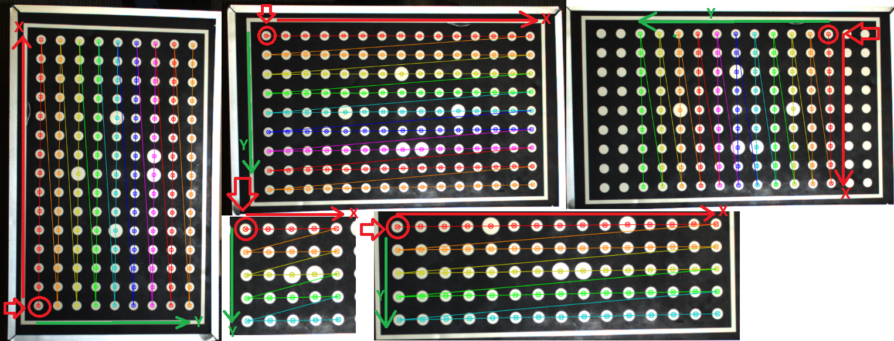

|

Check your Origin & Orientation
*******************************

There is an easy way to check where your origin & Orientations.

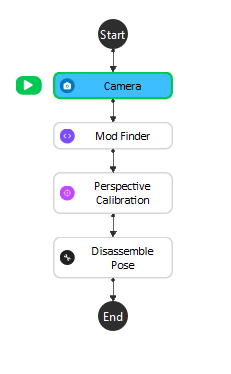

|

First of all, you can build a flowchart like image shown above. Linking them one by one, all image links should link to Camera node. 

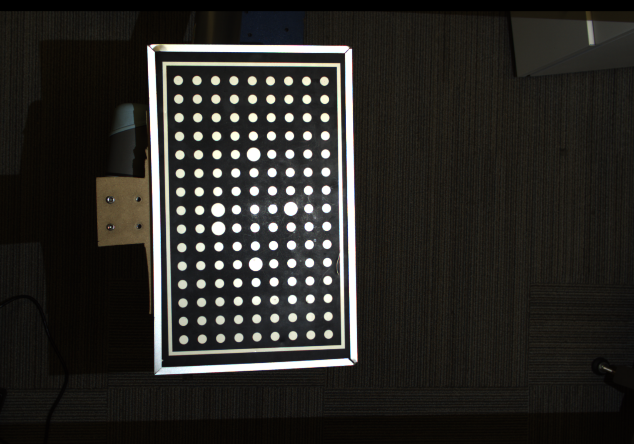

|

Capture a board in camera. Then Mod Finder defining a model which includes the whole board(You should define a new model each time camera captures, to reduce the Mod Finder's error). 

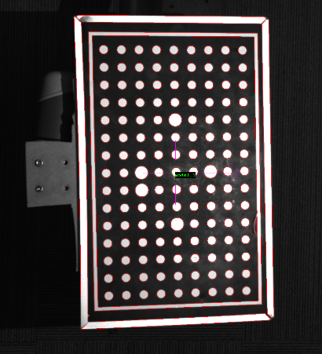

|

Calibrating the image on Perspective Calibration node with correct board parameters(You can use any mode, but Pixel2World mode is the most handy mode). We are not going to check the option for **Use Large Circle Grid** in this example since this option will give us the standard origin & orientations.

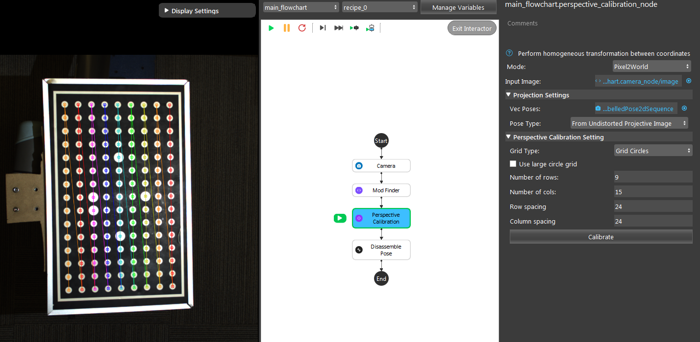

|

Origin
######

Now, you should change your reference point for Mod Finder's model. Since we do not know where the origin is, we might have to guess. But usually, the origin should sit at the center of one the corner circles. So changing your reference point to one of them like image shown below.

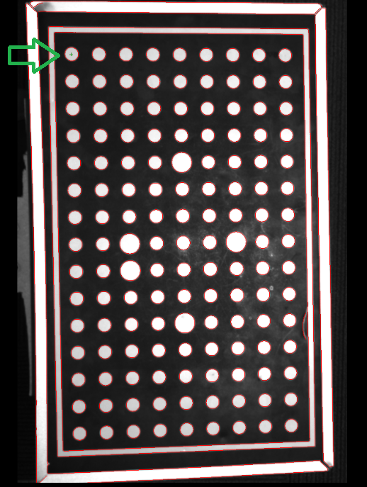

|

Then executes the Perspective Calibration node in Pixel2World mode. You will see the point we selected is now the red dot. And Perspective Calibration node will generate the pose: red dot in world location. Which is the 2D pose for this red dot in world regarding to the origin. 

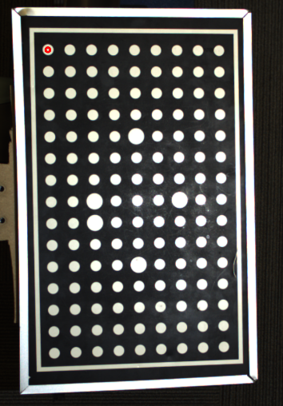

|

Disassemble this 2D pose, you will see the actual location of the red dot. If the red dot is somewhere close to 0 for **X** and **Y**, which means it is the origin, and the origin will always at the center of the circle.

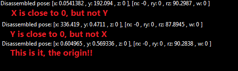

|

Orientation
###########

You can use the same method to find out where your **X** and **Y** orientation!

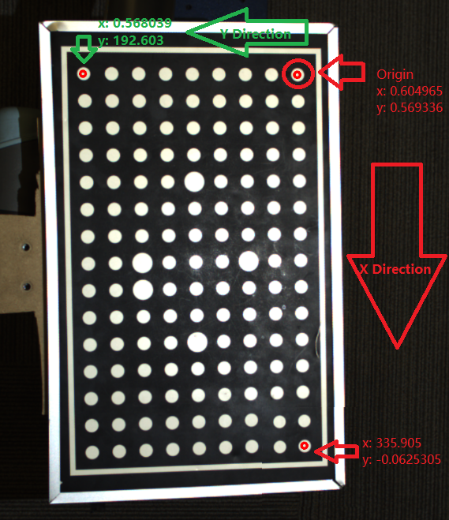

|

Exercise
---------

If your working plane is a tilted area and you will need to work on this area with camera not tilted. Which mode would you use for this scenario? 

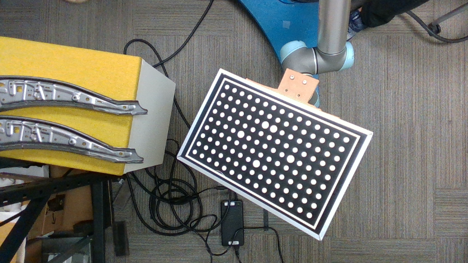

For example, your objects will be on the board, and your camera and working area is fixed.

Answers for Exercises
---------------------

Since you are working on a tilted area, **Parallel** mode is a good choice for it. First of all, Parallel mode will generate the paralleled image based on the board.

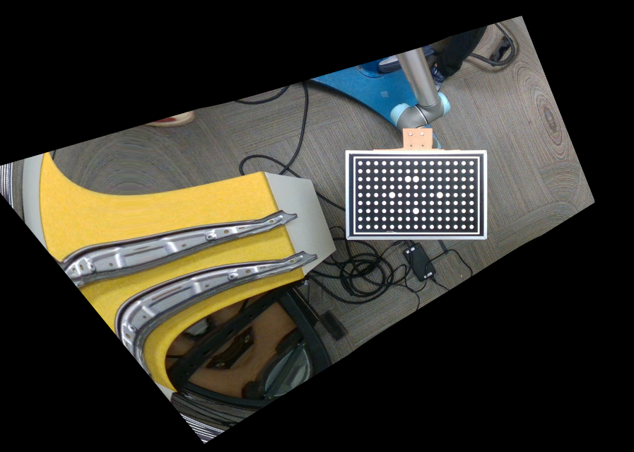

Because of 2D picking's detecting object within its designated world(plane), we need the object location on this plane.

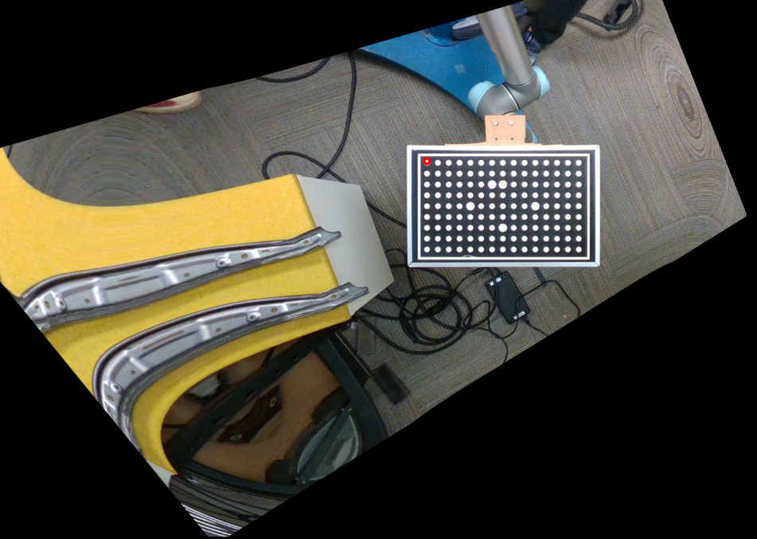

Like the red dot above, we now have the red dot(object) in world(the board center) location, the **object in world** location. 