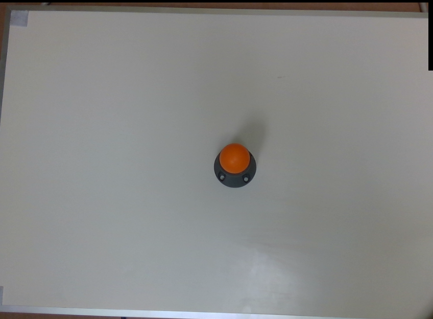

Procedure for Using Sphere Calibration Node
================================================

The functionality of sphere calibrator node is very similar to calibration node. The main difference lies in the used calibration tool and optimization method used for calibration. An example of the used sphere tool is shown below (orange sphere). This 
sphere can either be mounted to the robot arm (eye-in-hand) or could have a static position (eye-to-hand). Again same as the calibration node, you need to capture different 3D images from the calibration tool. Note that for each robot and sphere position, the robot pose and the 2D and 3D image of the scene should be captured. The next step is to detect the spheres in each capture to obataion the 
sphere poses in each capture. For this please refer to the sphere calibration flowchart template. 

    
|

Once you have captured calibration images and detected the sphere poses, you can add the sphere calibration node into the flowchart to perform calibration. 
When adding this node to the flowchart, you will see the option for choosing the calibration mode. We provide three modes for the sphere calibration node.
First, the accumulation mode is used to load the calculated sphere poses and robot poses for each robot position. When you choose the accumulation mode, you will be able to set different options and inputs. 

 .. image:: Images/sphere_calibration_node/accumulate.jpg
    :align: center
    
| 

As shown in the image above, you have to choose the hand-eye configuration. Also, the other inputs include the robot pose, sphere pose (position of sphere center point in the point cloud).  In the sphere calibration case, the transformations to be obtained are the 3D transformation of TCP to camera and the translation of sphere to base for eye-in-hand scenarios. This 
would be the 3D transformation of base to camera and the translation of sphere to TCP in the eye-to-hand case. Also, there is an option to set initial value for the 
translation of TCP to camera (eye-in-hand) and sphere to gripper (eye-to-hand). This is then used as an initialization for the optimization. The default value for this case is zero translation.      
 
After accumulation, the next step is to perform robot-camera calibration. This can be done by adding another sphere calibration node in the flowchart and setting the mode to final mode. The final mode will perform the main computation for the calibration.

 .. image:: Images/sphere_calibration_node/final.jpg
    :align: center
    
|

In the final mode, you have to specify the reference accumulation node, so, the results then can be used for calibration. Also, you have to determine a file name where the calibration results (obtained transformations) will be saved in.
By running
the calibration node in the final mode, the calibration results will be obtained. More specifically the outputs of the final mode are the gripper to camera, camera to gripper 3D transformations and sphere to base translation for the eye-in-hand scenario. 
This will be base to camera and camera to base 3D transformations and the translation of sphere to gripper for the eye-to-hand scenario. These transformations then can 
be used in the picking flowchart for different robot operations. 

Another existing mode for sphere calibration mode is the load mode which simply loads the result file saved in the final mode. This can be used to load the calibration results without a need to run the previous nodes. 

 .. image:: Images/sphere_calibration_node/load.jpg
    :align: center
    
|
