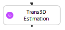
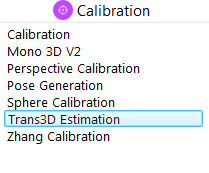
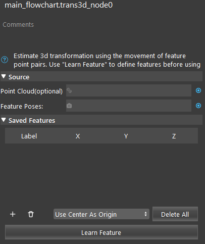
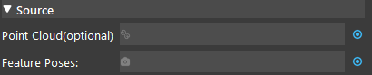
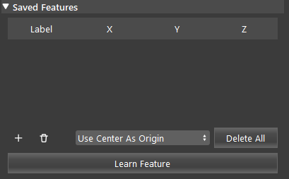

Trans3D Estimation
===================

Overview
----------

**Trans3D Estimation** node estimates the transformation of an object by computing learned features' locations.
A minimum of 3 features is required.
See :ref:`Trans 3D` for template usage.

Input and Output
-------------------

.. list-table::
   :widths: 25 25 50
   :header-rows: 1

   * - Input
     - Type
     - Description
   * - Point Cloud 
     - Cloud
     - Usually from Camera, Cloud Process, etc.
   * - Feature Poses
     - VecPose
     - Vector of 3D feature poses. 

.. list-table::
   :widths: 25 25 50
   :header-rows: 1

   * - Output
     - Type
     - Description
   * - NewInOldPose
     - Pose
     - Transformation of current object location in old object location.
   * - success
     - int
     - Whether the transformation is successful.

Node Settings
---------------

Source
~~~~~~~~~~

- **Point Cloud** (optional)
    The point cloud for the scene.

- **Feature Poses**
    Feature's 3D poses. Usually from Reconstruct.

Saved Features
~~~~~~~~~~~~~~~~~~

- **Use Center As Origin**
    Calculated transformation will be in the center of all the learned features.

- **Use Smallest Label as Origin**
    Use the label with the smallest number 

Procedure to Use
-----------------

1. Insert Camera, two Mod Finders, Reconstruct, Trans3D Estimation nodes. 

  .. image:: images/trans3d_1.png
      :align: center
      :scale: 100%

  .. image:: images/trans3d_1_1.png
      :align: center
      :scale: 100%

2. Please refer to :ref:`Camera` for details on setting up a virtual camera. You can use the .dcfs `here <>`_ .

  .. image:: images/trans3d_2.png
      :align: center
      :scale: 100%

3. In the first Mod Finder node, link the Camera's image output. Run the node once to load the display.

  .. image:: images/trans3d_3.png
      :align: center
      :scale: 100%

  .. image:: images/trans3d_3_1.png
      :align: center
      :scale: 100%

4. In the first Mod Finder node, add the "DaoAI" logo as the model. This Mod Finder node will be the reference fixture node. See :ref:`Reference Fixture System`.

  .. image:: images/trans3d_4.png
      :align: center
      :scale: 100%

5. In the second Mod Finder node, link the Camera's image output. Then, select "Use Reference Fixture", and select the first Mod Finder node. See :ref:`Reference Fixture System`.

  .. image:: images/trans3d_5.png
      :align: center
      :scale: 100%

  .. image:: images/trans3d_5_1.png
      :align: center
      :scale: 100%

6. In the second Mod Finder node, add four models as the features. We will use the following features on the object:

  .. image:: images/trans3d_6.png
      :align: center
      :scale: 100%

7. For each model (feature) defined in the Mod Finder, each of them need a different label that is not -1 (default). Assign 1 to 4 to each the four models respectively.

  .. image:: images/trans3d_7.png
      :align: center
      :scale: 100%

8. Run the node. You should see the following results.

  .. image:: images/trans3d_8.png
      :align: center
      :scale: 100%

9. In Reconstruct node, link the second Mod Finder's output as the object locations. Then, run the node.

  .. image:: images/trans3d_9.png
      :align: center
      :scale: 100%

  .. image:: images/trans3d_9_1.png
      :align: center
      :scale: 100%

10. In Trans3D Estimation node, link the reconstruct's output as the feature poses. You can optionally link the point cloud from camera. Click "Learn Feature". Run the Trans3D Estimation node, and you can see the learned features.

  .. image:: images/trans3d_10.png
      :align: center
      :scale: 100%

11. Run the flowchart again with the object at a different location (rotation, shifting, etc.) while the features are fully visible. You can see that the new transformation is calculated.

  .. image:: images/trans3d_11.png
      :align: center
      :scale: 100%

Exercise
------------

You see the following error message when you run the Trans3D Estimation node. 
How can you fix it?

  .. image:: images/trans3d_exercise_1.png
      :align: center
      :scale: 100%

|
|
|
|
|
|
|
|
|
|
|
|
|
|
|

Answers for Exercise
---------------------

This error is caused by incorrect feature label. 
You can fix this by checking all of the models' labels in the Mod Finder node and change them accordingly.
