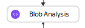
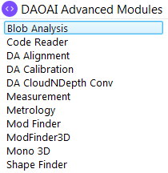
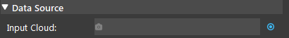
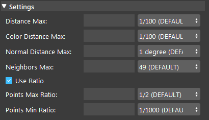

Blob Analysis Node
===================

Overview
-------------------

**Blob Analysis** node analyzes and locates the blobs in point clouds. 
Blobs are defined as subsets of neighbouring points which corresponds to physical objects scenes.
Points in a blob have similar colors, and lie on the same surface as neighboring points in the same blob.

Input and Output
--------------------

.. list-table:: 
   :widths: 50 50 300
   :header-rows: 1

   * - Input
     - Type
     - Description
   * - Distance Max
     - Double
     - Maximum distance within which two points are considered neighbors.
   * - Color Distance Max
     - Double
     - Mximum color distance within which two points are considered neighbors.
   * - Normal Distance Max
     - Double
     - Maximum angle between the normal vectors of two points for them to be considered neighbors.
   * - Neighbors Max
     - int
     - Maximum number of neighbors each point can have.
   * - Use Ratio
     - Bool
     - When selected, uses points max/min ratio for each blob. Otherwise uses points max/min.
   * - Points Max Ratio
     - Double
     - Maximum number of points each blob can have to number of total points in the point cloud.
   * - Points Min Ratio
     - Double
     - Minimum number of points each blob must have  to number of total points in the point cloud.
   * - Points Max
     - Double
     - Maximum number of points each blob can have.
   * - Points Min
     - Double
     - Minimum number of points each blob must have.
     
.. list-table:: 
   :widths: 50 50 300
   :header-rows: 1

   * - Output
     - Type
     - Description
   * - clouds
     - vector<Cloud>
     - Clouds of all the blobs. Individual blob cloud can be accessed with clouds[].
   * - poses
     - vector<Pose>
     - Poses of all the blobs. Individual blob pose can be accessed with poses[].
   * - numSegms
     - int
     - Number of segments found.

Node Settings
--------------------

Data Source
~~~~~~~~~~~~~~~~~~~~

**Input Cloud**
    The cloud of the scene to perform the blob analysis on. Usually from Camera and Cloud Process.

Settings
~~~~~~~~~~~~~~~~~~~~

- **Distance Max** (Default: 1/100; Range: (0.0, ∞))
    Maximum distance within which two points are considered neighbors.

- **Color Distance Max** (Default: 1/100; Range: (0.0, ∞))
    Maximum color distance within which two points are considered neighbors.

- **Normal Distance Max** (Default: 1 degree; Range: (0.0, 180.0])
    Maximum angle between the normal vectors of two points for them to be considered neighbors.

- **Neighbors Max** (Default: 49; Range: (0, ∞))
    Maximum number of neighbors each point can have.

- **Use Ratio** (Default: True)
    When selected, uses points max/min ratio for each blob. Otherwise uses points max/min.

- **Points Max Ratio** (Default: 1/2; Range: (0.0, 100.0))
    Available when "Use Ratio" is selected. Maximum number of points each blob can have to number of total points in the point cloud.

- **Points Min Ratio** (Default 1/1000; Range: (0.0, 100.0))
    Available when "Use Ratio" is selected. Minimum number of points each blob must have  to number of total points in the point cloud.

- **Points Max** (Default: 10000; Range: (0.0, ∞))
    Available when "Use Ratio" is unselected. Maximum number of points each blob can have.

- **Points Min** (Default: 1; Range: (0.0, ∞))
    Available when "Use Ratio" is unselected. Minimum number of points each blob must have.

Procedure to Use
--------------------

1. Insert Camera, Cloud Process, and Blob Analysis node.

    .. image:: images/blob_analysis/blob_1.png
        :align: center
        :scale: 80%

    .. image:: images/blob_analysis/blob_1_1.png
        :align: center

2. Add a virtual camera (refer to :ref:`Camera`) and run the node. You can use the .dcf files `here <https://daoairoboticsinc-my.sharepoint.com/:u:/g/personal/xchen_daoai_com/EUk6im90Rl1NnABY-dkAFGIBexudnq_f9ER9J0azRMRgKQ?e=IcOcK7>`_.

    .. image:: images/blob_analysis/blob_2.png
        :align: center

3. In Cloud Process node, link camera's cloud output as the input cloud (data source). 

    .. image:: images/blob_analysis/blob_3.png
        :align: center
        :scale: 80%

4. In Cloud Process node, add an "Adjust Bounding Box" operation. Run the node, and select the targeted area with the bounding box.

    .. image:: images/blob_analysis/blob_4.png
        :align: center
        :scale: 95%

    .. image:: images/blob_analysis/blob_4_1.png
        :align: center
        :scale: 99%

5. In Blob Analysis, link Cloud Process's cloud output.

    .. image:: images/blob_analysis/blob_5.png
        :align: center

6. Input the appropriate settings for the objects. Run the node, and the objects are segmentated from the scene.

    .. image:: images/blob_analysis/blob_6.png
        :align: center
        :scale: 100%

    .. image:: images/blob_analysis/blob_6_1.png
        :align: center
        :scale: 92%

Exercise
--------------------

    .. image:: images/blob_analysis/blob_exercise_1.png
        :align: center
        :scale: 88%

    .. image:: images/blob_analysis/blob_exercise_2.png
        :align: center
        :scale: 99%

| You notice the Blob Analysis node incorrectly segmentates the blobs. 
| Given the settings of the Blob Analysis node, how could you improve the segmentation?

A. Increase Distance Max
B. Decrease Distance Max
C. Increase Neighbors Max
D. Decrease Neighbors Max

|
|
|
|
|
|
|
|
|
|
|
|
|
|
|
|
|
|

Answers to Exercise
--------------------

| Observe that objects very close to each other are incorrectly segmentated as the same blob.
| Thus, decreasing Neighbors Max could improve the segmentation.
| Let's try to decrease the Distance Max to 1.

    .. image:: images/blob_analysis/blob_exercise_ans_1.png
        :align: center
        :scale: 90%

    .. image:: images/blob_analysis/blob_exercise_ans_2.png
        :align: center
        :scale: 98%

