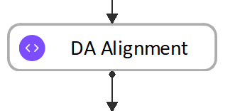
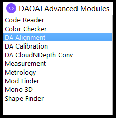
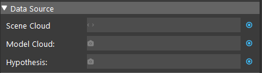

DA Alignment Node 
**********************

Overview
============

The **DA Alignment** Node is used to refine poses for better alignment using an iterative algorithm. 
Given initial poses, an input model mesh is iteratively aligned toward an input scene cloud by sampling points, 
matching them between the model and scene, and minimizing the error between matched points.
This node should be used when reasonably accurate poses have already been obtained, 
such as following after the **Reconstruct** Node or **Mod Finder** Node, in which case these poses can be further refined.

Input and Output
================

+----------------------------------------+-------------------------------+---------------------------------------------------------------------------------+
| Input                                  | Type                          | Description                                                                     |
+========================================+===============================+=================================================================================+
| Image                                  | Point Cloud                   | The Point Cloud from scene(Camera, Reader etc.)                                 |
+----------------------------------------+-------------------------------+---------------------------------------------------------------------------------+
| Object Model                           | Point Cloud                   | The Point Cloud model from objects(Cloud Process, Reader etc.)                  |
+----------------------------------------+-------------------------------+---------------------------------------------------------------------------------+
| 3D poses                               | Vec<3DPoses>                  | The results of poses. Usually from Mod Finder, Reconstruct etc.                 |
+----------------------------------------+-------------------------------+---------------------------------------------------------------------------------+

+-------------------------+-------------------+------------------------------------------------------------------------+
| Output                  | Type              | Description                                                            |
+=========================+===================+========================================================================+
| poses                   | Vec<Pose3D>       | Vector of 3D poses generated from "Hypothesis".                        |
+-------------------------+-------------------+------------------------------------------------------------------------+
| size                    | int               | Size of the objects aligned.                                           |
+-------------------------+-------------------+------------------------------------------------------------------------+

Node Settings
==============

Data Source
-----------------

|

   * Point Cloud

   The Point Cloud from scene(camera, reader etc.)

   * Model Cloud 
   
   The object point cloud model from scene or more file(Cloud Process, Reader etc.)

   * Hypothesis

   The initial guess for the poses, usually obtained from Reconstruct node or 3D Mod Finder node. 

Algorithm Setting
-----------------

.. image:: images/da_align/algo_setting.png
	:align: center

|

- **Use Model Box**: Range [**USE**, **IGNORE**] (Default value: **IGNORE**)

   Specifies whether to use the model point cloud's extraction box to limit the points during alignment. 

- **Error Metric**: (Default value: **Point-to-Point**)
   
   **Point-to-Point** is representative of the true error, while **Point-to-Plane** is representative of error relative to orientation. The change of relative pose that gives the minimal **Point-to-Plane** error is usually solved using standard nonlinear least-squares methods, which are often very slow. Generally, it is **recommended using Point-to-Point** error metric unless the geometry and amount of overlap between the hypothesis and scene are large to use the **Point-to-Plane** metric.

- **Max Iterations**: Range [1,∞) (Default value: 20)

   Maximum iteration steps. The higher the number is, the longer it would take for alignment, but the alignment quality will be better with more iteration. 

+-----------------+-----------------+-----------------+-----------------+-----------------+
|VERY LOW = 5     | LOW = 15        | MEDIUM = 50     | HIGH = 100      | VERY HIGH = 200 |
+-----------------+-----------------+-----------------+-----------------+-----------------+

- **Decimation Step Model** (Advanced): Range [1,∞) (Default value: MEDIUM)

   Step size for sampling points in the model. This is similar to Scene Decimation Step.

+-----------------+-----------------+-----------------+
|LOW = 2          | MEDIUM = 4      | HIGH = 8        |
+-----------------+-----------------+-----------------+

- **Decimation Step Scene** (Advanced): Range [1,∞) (Default value: MEDIUM)
   
   Step size for sampling points in the scene. The larger the step size means the more points it will skip for the alignment algorithm. Generally, the smaller the step will result in more accuracy. 

+-----------------+-----------------+-----------------+
|LOW = 2          | MEDIUM = 4      | HIGH = 8        |
+-----------------+-----------------+-----------------+

- **Model Overlap**: Range [1,100] (Default value: MEDIUM)

   Required overlap percentage between model and scene above which alignment will stop. 

+-----------------+-----------------+-----------------+
|LOW = 80%        | MEDIUM = 90%    | HIGH = 99%      |
+-----------------+-----------------+-----------------+

- **Down Sample Strength**: Range [1,10]

   Control overall downsample intensity for the scene and model. Larger vales means stronger downsample.

Procedure to use
=====================================

1. Open a workspace in DaoAI Vision Studio.
	.. image:: images/da_align/use1.png
		:align: center

2. Insert a Camera node to get the source image.
	.. image:: images/da_align/camera.png
		:align: center

3. A virtual image is used to demonstrate. Refer to System Overview, Tutorials on how to connect to camera.
	.. image:: images/da_align/tee.png
		:align: center

4. Insert a Mod Finder node and Reconstruct node are used for demonstration here.
	.. image:: images/da_align/4setups.png
		:align: center

5. Click on the blue dot on the right side of "Scene Cloud" to link the point cloud from the camera node above as input.
	.. image:: images/da_align/step_pointcloud.png
		:align: center

6. Expand the “Out/main_flowchart.camera_node” on the left window of the LinkExpressionDialog. Click the "pointCloud" then Apply.
	.. image:: images/da_align/link1.png
		:align: center

7. Click on the blue dot on the right side of "Hypothesis" to link the initial poses from the Reconstruct node above as input.
	.. image:: images/da_align/step_hypothesis1.png
		:align: center

8. Expand the “Out/main_flowchart.reconstruct_nodes” on the left window of the LinkExpressionDialog. Click the "objectPositions" then Apply.
	.. image:: images/da_align/step_hypothesis.png
		:align: center

9. Create a model to let the node know what it should be looking for. Click on the “+” to create a model.
	.. image:: images/da_align/add_model.png
		:align: center

10. Opening the model dialog for your created model. Choosing your expected type of input for the model. "From Link" is using the link expression to link model cloud as its model. "From Scene" defines the cloud model from the scene cloud input.
	.. image:: images/da_align/model_dialog.png
		:align: center

11. Click on the blue dot on the right side of "Model Cloud" to link model cloud from Reader node above as input.
	.. image:: images/da_align/model_from_link_dialog_bluedot.png
		:align: center

12. Expand the Reader node(the model cloud you need) on the left window of the LinkExpressionDialog. Click the "outputCloud" then Apply.
	.. image:: images/da_align/model_from_link.png
		:align: center

13. Click on "Define Model" button and you will see the model loaded into DA Alignment.
	.. image:: images/da_align/model_loaded_from_link.png
		:align: center

14. Click on "Define Model" button to define your model on scene.
	.. image:: images/da_align/model_from_scene_dialog.png
		:align: center

14. Adjusting the bounding box on scene to choose your model cloud.
	.. image:: images/da_align/adjusting_da_model_on_scene.png
		:align: center

15. Click on the blue dot on the right side of "Model Pose" to link model cloud from Transformation Tree node above as input.
	.. image:: images/da_align/model_from_scene_before_pose.png
		:align: center

.. note::
	You can see the model cloud is small and away from the coordinate. This is because the origin of point cloud is different to the origin of model you see on scene. You should apply the reverse operation on the model pose.

16. Click on "Update Model Pose" button to reverse your model cloud origin to the object itself.
	.. image:: images/da_align/model_loaded_from_scene.png
		:align: center

17. You should be able to see the model cloud aligned with the objects on scene.
	.. image:: images/da_align/align.png
		:align: center

.. tip::
	If you need to alter more settings in order to get your expected results, you can keep reading on the following steps. If not, you can jump to the next section :ref:`Exercise <Exercise>`.

18. You can change the option for "Use Model Box" to decide whether or not cropping the scene based on the model's bounding box before alignment to speeds up matching.
	.. image:: images/da_align/use_model_box.png
		:align: center

19. You can change the option for "Error Metric" to change either Point-to-Point or Point-to-Plane depending on the actual conditions.
	.. image:: images/da_align/error_metric.png
		:align: center

20. You can change the option for "Max Iterations" to change the iteration of re-align for better alignment result. But more iterations will take more time, choose the option with your best fit.
	.. image:: images/da_align/max_iterations.png
		:align: center

21. (Advanced)Decimation Step Model & Decimation Step Scene are used to adjust the step size for downsample. More steps will slow down the performance. Usually recommended using DEFAULT settings are good enough for most of the cases.
	.. image:: images/da_align/decimation.png
		:align: center

22. You can control the percentage of model points for calculation of this alignment with scene points. More is usually better and more accurate. 
	.. image:: images/da_align/model_overlaps.png
		:align: center

23. You can control the overall downsample intensity for calculation for scene and model. Lower is usually better and more accurate. However, more calculations is needed, takes longer to align.
	.. image:: images/da_align/downsample.png
		:align: center

Exercise
================

Try to come up with the setting on **DA Alignment** node according to the requirements below. 
You can work on these exercise with the help of this article. 
We also have answers attached at the end of this exercise.

This is some helpful resource when you are working on the exercise: 

**Scenario 1**
---------------------

There is a project which requires the robot to pick all the occurrences of the T-tube in scene. Your colleague has setup the 3D camera and robot in the lab for 
experiment. You need to help him setup the **DA Alignment** node in main_flowchart. Please choose the **all** correct answers from the options:

	.. image:: images/da_align/e1_1.png
		:align: center

1. Shown in the image above, we have the **DA Alignment** node inserted in the flowchart. How do you add inputs for these settings? 

	A. Right click on the **DA Alignment** node and you will see the option for adding inputs;

	B. Click on the blue dot next to **Scene Cloud**, link to **Camera** node **Point Cloud**; 

	C. Click on the blue dot next to **Hypothesis**, link to **Reconstruct** node **objectPositions**; 

	D. Click on the blue dot next to **Hypothesis**, link to **Mod Finder** node **labelledPose3dSequence**; 

	.. image:: images/da_align/e1_2.png
		:align: center

2. Shown in the image above, you decided to use the model **from scene** and chose the one T-tube as your model cloud. Then, which of the following options is correct? 

	A. Use model cloud **from link**, since this scene cloud is not qualified for model cloud;

	B. Link the **Reconstruct** node **objectPositions/occurrence[0]** for its model pose; 

	C. Link the **Mod Finder** node **labelledPose3dSequence/occurrence[0]** for its model pose; 
	
	D. The model is correct; 

	E. None of above; 

	.. image:: images/da_align/e1_3.png
		:align: center

3. You have the **DA Alignment** node setup like image shown above. Then, you found out the time it takes to finish the alignment is longer than the requirement. How would you change the settings to get a shorter runtime? (You can the quality of the alignment will stay the same after the changes, only affecting the runtime)

	A. enable **use pose label**;

	B. Change **Error Metric** to **Point-to-Plane, using Model Normals**; 

	C. Change **Max Iterations** to **DEFAULT**;

	D. Change **Down Sample Strength** to **9**; 

Answers for exercises
================

**Scenario 1**
---------------------

1. B, C

Explanation: You can check the :ref:`Node Settings section <Node Settings>` and :ref:`Procedure to use <Procedure to use>` for option A, B and C. For option D, 
you are aligning the 3D poses with scene cloud, it is better to link **Reconstruct** node since **Reconstruct** node uses **Mod Finder** results as hypothesis. It would be better to link **Reconstruct** as input here. 

2. E

Explanation: 

A: Using **from scene** can have the same/similar model, the model defined in the image is not good because the origin of its coordinate is away from the object. 
All you need to do is transforming the origin & coordinate back to the object. 

B and C: Applying the hypothesis to the model transformation is not going to give you the correct outcome. It will make it farther away from the object or somewhere strange. Because the poses from **Reconstruct** and **Mod Finder** node 
have their own origin, mostly default by the same origin as the scene cloud. Therefore, B and C are incorrect.

D: The model cloud needs transformation. 

What you should actually do: 

	* If you are working on **Vision** Studio version 2.22.4.0 or earlier, you can insert the **Pose Generation** node. Applying the **inverse** operation of hypothesis. Which means you should apply the correct pose for the correct object on scene(make sure the pose you inverse is the respect to the T-tube you cropped).

	.. image:: images/da_align/pose_gen.png
		:align: center

	* If you are working on **Vision** Studio version 2.22.6.0 or later, you can insert the **Transformation Tree** node for this transformation. Simply link the pose for this object as input, transforming the inverse of this pose. For example, if your input is **Object in Cloud**, then the output should be **Cloud in Object**.

	.. image:: images/da_align/tr_node.png
		:align: center